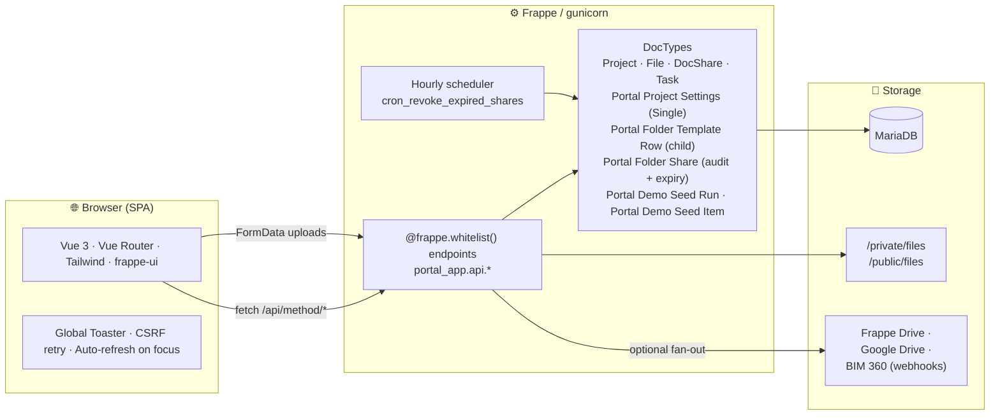
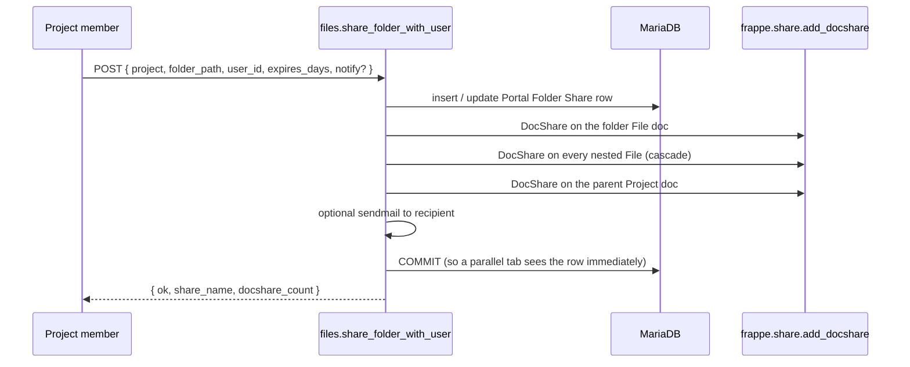

# Portal App — Developer Guide

> A Vue 3 + Frappe / ERPNext app that wraps the standard `Project` doctype with a
> modern, Drive-style portal: project portfolio, Kanban, tasks, calendar, files
> with a fixed company-wide folder standard, per-user file sharing, and a
> cinematic login. This guide is the contract between the codebase and anyone
> extending it.

---

## 1. Architecture overview



The text-art version below renders fine in plain editors; GitHub renders the
Mermaid diagram above instead.

```
┌────────────────────────────────────────────────────────────────┐
│                         Browser (SPA)                          │
│   /portal-app/*   →   Vue 3 + Vue Router + Tailwind + frappe-ui│
└───────────────┬────────────────────────────────────┬───────────┘
                │  fetch(/api/method/...)            │  fetch (FormData)
                ▼                                    ▼
┌────────────────────────────────────────────────────────────────┐
│                Frappe Framework  (gunicorn)                    │
│   • Whitelisted endpoints in portal_app.api.*                  │
│   • Doctypes:  Project, File, DocShare, Task                   │
│                Portal Project Settings (Single)                │
│                Portal Folder Template Row (child)              │
│                Portal Folder Share (audit/expiry tracking)     │
│                Portal Demo Seed Run + Item                     │
│   • Hourly cron: revoke expired shares                         │
└───────────────┬────────────────────────────────────┬───────────┘
                │                                    │
                ▼                                    ▼
        ┌──────────────┐                  ┌────────────────────┐
        │   MariaDB    │                  │  /private/files,   │
        │              │                  │  /public/files     │
        └──────────────┘                  └────────────────────┘
```

### Sharing flow (Drive-style)



### Two halves
1. **Backend** — pure Python, lives at `portal_app/portal_app/api/*.py`. Every
   user-facing call is a `@frappe.whitelist()`-decorated function. No custom
   doctype controllers run business logic; the API layer is the contract.
2. **Frontend** — Vue 3 SPA in `portal_app/frontend/`. Vite builds it into
   `portal_app/public/frontend/` which Frappe serves at `/portal-app/`.

There is *no* custom routing on the desk side. The portal is a self-contained
SPA mounted under `/portal-app/<sub-route>` via `website_route_rules`
(see `hooks.py`).

---

## 2. Repository layout

```
portal_app/
├── DOCUMENTATION.md            ← legacy / overview
├── DEVELOPER_GUIDE.md          ← this file
├── USER_GUIDE.md               ← end-user workflows
├── README.md
├── pyproject.toml              ← Python dependency manifest
├── package.json                ← root JS workspace marker
│
├── portal_app/                 ← Frappe app package
│   ├── hooks.py                ← website routes, install hooks
│   ├── install.py              ← after_install / after_migrate
│   │
│   ├── api/                    ← Whitelisted endpoints (the public contract)
│   │   ├── auth.py             ← session / portal-access checks
│   │   ├── dashboard.py        ← portfolio dashboard payload
│   │   ├── files.py            ← upload, list, share, revoke, ZIP import
│   │   ├── projects.py         ← projects, kanban, tasks, capabilities
│   │   ├── profile.py          ← user profile read/write
│   │   ├── portal_admin.py     ← admin-only seed / user creation
│   │   └── helper.py           ← role + permission helpers (no @whitelist)
│   │
│   ├── project_portal/
│   │   └── doctype/
│   │       ├── portal_project_settings/         ← Single doctype
│   │       ├── portal_folder_template_row/      ← Child of settings
│   │       └── portal_folder_share/             ← Audit / expiry / link tracking
│   │
│   ├── public/frontend/        ← built SPA (committed by CI / built locally)
│   ├── templates/              ← Frappe page wrapper for the SPA
│   └── www/                    ← static fall-throughs
│
└── frontend/                   ← Vue 3 source
    ├── src/
    │   ├── api/index.js        ← fetch wrapper, CSRF cache + retry
    │   ├── router/index.js     ← Vue Router routes + guards
    │   ├── component/          ← reusable UI (Sidebar, Header,
    │   │                          FileUploadPanel, DataTable, …)
    │   └── pages/              ← one per route (Dashboard, Files, …)
    ├── style.css               ← shared portal CSS variables + utility classes
    ├── tailwind.config.mjs
    └── vite.config.mjs
```

---

## 3. Backend

### 3.1 API surface

Every `@frappe.whitelist()` function below is callable as
`/api/method/portal_app.api.<module>.<function>`.

#### `portal_app.api.auth`
| Method | Purpose | Guest? |
|---|---|---|
| `get_logged_user` | Return `{user, full_name, profile_image}` for the current session | ✅ |
| `check_portal_access` | Boolean: does the current user have any portal-visible projects? | ✅ |

#### `portal_app.api.projects`
| Method | Purpose |
|---|---|
| `get_capabilities` | The single source of truth for *what the current user can do*. Returns `manageable_project_names`, `allowed_project_names`, `is_customer_portal_user`, `can_create_project`, `can_edit_portal_folder_template`, `can_manage_customers`, `portal_user`. Every page injects this. |
| `list_projects` / `get_project` | Listing + detail |
| `portfolio_dashboard` / `project_dashboard` | Aggregate cards + charts |
| `kanban_board` / `set_project_stage` | Board view + drag-update |
| `list_tasks` / `update_task` | Task workspace |
| `calendar_events` | Project + task events for `Calendar.vue` |
| `rename_project` / `create_project` / `set_project_customer` | Project mutations |
| `sync_project_team` / `sync_customer_portal_users` / `create_customer_portal_user_from_project` | Team / external-portal user management |
| `search_customers` / `create_or_get_customer` / `search_portal_users` | Typeaheads |
| `get_portal_folder_template` / `save_portal_folder_template` / `import_portal_folder_template_zip` | Auditor-only template editing |

#### `portal_app.api.files`
| Method | Purpose |
|---|---|
| `list_project_files` | Files attached to a project + `folders` tree + portal settings |
| `list_project_folders` | Just the folder tree (lighter call) |
| `upload_project_file` | Multipart upload. Reads `target_folder`, runs inside `_bypass_max_attachments()`, force-corrects folder if a hook reset it |
| `delete_project_file` | Manager-any / owner-self deletion |
| `rename_project_subfolder` | Manager-only rename of any folder segment |
| `create_folder_share_link` | Signed token + `Portal Folder Share` row (when DocType present) |
| `share_folder_with_user` | Adds ERPNext-native `DocShare` on the folder, every nested File, AND the parent Project. Records audit row when DocType is present. **Available to any project member.** |
| `list_folder_shares` | Active shares for a folder; falls back to native `DocShare` rows if our tracking DocType is missing |
| `revoke_folder_share` | Member can revoke shares they created; manager can revoke any. Cleans up DocShares; only drops Project share if no other active grant remains |
| `extend_folder_share` | Bump expiry on a tracked share |
| `list_shared_with_me` | Everything visible to the current user, grouped by project — backs the **Shared with me** page |
| `get_shared_folder_files` | Public, token-verified read-only view (the `/shared-folder?token=…` page). Increments access counters |
| `get_file_download_url` | Signed URL for private files |

#### `portal_app.api.profile`
| Method | Purpose |
|---|---|
| `get_my_profile` | Identity + roles + linked customer |
| `update_my_profile` | Save full_name, mobile, language, time zone |

#### `portal_app.api.portal_admin`
| Method | Purpose |
|---|---|
| `get_portal_admin_capabilities` | Powers the `requiresPortalAdmin` route guard |
| `create_portal_user` | Admin-only user creation with role assignment |
| `run_demo_seed` | Showcase data (gated by site config) |

### 3.2 Permission helpers — `api/helper.py`

These are not whitelisted; the API methods compose them. Use them — never
re-implement.

```
user_can_use_portal()                   # has any portal-visible project access
user_is_customer_portal_user()          # has Portal Customer role
has_portal_staff_project_access()       # internal staff override
get_allowed_project_names()             # all projects user can read
can_manage_project(name)                # is portal_project_manager / Projects Manager / SM
can_edit_portal_folder_template()       # Auditor (or System Manager fallback)
can_manage_customers_in_portal()
assert_project_access(name)             # → throws PermissionError
assert_manage_project(name)             # → throws PermissionError
assert_customer_portal_can_upload(name) # blocks Portal Customer uploads
```

### 3.3 Capability matrix (server-enforced)

| Action | Customer Portal User | Project Member | Portal PM | Projects / System Manager | Auditor |
|---|---|---|---|---|---|
| Read project | ✅ if linked customer | ✅ | ✅ | ✅ | ✅ if listed |
| Upload file | ❌ | ✅ | ✅ | ✅ | ✅ |
| Delete *own* upload | ❌ | ✅ | ✅ | ✅ | ✅ |
| Delete *any* file | ❌ | ❌ | ✅ | ✅ | ❌ |
| Rename folder segment | ❌ | ❌ | ✅ | ✅ | ❌ |
| Share folder with user | ❌ | ✅ | ✅ | ✅ | ❌ unless member |
| Revoke share **they made** | ❌ | ✅ | ✅ | ✅ | ✅ |
| Revoke share **others made** | ❌ | ❌ | ✅ | ✅ | ❌ |
| Edit company folder template | ❌ | ❌ | ❌ | ✅ (SM only) | ✅ |
| Run demo seed | ❌ | ❌ | ❌ | ✅ (SM only) | ❌ |

Frontend mirrors this via `portalCapabilities` (see §4.2) but **never trust the
client**. The same checks fire on every whitelisted call.

### 3.4 Doctypes

```
Portal Project Settings (Single)           ← portal-wide configuration
└── folder_template (table) ─→ Portal Folder Template Row
                                  • folder_name : Data, "/" for nesting

Portal Folder Share                        ← audit + expiry + link tracking
├── project, folder_path, folder_label
├── share_kind : "User" | "Link"
├── user / user_email / user_full_name      (User shares)
├── share_token / share_url                 (Link shares — HMAC-signed)
├── expires_at, revoked, revoked_by, revoked_at
└── created_by_user, last_accessed_at, access_count
```

The `Portal Folder Share` doctype is *optional* — the backend gracefully falls
back to native `DocShare` rows when it isn't installed yet (e.g. between
`bench install` and `bench migrate`). All share APIs return
`tracking_available: false` in that case, and the frontend hides per-share
expiry / link sharing accordingly.

### 3.5 The folder-standard system

Every project gets a deterministic folder tree under
`Home/Attachments/<project_id>/…`. The shape comes from:

```
1. Portal Project Settings → folder_template       ← table editor (Auditor)
2. site_config.json → PORTAL_PROJECT_FOLD_TEMPLATE_JSON   ← JSON list fallback
3. files.PROJ_FOLD_DEFAULT                          ← built-in "00 PROJ FOLDER STANDARD"
```

`ensure_project_folders(project)` (idempotent) walks the leaf paths from the
template and creates each intermediate folder via `_ensure_folder()`. Children
are created on demand the first time a file is uploaded to that subtree, so
existing projects automatically gain new template rows.

### 3.6 Sharing model

```
[ Project member clicks Share on a folder ]
                ↓
share_folder_with_user(project, folder_path, user_id, expires_days)
                ↓
        ┌─────────────────────────────────────────────────────────────────┐
        │ 1. assert_project_access(project)                               │
        │ 2. resolve canonical File doc name + label                      │
        │ 3. (if doctype present) upsert Portal Folder Share row          │
        │ 4. frappe.share.add(File, folder, user, read=1, …)              │
        │ 5. for each nested File under that folder:                      │
        │        frappe.share.add(File, child, user, read=1, …)           │
        │ 6. frappe.share.add(Project, project, user, read=1, …)          │
        └─────────────────────────────────────────────────────────────────┘
                ↓
The recipient now sees the project + folder + every file in their portal
"Shared with me" page and in their Frappe desk view.
```

Step 5 is critical — Frappe's File-level DocShare does **not** cascade. Without
explicit grants on each child file, the recipient could open the folder but
not the files inside. Step 6 lets them navigate to the project header in the
portal.

`revoke_folder_share` reverses the same set, but only drops the `Project`
DocShare if no *other* active `Portal Folder Share` exists for
`(project, user)` — otherwise concurrent shares would silently break.

### 3.7 CSRF strategy

Frappe enforces CSRF on every non-GET. The frontend wrapper
(`frontend/src/api/index.js`) does three things:

1. Reads the token from `window.csrf_token`, `window.frappe.boot.csrf_token`,
   then the `csrf_token` cookie — first hit wins, cached in module scope.
2. On a 403 response containing `CSRFTokenError`, fetches a fresh token via
   `/api/method/frappe.sessions.get_csrf_token` and retries the request **once**.
3. The Login page calls `ensureCsrfReady()` after a successful sign-in so the
   first POST after login (e.g. `share_folder_with_user`) doesn't race the
   freshly issued token.

This is automatic for any caller of `call(...)` or `uploadFile(...)`.

### 3.8 Install hooks

`hooks.py` registers:

```python
after_install  = "portal_app.install.after_install"
after_migrate  = "portal_app.install.after_migrate"
```

Both call:

* `ensure_project_portal_custom_fields()` → custom fields on `Project`
  (`portal_project_code`, `portal_project_manager`, `portal_kanban_stage`)
  and on `User` (`portal_linked_customer`).
* `ensure_portal_customer_access()` → ensures the `Portal Customer` role exists.
* `lift_project_attachment_limit()` → installs a Property Setter that sets
  `Project.max_attachments = 0` (no cap). Required because Frappe's default
  4-attachment cap on Project conflicts with the standard folder tree's many
  files.

For the rare case where migration hasn't run yet, `upload_project_file` wraps
each upload in a `_bypass_max_attachments()` context manager that monkey-patches
`File.validate_attachment_limit` for the duration of one insert — lock-free and
restored in `finally`.

---

## 4. Frontend

### 4.1 Stack
* Vue 3 (`<script setup>`)
* Vue Router 4 (history mode, base = `/portal-app/`)
* Tailwind 3 + a custom design-system layer in `style.css`
  (`portal-card-strong`, `portal-btn`, `portal-btn-primary`, `portal-pill-*`,
  `portal-hero`, `portal-kpi`, gradient utilities, `portal-anim-in`)
* `frappe-ui` (`Button`, `TextInput`, `Password`, `FeatherIcon`)
* Vite for build

### 4.2 Module map

```
src/
├── api/index.js
│   ├── call({ method, args, type })         ← JSON RPC + CSRF retry
│   ├── uploadFile(method, file, fields)     ← multipart RPC + CSRF retry
│   └── ensureCsrfReady()                    ← prime cache after login
│
├── router/index.js
│   ├── /login          → Login.vue
│   ├── /shared-folder  → SharedFolder.vue            (public, token-only)
│   └── /  (Layout.vue)
│        ├── /dashboard               → Dashboard.vue
│        ├── /projects                → Projects.vue
│        ├── /projects/:name          → ProjectDetail.vue
│        ├── /kanban                  → Kanban.vue
│        ├── /tasks                   → Tasks.vue
│        ├── /calendar                → Calendar.vue
│        ├── /files                   → Files.vue
│        ├── /shared-with-me          → SharedWithMe.vue
│        ├── /file-tools              → FileTools.vue   (requiresAuditor)
│        ├── /profile                 → Profile.vue
│        └── /admin                   → Admin.vue       (requiresPortalAdmin)
│
├── component/
│   ├── Sidebar.vue           — nav, role-aware items
│   ├── Header.vue            — search, profile menu
│   ├── FileUploadPanel.vue   — shared upload UI (Files + ProjectDetail)
│   ├── DataTable.vue         — generic table
│   ├── DescriptionModal.vue
│   ├── ItemPerPage.vue
│   ├── LogoutModal.vue
│   └── Shimmer.vue
│
└── pages/  (one per route)
```

### 4.3 The capability injection

`Layout.vue` calls `portal_app.api.projects.get_capabilities` once per session
and provides the result via Vue's `provide(...)`:

```js
provide("portalCapabilities", portalCapabilities)
provide("refreshPortalCapabilities", loadPortalCapabilities)
provide("portalAdmin", portalAdmin)
```

Every page that needs role/permission data injects it:

```js
const portalCapabilities = inject("portalCapabilities", ref({}))
const canShareFolder = computed(
  () => (portalCapabilities.value.allowed_project_names || []).includes(project.value)
)
```

### 4.4 The shared upload component — `FileUploadPanel.vue`

```
Props
├── project          : str       (required)
├── folders          : Array     (subfolders payload from API)
├── projectRootPath  : str
├── allowShare       : bool      (caller decides whether to show Share btn)
└── disabled         : bool

Internal state
├── targetFolder, isPrivateUpload, destination, externalProvider
├── advancedUploadOpen
├── folderPickerOpen, folderPickerSearch, folderPickerExpanded
└── uploadBusy / uploadError / uploadInfo

Computed
├── targetFolderEntry       — current row in `folders`
├── targetFolderLeafLabel   — last segment for the tile
├── targetFolderParentLabel — breadcrumb caption
└── folderTree / folderTreeFiltered — depth-aware list for the picker

Events
├── @uploaded         — { count, folderLabel }
└── @open-share       — folderPath  (parent decides what to do)

Exposed (defineExpose)
└── scrollIntoView()
```

Used by `Files.vue` (with `allow-share=canShareFolder`) and `ProjectDetail.vue`
(emits `open-share` → router push to `/files?project=…&folder=…&share=1`).

### 4.5 Drive-style sharing modal — in `Files.vue`

```
[ Share button on a folder card / upload panel ]
                ↓ openShareModal(folderPath)
                ↓
┌─────────────────────────────────────────────────────────────┐
│ Modal                                                       │
│   ▸ Add people    : typeahead via search_portal_users +     │
│                     expiry input                            │
│                     → share_folder_with_user                │
│   ▸ People with access : list_folder_shares                 │
│                     · Revoke button per row                 │
│                     · "ERPNext share" tag for native-only   │
│   ▸ Anyone with the link  (only if tracking_available)      │
│                     · Create / Copy / Revoke link           │
└─────────────────────────────────────────────────────────────┘
```

When `tracking_available === false` (DocType missing), the link section hides
itself and an info strip explains the fallback. The portal still works in
that mode — just without expiry / link sharing / audit log.

### 4.6 Routing guards

```js
router.beforeEach(async (to) => {
  // 1. unauth → /login
  // 2. requiresPortalAdmin (meta) → check get_portal_admin_capabilities
  // 3. requiresAuditor   (meta) → check get_capabilities.can_edit_portal_folder_template
})
```

### 4.7 Design tokens (`style.css`)

```css
:root {
  --portal-bg, --portal-bg-dim, --portal-surface,
  --portal-text, --portal-muted, --portal-subtle,
  --portal-accent, --portal-accent-soft, --portal-accent-strong,
  --portal-border, --portal-border-strong,
  --portal-success, --portal-warning, --portal-danger;
}
```

Components reference these via `text-[color:var(--portal-text)]` etc.; never
hard-code Tailwind palette colors in pages so the design system stays
consistent.

### 4.8 Build

```
cd portal_app/frontend
yarn install         # or pnpm / npm
npx vite build       # → ../portal_app/public/frontend/{index.html,assets/*,*.js}
```

In dev:

```
npx vite dev         # http://localhost:8080  (proxies /api/* to your bench)
```

`bench build --app portal_app` will also do this automatically inside a Frappe
dev workflow.

---

## 5. Workflows (developer-side)

### 5.1 Adding a new whitelisted endpoint

```
1. portal_app/api/<module>.py
   @frappe.whitelist()
   def my_endpoint(arg1, arg2=None):
       helper.assert_project_access(arg1)        # ALWAYS gate
       ...
       return {"ok": True, ...}

2. Frontend
   const res = await call({
     method: "portal_app.api.<module>.my_endpoint",
     type: "POST",       // unless purely read-only
     args: { arg1, arg2 },
   });

3. Restart bench worker (`bench restart` or kill the process)
4. The CSRF retry in api/index.js handles freshly issued tokens automatically.
```

### 5.2 Adding a new role-gated action

```
1. helper.py
   def can_do_X(user=None) -> bool:
       roles = set(frappe.get_roles(user or frappe.session.user))
       return "Auditor" in roles  # or whatever

2. helper.py
   def assert_can_do_X():
       if not can_do_X():
           frappe.throw(_("Not permitted"), frappe.PermissionError)

3. api/projects.get_capabilities()
   return { ..., "can_do_x": helper.can_do_X() }

4. Frontend page
   const canDoX = computed(() => !!portalCapabilities.value?.can_do_x)
   <button v-if="canDoX">…</button>

5. router/index.js  (if it's a whole page)
   { path: "x", component: X, meta: { requiresX: true } }
   router.beforeEach: check can_do_x
```

### 5.3 Adding a new doctype

```
1. portal_app/project_portal/doctype/<name>/__init__.py    (empty)
2. portal_app/project_portal/doctype/<name>/<name>.json    (doctype JSON)
3. portal_app/project_portal/doctype/<name>/<name>.py      (Document subclass)
4. bench --site <site> migrate
5. (optional) install.py: ensure_<name>() called from after_migrate
```

Pattern to follow: `Portal Folder Share` is the canonical example for a
non-tree doctype with audit fields and Property Setter integration.

### 5.4 Extending the folder template

```
Auditor flow (preferred):
   /file-tools  →  Add row  →  "01-DOCUMENTS/01-CLIENT DATA/07-NEW"  → Save

CLI (one-off):
   bench --site <site> console
   >>> doc = frappe.get_single("Portal Project Settings")
   >>> doc.append("folder_template", {"folder_name": "01-DOCUMENTS/.../07-NEW"})
   >>> doc.save()

site_config.json (overrides DB until DB rows exist):
   "PORTAL_PROJECT_FOLD_TEMPLATE_JSON": "[\"01-DOCUMENTS/.../07-NEW\", ...]"

Source (last resort — tracked in git):
   files.py → PROJ_FOLD_DEFAULT
```

`ensure_project_folders` is idempotent, so existing projects pick up new rows
the next time anyone visits their files page.

### 5.5 Importing a folder structure from a real project

`Auditor → /file-tools → Import ZIP structure` calls
`projects.import_portal_folder_template_zip`. The backend reads only directory
entries from the ZIP (no files), normalises paths, deduplicates, and replaces
the template. Useful for "we already have this layout on disk — adopt it".

### 5.6 Local development loop

```
Terminal A:  bench start
Terminal B:  cd apps/portal_app/frontend && npx vite dev
Browser:     http://localhost:8080/portal-app
```

Vite proxies `/api/*`, `/private/*`, `/files/*`, `/method/*` to the bench
on `:8000`. Vue HMR is instant; backend changes need
`bench restart` (or just kill the worker — `gunicorn` will respawn).

For production:

```
bench build --app portal_app
bench restart
```

---

## 6. Testing matrix

There are no automated tests yet. Manual verification checklist after any
change to files/sharing:

```
☐ Customer Portal User cannot upload, cannot share, cannot rename
☐ Project Member can upload, share, see "Shared with me", revoke own shares
☐ Project Member CANNOT revoke a share another member created
☐ Portal Project Manager can rename folders, delete any file, revoke any share
☐ Auditor can edit /file-tools template; non-Auditor sees lock screen
☐ Sharing a folder grants the recipient: folder + nested files + Project
☐ Revoking the only active share for a (project, user) drops the Project share
☐ ZIP import replaces template; nested directories preserved
☐ Login → first POST works (no CSRFTokenError)
☐ /shared-folder?token=… still works after target share is revoked → blocked
☐ Upload a 5th file to a Project (default cap was 4) → succeeds
```

---

## 7. Troubleshooting cookbook

| Symptom | Root cause | Fix |
|---|---|---|
| `CSRFTokenError: Invalid Request` on any POST | Stale `csrf_token` cookie | Reload once; the api wrapper auto-recovers on the next call. After `bench restart` this happens once. |
| `Maximum Attachment Limit of 4 has been reached` | Property Setter not applied yet | `bench --site <site> migrate` (runs `lift_project_attachment_limit`). The runtime context manager already prevents this in normal flow. |
| `Portal Folder Share is not installed on this site` | Old client-side message; doctype not migrated | Run `bench migrate`. Backend already silently falls back to native `DocShare`. |
| Shared user can list folder but not open files | Cascade DocShare on children failed | Check Error Log; usually `frappe.share.add` raised. Restart worker, re-share. |
| File ends up at project root, not the chosen subfolder | Frappe hook reset `folder` on insert | Backend force-corrects via `frappe.db.set_value` post-insert; if you still see this, check Error Log for the reset hook |
| `/file-tools` shows "Auditor role required" for a System Manager | The check accepts SM as a fallback — this would be a regression, file a bug |
| Login lands on `/login` after credentials accept | `check_portal_access` returned `false` — the user has no portal-visible projects |

---

## 8. Coding conventions

* **Backend** — tabs, snake_case, docstrings on whitelisted endpoints describing
  who is allowed. Always gate at the top with `helper.assert_*`.
* **Frontend** — `<script setup>`, ES modules, kebab-case file names for routes,
  PascalCase for components. No global state libs (Pinia / Vuex) — `provide /
  inject` is enough.
* **Styling** — design-system classes (`portal-*`) first; raw Tailwind only for
  layout (flex, grid, spacing). Never hard-code hex colors in `<template>`.
* **Comments** — comment *why*, not *what*. Example below from `files.py`:

  ```python
  # Belt-and-braces: if some hook reset the folder, force it back.
  if doc and doc.folder != target_folder:
      frappe.db.set_value("File", doc.name, "folder", target_folder, …)
  ```

* **Errors** — surface them. Never `except: pass`. Use
  `frappe.log_error(frappe.get_traceback(), "Portal: <context>")` on
  best-effort grants/revokes.

---

## 9. Release checklist

```
☐ python -c "import ast; [ast.parse(open(f).read()) for f in <changed py files>]"
☐ cd frontend && npx vite build      → no errors, only the Tailwind
                                        darkMode warning
☐ Manual matrix above
☐ Bump version in pyproject.toml if shipping
☐ Update DOCUMENTATION.md / DEVELOPER_GUIDE.md / USER_GUIDE.md if behaviour changed
☐ git commit, push, deploy with `bench update --pull && bench build --app portal_app && bench restart`
```
