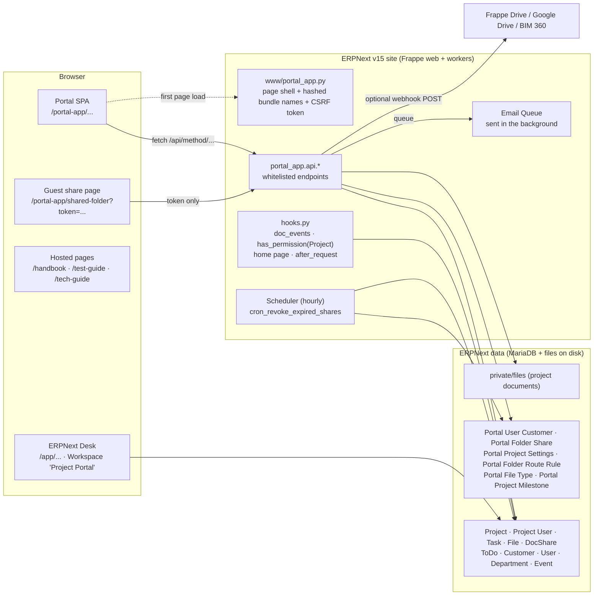

# ATA Project Portal — Technical Guide

**Knowledge-transfer document for the next maintainer of `portal_app`.**

Last updated: 1 October 2026

This guide is for the person who will look after the ATA Project Portal next: someone in ATA IT, or a new Enfono developer. It assumes you know basic ERPNext (Desk, DocTypes, `bench`). It does not assume you know this app.

The English is kept simple on purpose. Section 0 explains the words this guide uses most. Other technical words are explained where they first appear. When the code and this guide disagree, **the code wins**. Please fix the guide when that happens.

> **Public repository.** This repository is public on GitHub. Never add passwords, API keys, tokens, server addresses, SSH details, site_config secrets, test-login credentials, real people's names or emails, or real client names to this file or any other file in the repo. Use neutral examples such as `client@example.com`, "Customer A" and `PROJ-0001`.

> **Other guides.** `USER_GUIDE.md` and `DOCUMENTATION.md` were rewritten together with this guide on 30 September 2026. When this guide was last checked, `TESTING.md`, `docs/UAT_TEST_GUIDE.md` and the tester page `/test-guide` still had some out-of-date statements (see [13.4](#134-documentation-that-is-out-of-date)). Where any guide disagrees with the code, the code wins.

> **Hosted HTML copies.** Two guides also exist as hand-written web pages. Nothing generates them, so keep them in step by hand.
>
> - `/tech-guide` (`portal_app/www/tech-guide.html`) is a copy of **this** file. When you change this file, make the same change there in the same pull request, then deploy (10.1).
> - `/handbook` (`portal_app/www/handbook.html`) is the hosted copy of `USER_GUIDE.md`. When you change either, make the same change in the other in the same pull request.

How to read code references: `files.py:514` means "file `portal_app/api/files.py`, around line 514, at the time of writing". Line numbers move. Search for the function name if a line number is wrong. A bare number such as 5.10 means section 5.10 of this guide.

---

## Contents

- [0. Words used in this guide](#0-words-used-in-this-guide)
- [1. Big picture](#1-big-picture)
- [2. Repository map](#2-repository-map)
- [3. How the app plugs into ERPNext](#3-how-the-app-plugs-into-erpnext)
- [4. Custom DocTypes](#4-custom-doctypes)
- [5. Access and security model](#5-access-and-security-model)
- [6. Backend reference, module by module](#6-backend-reference-module-by-module)
- [7. Emails](#7-emails)
- [8. Frontend (the Vue app)](#8-frontend-the-vue-app)
- [9. Configuration](#9-configuration)
- [10. Operations runbook](#10-operations-runbook)
- [11. Testing](#11-testing)
- [12. Change log of recent work](#12-change-log-of-recent-work)
- [13. Known limitations, open items and ideas](#13-known-limitations-open-items-and-ideas)

---

## 0. Words used in this guide

| Word | What it means here |
|---|---|
| **DocType** | A table plus its form in ERPNext. Example: `Project`, `Task`, `File`. Each record in it is a "document". |
| **Single DocType** | A DocType that has only one record, used for settings. Example: `Portal Project Settings`. |
| **Child table** | A DocType whose rows live inside another document. Example: `Project User` rows inside a `Project`. |
| **Custom Field** | An extra field added to a core DocType (such as `Project`) without editing ERPNext's code. |
| **Property Setter** | A saved change to one property of a core DocType or field (for example "max attachments = 0"). |
| **Desk** | ERPNext's normal back-office interface at `/app/...`. |
| **Portal / SPA** | This app's own web interface at `/portal-app/...`. SPA = "single-page application": one web page that swaps screens without reloading. |
| **Endpoint / whitelisted method** | A Python function marked `@frappe.whitelist()`. The browser calls it at `/api/method/<dotted.path>`. Anyone who can reach the site can call it (most need a login), so each one must check who is calling. |
| **Gate** | A check at the top of an endpoint that throws an error when the caller is not allowed (the `helper.assert_*` functions). |
| **Hook** | A line in `hooks.py` that tells Frappe "when X happens, also run this function". |
| **Controller** | The `.py` file next to a DocType's JSON. Its methods (`validate`, `after_insert`, `on_trash`) run when a record is saved, inserted or deleted. |
| **Patch** | A one-time data migration script that `bench migrate` runs once per site. |
| **Fixture** | A record exported to JSON inside the app, re-imported on every `bench migrate`. |
| **Force import** | The fixture overwrites the record in the database on every migrate, even if someone edited it in Desk. |
| **Field types** | Data = short text. Link = points to one record of another DocType. Select = one value from a fixed list. Check = tick box. Table = child table. Date / Datetime = a date / a date and time. |
| **permlevel (permission level)** | A number on a field. Level 0 follows the document's normal permissions. Level 1 or higher needs its own role rule, so a user who may edit the document still cannot edit that field. |
| **DocPerm** | One row of a DocType's role permissions, for example "role X may read and write this DocType". |
| **Scheduler / worker** | Background processes of the site. The scheduler starts timed jobs (like the hourly share clean-up). Workers run queued jobs and send queued emails. |
| **Webhook** | A web address that the portal sends data to (an HTTP POST). Here: a copy of an uploaded file for an external drive. |
| **Allow-list** | A fixed list of accepted values. Anything else is refused. |
| **Multipart (form data)** | The format a browser uses to send files in a POST request. Upload endpoints read the file and the other fields from it. |
| **Fail closed** | If something needed is missing (for example a signing key), the code refuses instead of allowing. |
| **Stock** | As shipped, with no changes. "Stock ERPNext permissions" means ERPNext's standard role permissions. It has nothing to do with the Stock (inventory) module. |
| **Bundle / chunk** | The built JavaScript files of the Vue app. The entry bundle loads first. Chunks load later, only when a screen needs them ("lazy-loaded"). |
| **System User / Website User** | Frappe's two kinds of login. A System User can open Desk. A Website User cannot; client contacts are Website Users. |
| **DocShare** | Frappe's per-document sharing record: "user X may read (or write) document Y". |
| **Guest link** | A signed "anyone with the link" address to a folder (`/portal-app/shared-folder?token=...`), stored as a Portal Folder Share row of kind Link. |
| **Desk share** | A DocShare made in Desk (or by Frappe), not by the portal. The Shared with me page labels it "ERPNext share". |
| **ToDo / Assign To** | Frappe's assignment feature. "Assign To" on a document creates an open `ToDo` for the person. |
| **Info comment** | A short system note on a record's timeline (Comment type Info), for example "Customer portal access granted". |
| **CSRF token** | A secret per-session value the browser must send with every change request (POST). It stops other websites from making changes in the user's name. |
| **Staff** | In this code: a user with **System Manager** or **Projects Manager**. Only these two. |
| **Internal user** | Any ATA login that can use the portal and is not a client contact. Staff are internal users too. |
| **Team user** | An internal user who is **not** staff (usually a Projects User or a project-team member). The section 5 tables use this meaning. |
| **Portal user** | Any login that passes `user_can_use_portal()`: staff, team users and client contacts. Other logins are logged out of the portal. "Portal users" in the section 6 tables includes client contacts. |
| **Client contact / client login** | The person / their User record: a login with the **Portal Customer** role and no staff role. They belong to one or more ERPNext Customers. The screens call them "customer portal users" (the "Customer portal users" card, the "Invite customer user" button). This guide says **client contact** for the person and **client login** for the User record. In short text this guide also says **client** for a client contact. |
| **Project team** | The `Project User` rows (the "Users" table) on an ERPNext Project. Being on the team gives the right to *change* the project. The portal never puts a client contact on a project team: Save team refuses them, and the ToDo hook ignores a Desk Assign To for them. The Users table on the Desk Project form is not checked, so never add client logins there (10.9). |
| **Team (Department)** | An ERPNext `Department` shown on the Teams page and used to group the Gantt chart. It is not the same as a project team, and it gives no project access. |
| **Gantt team** | The Project field `portal_team`: the one Team (Department) a project is grouped under on the Gantt chart. The Project page card is "Portal Team (Gantt grouping)". It gives no access. |
| **Lead Architect** | The Project field `portal_project_manager`. The portal shows it as "Lead Architect" and Desk shows it as "Portal Project Manager". It names one person per project. It is **not** the Projects Manager role. This guide always says "Lead Architect". |
| **Handbook** | The public page `/handbook`, the hosted user guide. `/user-guide` redirects to it. `USER_GUIDE.md` is the separate, longer user guide file in the repo. |
| **Value** | A project's money figure, `Project.estimated_costing`. Shown only to some managers. |
| **Value-visible** | A project whose value the current user may see (5.5). |
| **Files hub** | The page `/portal-app/files` (sidebar "Files", `Files.vue`). |
| **Shared with me page** | The page `/portal-app/shared-with-me` (sidebar "Shared", `SharedWithMe.vue`): things shared with the current user. |
| **Manage shares page** | The page `/portal-app/manage-shares` (sidebar "Shares", `ManageShares.vue`): shares on projects the user manages. |
| **Super Admin / Team Manager** | Options on the Admin page's "Create portal user" form. Super Admin adds the System Manager role. Team Manager makes the new user the team lead of one team. |
| **Kanban / Gantt** | A board of cards in stage columns / a timeline chart of project dates. |
| **UAT** | User acceptance testing: the client's own test before go-live. |
| **SMTP** | The protocol used to send email. The Email Account holds the SMTP server settings. |
| **LIKE** | A SQL text match. `%` means "anything". |
| **Regex** | A text pattern used to match names. |
| **nvm** | Node Version Manager. `nvm use 22` switches the shell to Node 22. |
| **supervisor** | The Linux service that keeps the bench web and worker processes running on a production server. |
| **Gitignored** | Listed in `.gitignore`, so git never commits it. |

---

## 1. Big picture

### 1.1 What the portal is

The ATA Project Portal is a custom Frappe app called **`portal_app`** (app title "Portal App"; the `/apps` tile and the module are called "Project Portal"). It runs on an **ERPNext v15** site. It needs ERPNext (`hooks.py`: `required_apps = ["erpnext"]`).

It does not replace ERPNext. It adds a modern web interface on top of ERPNext's own records:

- A **project** is a normal ERPNext `Project`.
- A **document** is a normal ERPNext `File`, attached to that Project, stored in the File Manager folder `Home/Attachments/<project id>/...`. This folder tree exists only in the database (5.7).
- A **team member** of a project is a `Project User` row on the Project. It is kept in step with Desk's "Assign To" (except for client contacts, whom the ToDo hook ignores, 3.3).
- A **team** (for the Teams page and Gantt grouping) is an ERPNext `Department`.
- A **client company** is an ERPNext `Customer`.
- A **client login** is a Website User with the custom role **Portal Customer**. The app's own DocType **Portal User Customer** says which customers that login may see.
- **Sharing** uses Frappe `DocShare` records, with the app's **Portal Folder Share** DocType on top for audit, expiry and guest links.

The main rule behind all of it is **"read wide, write narrow"**. Internal users can *see* every project. They can *change* only the projects whose team they are on, unless they are staff (System Manager or Projects Manager). Money is gated separately. Client contacts see only their own company's projects, and only the client folder inside them.

### 1.2 What runs where

| Surface | Address | Who can open it | Made of |
|---|---|---|---|
| Portal app (SPA) | `/portal-app` and every `/portal-app/<sub-route>` | Any logged-in portal user. Screens differ by role. | `frontend/src` (Vue 3), built to `portal_app/public/frontend`, served by `portal_app/www/portal_app.py` + `portal_app.html` |
| Portal sign-in | `/portal-app/login` | Anyone | Part of the SPA (`Login.vue`) |
| Guest share page | `/portal-app/shared-folder?token=...` | Anyone holding a valid guest link, no login | Part of the SPA (`SharedFolder.vue`) + guest endpoints in `files.py` |
| Public handbook | `/handbook` | Everyone, no login | `portal_app/www/handbook.html` + `handbook.py` |
| Old guide address | `/user-guide` | Everyone | Redirects to `/handbook` (`user_guide.py`) |
| UAT tester guide | `/test-guide` | System Manager only | `portal_app/www/test-guide.html` + `test_guide.py` |
| Technical guide page | `/tech-guide` | Logged-in System Manager only. The login protects only the rendered page. The template is in this public repository and has the same content as this guide, so treat it as public. | `portal_app/www/tech-guide.html` + `tech_guide.py` (Guest → login redirect; non-System-Manager → 403) |
| Desk workspace | `/app/project-portal` | Desk users | Fixture `portal_app/fixtures/workspace.json` |
| Desk page | `/app/portal_app` | Any Desk user | Page `portal_app` (loads the same SPA inside Desk) |
| Apps screen tile | `/apps` → "Project Portal" | Every Desk user | `hooks.py` `add_to_apps_screen` |
| Hourly job | (background) | — | `files.cron_revoke_expired_shares` |
| Email sending | (background) | — | Frappe's Email Queue, sent by the scheduler and workers |

### 1.3 Architecture diagram


```mermaid
flowchart LR
    subgraph Browser
        SPA["Portal SPA<br/>/portal-app/..."]
        GuestPage["Guest share page<br/>/portal-app/shared-folder?token=..."]
        Hosted["Hosted pages<br/>/handbook · /test-guide · /tech-guide"]
        DeskUI["ERPNext Desk<br/>/app/... · Workspace 'Project Portal'"]
    end

    subgraph Site["ERPNext v15 site (Frappe web + workers)"]
        Shell["www/portal_app.py<br/>page shell + hashed bundle names + CSRF token"]
        API["portal_app.api.*<br/>whitelisted endpoints"]
        Hooks["hooks.py<br/>doc_events · has_permission(Project)<br/>home page · after_request"]
        Cron["Scheduler (hourly)<br/>cron_revoke_expired_shares"]
        Mail["Email Queue<br/>sent in the background"]
    end

    subgraph Data["ERPNext data (MariaDB + files on disk)"]
        Core["Project · Project User · Task · File · DocShare<br/>ToDo · Customer · User · Department · Event"]
        Own["Portal User Customer · Portal Folder Share<br/>Portal Project Settings · Portal Folder Route Rule<br/>Portal File Type · Portal Project Milestone"]
        Disk["private/files (project documents)"]
    end

    SPA -- "fetch /api/method/..." --> API
    GuestPage -- "token only" --> API
    SPA -. "first page load" .-> Shell
    DeskUI --> Core
    API --> Core
    API --> Own
    API --> Disk
    API -- "queue" --> Mail
    Hooks --> Core
    Cron --> Own
    Cron --> Core
    API -- "optional webhook POST" --> Ext["Frappe Drive / Google Drive / BIM 360"]
```

### 1.4 What happens when someone opens the portal

1. The browser asks for `/portal-app/projects` (for example).
2. `hooks.py` `website_route_rules` send every `/portal-app...` address to the www page `portal_app`.
3. `www/portal_app.py` reads the current bundle file names from the built `index.html`, adds the session's CSRF token as `window.csrf_token`, and returns a small HTML page. The `after_request` hook marks this HTML "never cache".
4. The Vue app starts. The router calls `portal_app.api.auth.get_logged_user`. If nobody is logged in, it opens the sign-in screen (`/portal-app/login`).
5. The layout calls `portal_app.api.projects.get_capabilities`. The answer ("capabilities") says what this person may do. The menu and buttons use it.
6. Each screen calls endpoints such as `portal_app.api.projects.list_projects`.
7. Every endpoint checks access itself, in one of two ways:
   - Most endpoints first call a `helper.assert_*` gate. The internal working tools (Tasks, Kanban, Calendar, Gantt, Daily Task, AI Chat) call `helper.assert_not_customer_only()`, which refuses client contacts.
   - List and search endpoints (for example `list_projects`, `global_search`) have no gate, or refuse only Guest. They return only projects and tasks from `get_allowed_project_names()`, which is empty for anyone without portal access. `global_search` returns no tasks to client contacts. It also returns up to 5 teams (Departments), which are not tied to projects ([6.14](#614-portal_appapisearch)).

   After the check, most endpoints read or write ERPNext records with `ignore_permissions=True`.

> **Why `ignore_permissions`?** ERPNext's stock permissions do not match the portal's rules. For example, a stock Projects User may write every Project in Desk, but the portal only lets them change projects they are on the team of. So the portal does its own check first, then writes. **Never add an endpoint that writes without calling a `helper.assert_*` gate first.**

---

## 2. Repository map

```
ATA-Custom/                         (repo root = the Frappe app folder "portal_app")
├── README.md                       install/update steps and doc index, license
├── DEVELOPER_GUIDE.md              this file
├── USER_GUIDE.md                   complete end-user guide (staff and clients)
├── DOCUMENTATION.md                start-here overview, feature list, which guide to read
├── TESTING.md                      plain-language walkthrough of every screen
├── docs/UAT_TEST_GUIDE.md          older UAT script (pinned to an old build)
├── package.json                    root "build"/"postinstall" scripts → build the frontend
├── pyproject.toml                  Python package (flit), python >= 3.10, ruff config
├── license.txt                     AGPL-3.0
├── frontend/                       Vue 3 source (see section 8)
└── portal_app/                     the Python package
    ├── __init__.py                 version string
    ├── hooks.py                    every integration point with Frappe (section 3.3)
    ├── install.py                  custom fields, role, property setter, seed data (3.2)
    ├── patches.txt + patches/      five one-time data migrations (3.4)
    ├── modules.txt                 one module: "Project Portal"
    ├── utils.py                    after_request hook: no-cache header for /portal-app HTML
    ├── demo_seed.py                older command-line demo seed (bench execute only)
    ├── api/                        all whitelisted endpoints (section 6)
    │   ├── helper.py               access rules used by everything (section 5)
    │   ├── auth.py                 session check, portal-access check, CSRF token
    │   ├── public.py               login-page branding, bundle names for the Desk page
    │   ├── projects.py             projects, tasks, calendar, team, customers, client logins,
    │   │                           milestones, folder template, capabilities
    │   ├── files.py                folders, uploads, downloads, sharing, guest links,
    │   │                           routing rules, hourly expiry job
    │   ├── teams.py                Teams / Org Chart (Departments)
    │   ├── portal_admin.py         Admin page: create users, demo seed runs
    │   ├── profile.py              own profile, own password, notifications
    │   ├── dashboard.py            manager dashboard
    │   ├── gantt.py                Gantt chart data
    │   ├── daily_task.py           personal reminders (Event records)
    │   ├── contracts.py            manager-only contract files
    │   ├── ai_chat.py              rule-based Q&A (no AI model)
    │   └── search.py               header global search
    ├── project_portal/
    │   ├── doctype/                the app's nine DocTypes (section 4)
    │   └── page/portal_app/        Desk page that loads the SPA inside Desk
    ├── fixtures/workspace.json     Desk Workspace "Project Portal"
    ├── www/                        hosted pages
    │   ├── portal_app.py/.html     the SPA shell for /portal-app
    │   ├── handbook.py/.html       public handbook /handbook
    │   ├── user_guide.py/user-guide.html   redirect to /handbook
    │   ├── test_guide.py/test-guide.html   tester guide, System Manager only
    │   └── tech_guide.py/tech-guide.html   technical guide, System Manager only
    ├── public/
    │   ├── ama-logo.png            logo used by the /apps tile
    │   ├── images/handbook/        drawn SVG figures for /handbook (not screenshots)
    │   └── frontend/               BUILT SPA — generated by `yarn build`, gitignored
    ├── templates/pages/            empty package
    ├── config/                     empty package
    ├── scripts/                    one-off import/repair scripts (bench execute only)
    └── tests/                      automated tests (section 11)
```

> **Warning — `portal_app/scripts/`.** One-off import and repair scripts, run once with `bench execute`. Do not copy anything from them into docs, tests or examples, and do not add data files like them. Do not re-run them without reading them first and taking a backup (see [10.9](#109-data-fixes-to-avoid)). The same "never copy" rule applies to the demo project lists (`DEMO_PROJECTS`) in `demo_seed.py` and `portal_demo_seed_run.py` (see [4.8](#48-portal-demo-seed-run-and-portal-demo-seed-item)).

---

## 3. How the app plugs into ERPNext

### 3.1 Core DocTypes the app uses

| ERPNext/Frappe DocType | What the portal uses it for | Portal reads / writes |
|---|---|---|
| `Project` | Every project. Custom fields add code, manager, stage, phase, office, team, milestones, server links. | Read + write |
| `Project User` (child "users") | The project team. Being a row here grants the right to change the project. | Read + write |
| `Task` | Tasks page, Calendar, Dashboard, project task list. | Read + create + update |
| `Comment` | Task comments (`comment_type = Comment`, reference Task). Also Info comments on User when client access changes. | Read + create |
| `ToDo` (Assign To) | Kept in step with project teams. Also stores team membership on Departments, and the assignee of a task made with Tasks → New task. | Read + create + cancel |
| `DocShare` | Read grants for shares, and pre-shares for new team members and new task assignees. The portal never gives a client contact a Project DocShare (5.10). | Create + delete |
| `Customer` | The client company linked to a project. Can be created from the portal. | Read + create |
| `Selling Settings`, `Customer Group`, `Territory` | Defaults for customers created in the portal. | Read |
| `User`, `Has Role`, `Role` | Staff and client logins. Client logins are Website Users. | Read + create + update |
| `Contact` | Frappe creates one automatically (a queued job) for every new User, client logins included, unless a Contact with that email already exists. It is **not** linked to the ERPNext Customer, and the portal never reads it. Client access comes only from Portal User Customer rows (5.9). | Created by Frappe |
| `Department` | Teams (with custom fields `portal_office`, `portal_team_lead`). | Read + create + update |
| `Employee` | Only the sidebar "ATA Teams" headcount. | Read |
| `User Group`, `User Group Member` | Add a whole group to a team. | Read |
| `Event` | Daily Task reminders (custom fields `is_portal_daily_task`, `portal_assigned_to`). | Read + write |
| `File` | Project folders and documents; contract files. | Read + write |
| `Tag` / `File._user_tags` | Tag "Client Upload" on files uploaded by clients. | Write |
| `Notification Log` | Header bell. | Read + mark read |
| `Email Queue`, `Email Account` | All portal emails are queued; an outgoing account must exist. | Write (queue) |
| `System Settings` | Password policy; reset/welcome link expiry. | Read |
| `Company` | Default company for new projects and teams. | Read |
| `Page`, `Workspace`, `Scheduled Job Type`, `Patch Log`, `Error Log` | Desk page, workspace fixture, hourly job, patch tracking, error logging. | Framework |

### 3.2 What `install.py` creates

`hooks.py` runs **the same seven steps** in `after_install` (when the app is installed) and `after_migrate` (after **every** `bench migrate`):

1. `ensure_department_portal_custom_fields`
2. `ensure_project_portal_custom_fields`
3. `ensure_portal_customer_access` (role + User field)
4. `lift_project_attachment_limit`
5. `ensure_daily_task_custom_fields`
6. `ensure_portal_file_type_field`
7. `seed_default_portal_file_types`

Custom fields are created with `create_custom_fields(..., update=True)`.

> **Warning.** Because of `update=True`, every property that `install.py` sets for a field is **silently put back on the next migrate**: fieldtype, label, options, `insert_after` (position), description, default, `in_list_view` / `hidden` where given, and `read_only` + `permlevel` on `User.portal_linked_customer`. Other properties you change in Desk (for example "mandatory") are kept. To change a property that `install.py` sets, edit `install.py` and migrate.

**Custom fields**

| DocType | Field | Type | Purpose |
|---|---|---|---|
| Project | `portal_project_code` | Data | ATA project number (for example `26nn`, `CB-nn`, `ATA-xxxx`). Searched in the portal. |
| Project | `portal_project_manager` | Link User | "Lead Architect" (Desk label "Portal Project Manager"). Controls money visibility for a Projects Manager, who may save the team, and who may set the Gantt team. It does **not** give edit rights by itself. |
| Project | `portal_kanban_stage` | Select: Planning / Active / On Hold / Review / Done (default Planning) | Kanban column. Shown in list view. Independent of the ERPNext `status`: moving a card to Done does not complete the Project, and completing it does not move the card. |
| Project | `portal_office` | Data | Office label (shown as "Assignee" in the Projects table header). |
| Project | `portal_phase` | Select: blank / Schematic Design / CD / CD+ / DD / TD / FC / Construction | Design phase. |
| Project | `portal_project_server` | Data | Server note. |
| Project | `portal_upcoming_milestone`, `portal_milestone_date` | Data, Date | Summary of the next milestone. Recalculated only by the portal's milestone endpoints (see 4.5). |
| Project | `portal_milestones` | Table → Portal Project Milestone | Any number of dated milestones. |
| Project | `portal_server_t` | Data | "T-Server (Google Drive)" link. |
| Project | `portal_server_a` | Data | "A-Server (Autodesk)" link. |
| Project | `portal_server_c` | Data | "ERP Server — Client link". |
| Project | `portal_team` | Link Department | The Gantt team (section 0): groups the project on the Gantt chart. |
| Department | `portal_office` | Data | Office tag. **A team must have an office to appear in the portal.** |
| Department | `portal_team_lead` | Link User | Team lead. Can manage that one team. |
| User | `portal_linked_customer` | Link Customer, **read_only, permlevel 1** | Display only: the login's first customer. Grants nothing (see [5.9](#59-client-access-comes-only-from-portal-user-customer)). |
| Event | `is_portal_daily_task` | Check, hidden, default 0 | Marks an Event as a Daily Task reminder. |
| Event | `portal_assigned_to` | Link User | Whose board the reminder is on. |
| File | `portal_file_type` | Link Portal File Type | File-type tag chosen on upload. |

**Other records**

| Record | Created by | Purpose |
|---|---|---|
| Role **Portal Customer** (`desk_access = 0`, custom) | `ensure_portal_customer_access` (also created on demand by `helper.ensure_portal_customer_role`) | Client-contact role. |
| Property Setter `Project.max_attachments = 0` | `lift_project_attachment_limit` | ERPNext allows only 4 attachments per Project by default. This removes the limit. Uploads also bypass the check at runtime (`files._bypass_max_attachments`) in case migrate has not run. |
| 10 Portal File Types | `seed_default_portal_file_types` | AutoCAD, PDF Document, GAD File, Document, Spreadsheet, Presentation, Image, 3D Model, Archive, Other. Insert-only: existing rows are never overwritten, but a deleted default comes back on the next migrate. |

### 3.3 `hooks.py`, entry by entry

| Hook | Value | What it does |
|---|---|---|
| `app_name`, `app_title`, `app_description`, `app_license` | `portal_app`, "Portal App", …, `agpl-3.0` | App identity. |
| `required_apps` | `["erpnext"]` | The app cannot be installed without ERPNext. |
| `website_route_rules` | `/portal-app/<path:app_path>` → `portal_app`; `/portal-app` → `portal_app` with `app_path = ""` | Every portal address opens the same SPA shell. The root needs its own rule because `<path:...>` does not match an empty path. |
| `fixtures` | `Workspace` where `module = Project Portal` | Ships the Desk workspace. Re-imported with force on every migrate. |
| `add_to_apps_screen` | tile "Project Portal" → `/portal-app`, logo `/assets/portal_app/ama-logo.png` | Tile on `/apps`. No permission check; access is checked when the portal loads. |
| `get_website_user_home_page` | `helper.get_website_user_home_page` | After Frappe's own `/login` or set-password page, a client contact goes to `/portal-app` instead of `/me` (the hook returns the route without the leading slash, `portal-app`, as Frappe expects). Returns `None` for everyone else. |
| `after_install`, `after_migrate` | `install.after_install`, `install.after_migrate` | The seven setup steps in 3.2. |
| `has_permission` | `{"Project": "helper.project_has_permission"}` | Extra deny-only check on Project read (see [5.6](#56-the-project-has_permission-hook)). |
| `doc_events` → `ToDo` `after_insert` / `on_update` / `on_trash` | `projects.sync_project_access_from_todo` | Desk "Assign To" on a Project adds or removes that person in the project team. Only acts when `reference_type == "Project"`. It ignores client contacts, so they never join a project team this way. |
| `doc_events` → `User` `on_trash` | `helper.delete_portal_user_customer_rows` | Deleting a User removes its Portal User Customer rows first, so the delete is not blocked by links. This is a direct database delete, so the Portal User Customer `on_trash` logic (share revocation, Info comment) does not run. Frappe then deletes the user's DocShares itself. Frappe still refuses the delete while the user is named in a Portal Folder Share row, a project team, a Lead Architect or a team-lead field. Disable users instead (10.13). |
| `doc_events` → `User` `on_update` | `helper.drop_customer_rows_without_role` | If the saved User no longer has the Portal Customer role, delete all its Portal User Customer rows (one by one, so their `on_trash` revokes shares). |
| `doc_events` → `Customer` `on_trash` | `helper.delete_portal_user_customer_rows` | Deleting a Customer removes its rows first (the same direct delete). A Customer that is still set on any Project cannot be deleted (Frappe link check). |
| `scheduler_events` → `hourly` | `files.cron_revoke_expired_shares` | Revokes expired shares every hour. |
| `after_request` | `utils.set_spa_no_cache` | Adds `Cache-Control: no-store` (plus `Pragma`, `Expires`) to HTML responses under `/portal-app` only. Never raises. |

> Changing `hooks.py` needs `bench --site <site> clear-cache` and a restart of web and worker processes. Frappe caches hooks; a pull alone is not enough.

### 3.4 Patches

`patches.txt` has an empty `[pre_model_sync]` section. `[post_model_sync]` lists, in this order:

| Patch | What it does | Notes |
|---|---|---|
| `add_project_portal_fields` | Calls `ensure_project_portal_custom_fields`, commits. | Historic. `after_migrate` does the same every time. |
| `add_portal_customer_access` | Calls `ensure_portal_customer_access`, commits. | Historic. |
| `make_project_files_private` | Finds `File` rows attached to a Project that are public and not folders. Sets `is_private = 1` and saves each one, so Frappe moves the bytes to `private/files` and rewrites `file_url`. Failures go to the Error Log. | Ran once. Files made public later are **not** fixed by it. |
| `backfill_portal_user_customer` | For every User with `portal_linked_customer` set, creates a Portal User Customer row if the Customer exists and no row exists yet. | Needed when the multi-customer model arrived (PR #17). |
| `remove_client_project_docshares` | For every User that holds the Portal Customer role and is a client contact (`helper.is_customer_only`, so staff are skipped), deletes every DocShare on a **Project** held by that user, Desk shares included. File DocShares are kept. | Added in the October 2026 bug-fix release. Older folder/file shares and team saves gave recipients a read share on the Project, which opened the whole Project record to a client. Shared files do not need it. Safe to run twice. |

Frappe records each patch in **Patch Log**, so it runs at most once per site. On a fresh `install-app`, every existing patch is marked as done without running; only patches added later run on that site. (So on a new site `backfill_portal_user_customer` never runs; `after_install` and `after_migrate` do the setup work.) To add a patch: create `portal_app/patches/<name>.py` with an `execute()` function, add its dotted path to the end of `patches.txt`, and make it safe to run on any site (check before you change).

### 3.5 What `bench migrate` does for this app

In Frappe v15 order:

1. Pre-model-sync patches (none for this app).
2. DocType JSON sync — the nine app DocTypes are created or updated.
3. Post-model-sync patches — the five patches above, each once.
4. Scheduled jobs sync — registers the hourly `cron_revoke_expired_shares`.
5. Fixtures sync — re-imports the "Project Portal" Workspace with force. **Desk edits to that workspace are lost.**
6. `after_migrate` — the seven setup steps (custom fields put back, role, property setter, file types).
7. Website cache is cleared.

> A patch runs **before** `after_migrate`. On a brand-new site, a patch must not assume a custom field from `after_migrate` already exists.

### 3.6 ERPNext behaviour that changes what the portal does

These come from ERPNext itself, not portal code, and often surprise people:

- **`Project.validate`** runs every time the portal saves a Project. It does three things:
  - **Progress** — recalculates `percent_complete` from the tasks. Projects made in the portal keep the default "% Complete Method", "Task Completion".
  - **Status** — sets `status` to Completed at 100 %, otherwise Open.
  - **Emails** — sends a **"Project Collaboration Invitation"** to each `Project User` row whose `welcome_email_sent` is 0.

  When the method is **Manual**, Progress and Status are skipped. The only exception: a Completed project is set to 100 %. Status is also skipped when the status is Cancelled. ERPNext switches a project to Manual by itself when a project with **no tasks** is marked Completed.
- **ERPNext `Project.status` allows only Open, Completed and Cancelled.** The portal's Edit modal also offers "In Progress" and "On Hold" (portal-only statuses). `update_project` handles them like this:
  - **a.** Just before the save, a portal-only status on the document is set to Open, so Frappe's check of allowed Select values passes. On any method other than Manual (portal projects default to Task Completion), the Status step then sets Open or Completed.
  - **b.** After the save, the portal writes the chosen value with `frappe.db.set_value`.
  - **c.** An `update_project` call that sends **no** status keeps a stored portal-only status the same way. This covers an Edit Project save that does not change Status (the modal sends only changed fields), the Portal Team (Gantt grouping) card and Assign Architect.
  - **d.** Every other save resets it: Rename, a Kanban move, milestones, Save team, the Customer card, a save in Desk, a Desk Assign To or unassign on the project that changes the team (the ToDo hook then saves the Project, 3.3), and any change to one of the project's tasks (see "Task changes rewrite the Project too" below).

  The requested status is re-applied with `db.set_value` whenever the status after the save differs from it (changed by `Project.validate`, or set to Open by step a), unless it is Cancelled. So "Completed" chosen on a project whose tasks are not all done also sticks, and so does "Open" on a project at 100 %, until a save from step d. When no status is sent and the stored status is Open or Completed, ERPNext decides as usual (100 % still completes the project).

  **On a Manual-method project** the Status step is skipped. Edit Project still works: step a lets the save pass, and step b writes the chosen status back. The other portal saves in step d, and saves in Desk, do not have step a, so while the stored status is "On Hold" or "In Progress" they fail with an error like 'Status cannot be "On Hold"'. There the ToDo hook's save also fails; it is only logged as "sync_project_access_from_todo failed" and the team is not changed. Task changes do not fail there: they leave a Manual project's status alone.
- **`Task.validate`** refuses task dates after the project's Expected End Date. Setting a task to Completed forces progress to 100 and closes its assignments.
- **Task changes rewrite the Project too.** `Task.on_update` and `Task.after_delete` call `Project.update_project()`. That runs `update_percent_complete()` and `update_costing()` and writes the result with `db_update()`. It does not run `Project.validate`, so no invitation emails are sent. What this means:
  - Creating, editing or deleting any task recalculates the project's progress. This covers the portal New task, the Tasks page Save, and task changes in Desk.
  - The project's status becomes Completed at 100 % and Open otherwise. A portal-only "On Hold" or "In Progress" status (see the status point above) is lost at that moment.
  - A Completed project goes back to Open when a new open task is added.
  - The exceptions are the same as for `Project.validate`: on a Manual-method project nothing changes (a Completed one stays at 100 %), and a Cancelled project keeps its status.
- **The project title must be unique.** ERPNext's `Project.project_name` is a unique field. "New project" and "Rename project" with a title that another project already uses fail with Frappe's duplicate error. The portal does not check first. Use a different title (for example, add the project code). The project ID (`PROJ-####`) is separate and never changes.
- **Every file adds a line to the Project timeline.** Frappe's `File.after_insert` adds an "Attachment" comment (file name and link) to the Project, and `File.on_trash` adds "Attachment Removed". So every portal upload appears on the Desk Project timeline: each file of an unpacked ZIP, every routed copy, every Submit to Client copy and every contract. Large ZIP imports make the timeline long.
- **`save_file`** (used for uploads) reuses stored files that have the same content:
  - It first looks up the content hash. If the same bytes are already stored with the same privacy (in any project), the new File row reuses that file's `file_name` and `file_url`.
  - So the name the user typed (or the portal's automatic name) is **ignored** and the old name shows. Example: "I uploaded X_v2.pdf but it shows X_v1.pdf".
  - If the name is taken by a file with different content, Frappe adds a 6-character hash before the extension.
  - `submit_to_client_submittal` puts its `NN_<date>_<name>` name back afterwards. `upload_project_file` does not.
  - Deleting one of the rows keeps the bytes on disk while another row still uses them.
- **`frappe.rename_doc("File", ...)`** renames a folder and re-parents its children (used by folder rename).
- **Assign To** creates Notification Log entries (and assignment emails, depending on each user's notification settings).

---

## 4. Custom DocTypes

All nine DocTypes are in module **Project Portal**, under `portal_app/project_portal/doctype/`. The portal usually writes them with `ignore_permissions=True` after its own role checks, so the Desk permissions below mainly control who can open them in Desk.

### 4.1 Portal User Customer

**Purpose:** each row says "this login may see this customer's projects". **These rows are the only thing that gives a client contact access.** One login can have several rows (several customers).

| Field | Type | Notes |
|---|---|---|
| `user` | Link User, required, indexed | The client login. |
| `customer` | Link Customer, required, indexed | The customer it may see. |

- Naming: random. Track changes: on.
- Desk permission: **System Manager only.** Projects Managers manage rows from the portal project page.
- Controller (`portal_user_customer.py`):
  - `validate` — refuses a duplicate user + customer pair.
  - `after_insert` — if `User.portal_linked_customer` is empty, sets it to this customer (display only, `update_modified=False`); adds an Info comment "Customer portal access granted: …" on the User.
  - `on_trash` — if the deleted row was the customer shown in `User.portal_linked_customer`, re-points that field to the oldest remaining row (or clears it); otherwise leaves the field alone. It also revokes this login's folder/file shares on **all** projects of this customer (`files.revoke_user_shares_on_projects`); adds an Info comment "Customer portal access removed: …".
- Created by: project page "Invite customer user" / "Add existing user", Admin page "Create portal user" (Portal Customer), the backfill patch, or by hand in Desk.

### 4.2 Portal Folder Share

**Purpose:** audit and expiry record for every share made in the portal, and the store for guest-link tokens.

| Field | Type | Notes |
|---|---|---|
| `project` | Link Project, required | |
| `folder_path` | Data, required | Full File path of the folder. For a single-file share: the File's name (a 10-character hash). |
| `folder_label` | Data | Friendly label (or the file name). |
| `share_kind` | Select User / Link, required | User = a named person. Link = "anyone with the link". |
| `user`, `user_email`, `user_full_name` | Link User, Data, Data | Recipient (kind User). |
| `share_token` | Small Text | Signed token (kind Link). |
| `share_url` | Data | Full guest URL (kind Link). |
| `expires_at` | Datetime | When access ends. |
| `revoked`, `revoked_by`, `revoked_at` | Check, Link User, Datetime | Set by Revoke, by the hourly job (which leaves `revoked_by` empty), or when a login is removed from a customer (`revoke_user_shares_on_projects`, which records the remover in `revoked_by`). |
| `created_by_user` | Link User | Who made (or last re-made) the share. |
| `last_accessed_at`, `access_count` | Datetime, Int | `last_accessed_at` = time of the last guest open. `access_count` is meant to count opens, but it currently stays at 1 (see [13.1](#131-behaviour-bugs-found-by-reading-the-code)). |

- Naming: `PFS-{YYYY}-{#####}`. Track changes: on.
- Desk permission: System Manager and Projects Manager (read, write, create, delete).
- Controller: none. All logic is in `files.py`.
- The code checks whether this DocType exists. If it does not (site not migrated), sharing falls back to plain DocShare ("basic mode") and guest links do not work.

> **Always revoke from the portal.** Ticking "Revoked" or deleting a row in Desk does not remove the DocShares the share created. A guest link (kind Link) needs its row: when the row is revoked, expired or deleted, both the guest listing and the guest download refuse the link. Revoking keeps the audit record; deleting loses it.

### 4.3 Portal Project Settings (Single)

**Purpose:** one settings page for the whole portal. Desk: System Manager only. Field list in [9.1](#91-portal-project-settings).

### 4.4 Portal Folder Template Row (child of Portal Project Settings)

| Field | Type | Notes |
|---|---|---|
| `folder_name` | Data, required ("Subfolder name") | A folder path. `/` means nesting, for example `01-DOCUMENTS/01-CLIENT DATA/02-TITLE DEED`. |

Edited from the portal File tools page (template editors, see 5.1), the Admin page import, or Desk.

### 4.5 Portal Project Milestone (child of Project)

| Field | Type | Notes |
|---|---|---|
| `title` | Data, required ("Milestone") | |
| `milestone_date` | Date, required | |

Linked from the Project custom field `portal_milestones`. Written by `projects.add_project_milestone` / `delete_project_milestone`, shown on the Gantt chart as red flags.

The Projects table's "Upcoming Milestone" column reads the summary fields `portal_upcoming_milestone` / `portal_milestone_date`. `_resync_upcoming_milestone_summary` recalculates them **only** inside `add_project_milestone` / `delete_project_milestone`. Editing the Portal Milestones table in Desk, or a milestone date passing, does not refresh them. Add and remove milestones in the portal (Gantt → flag icon), or refresh one project from the console:

```python
from portal_app.api.projects import _resync_upcoming_milestone_summary
_resync_upcoming_milestone_summary(frappe.get_doc("Project", "PROJ-0001")); frappe.db.commit()
```

### 4.6 Portal File Type

| Field | Type | Notes |
|---|---|---|
| `type_name` | Data, required | Also the record name (`autoname: field:type_name`). |
| `extensions` | Data | Comma-separated, for example `.dwg,.dxf`. Used to pre-select the type on upload. |
| `description` | Small Text | |

Desk permission: System Manager full; Projects Manager and Projects User read.

### 4.7 Portal Folder Route Rule

**Purpose:** "also copy uploads to another folder" rules.

| Field | Type | Notes |
|---|---|---|
| `enabled` | Check, default 1 | |
| `rule_name` | Data, required | |
| `rule_type` | Select Cross-route / Mirror, default Cross-route | Mirror = copy everything from a source folder area into a parallel area. Cross-route = copy files of one classification into a target folder. |
| `file_classification` | Select | Presentation Files, Drawing / Layout Files, 3D Model Files, Feasibility / Area Calculation Files, Editable Design Source Files, Rendering / Image Files, Submission Files, Uncategorized. Required for Cross-route rules saved from the portal Routing rules page (`save_folder_route_rule`). The DocType itself does not enforce it, so a save in Desk can leave it blank. The upload panel never matches a Cross-route rule with a blank classification. |
| `source_folder_pattern`, `source_match_mode` | Data (required), Select contains / starts_with / exact | |
| `target_folder_pattern`, `target_match_mode` | Data (required), Select contains / starts_with / exact | |
| `notes` | Small Text | Wiped when a rule is saved from the portal (the portal does not send it). |

Desk permission: System Manager full; Projects Manager read. Controller: empty.

> Rules are applied **in the browser**, only by the upload panel on the Project page (`FileUploadPanel.vue`). The Files hub, ZIP upload, client uploads and the server never apply them. No rules are created by install or fixtures.

### 4.8 Portal Demo Seed Run and Portal Demo Seed Item

**Purpose:** create a labelled batch of demo data and remember exactly what was created, so it can be removed cleanly.

Portal Demo Seed Run (naming `DEMO-{YYYY}-{#####}`, System Manager only): `run_label`, `status` (Active / Cleaned / Failed), `run_at`, `run_by`, the switches `include_users/customers/projects/tasks/files`, `demo_password_hint`, child tables `created_users`, `created_customers`, `created_projects`, `created_tasks`, `created_files`, `summary_json`, `notes`.

Portal Demo Seed Item (child): `record_doctype`, `record_name`, `record_label`, `skipped` ("Pre-existing").

- `before_insert` creates the demo data (users, customers, projects with team rows, tasks, placeholder files) and records each record. Records that already existed are recorded with `skipped = 1`. It makes a fresh random password per run and stores it in `demo_password_hint`. On error it cleans up and fails.
- `on_trash` deletes the recorded, non-skipped records in the order files → tasks → projects → customers → users.

> **Never seed on a live client site.** Delete every run after a demo.
>
> - Seeding creates real, enabled logins (one with Projects Manager).
> - The seed creates one Portal Customer login, but no customers and no Portal User Customer row, so that login sees no projects. To demo the client view:
>   1. Set a Customer on one demo project (Project page → Customer card).
>   2. Add the demo client login under Customer portal users → Add existing user.
>
>   Deleting the run still removes the login (the User `on_trash` hook deletes its Portal User Customer rows first).
> - Saving a new run **in Desk** runs the seed at once and skips the portal's gate.
> - Placeholder files are saved public.
> - It queues ERPNext "Project Collaboration Invitation" emails to the demo addresses; they fail in Email Queue.
> - `Project.validate` resets each seeded project that is not Done to Open and recalculates its progress, so the seeded status and percent are lost (3.6).
> - `demo_seed.py` (bench only) and `portal_demo_seed_run.py` keep separate lists of demo users and projects. Changing one does not change the other.
> - `DEMO_PROJECTS` in both files uses realistic-looking project and client names. Never copy those names or codes into docs, tests, figures or screenshots. Use `PROJ-0001` / "Customer A".
> - Seeded projects get `portal_project_code = ATA-<code>`. The public `/handbook` counts `ATA-%` codes as earlier projects (and every Project in its total), so its figures are inflated until the demo data is removed.

### 4.9 Desk Page `portal_app` and Workspace "Project Portal"

- **Page `portal_app`** opens at `/app/portal_app`. It has no roles, so any Desk user can open it. When it opens:
  1. Its JS asks `portal_app.api.public.get_frontend_bundle` for the current file names.
  2. It loads the CSS and replaces the page with `<div id="app">`.
  3. It loads the app's JS files as module scripts, then restores Desk's jQuery.

  The app's router works under `/portal-app/`, so after the first click the address bar should change to `/portal-app/...` (open the page and click a menu item to check). **Use `/portal-app` as the normal way in.**
- **Workspace "Project Portal"** (fixture, public). Shortcuts: Open Portal (`/portal-app`), Project, Task, Portal Project Settings, User Guide (`/handbook`), Technical Guide (`/tech-guide`). Cards: Portal Setup (Portal Project Settings, Portal File Type, Portal User Customer, Portal Demo Seed Run), Files & Sharing (Portal Folder Share, Portal Folder Route Rule, File), Projects (Project, Task, Customer).

---

## 5. Access and security model

This is the most important section. Read it before you change any endpoint.

### 5.1 The kinds of people

| Kind | How the code recognises them | What they see | What they can change |
|---|---|---|---|
| **Staff** | Role System Manager **or** Projects Manager (`has_portal_staff_project_access`). Administrator holds every role, so it counts as staff. | Every project. | Every project. |
| **Team user** | Not staff and not a client contact, **and** either has the Projects User role or is on at least one project team (`user_can_use_portal()` and not `is_customer_only()`). | Every project (read-wide). | Only projects whose team they are on (write-narrow). |
| **Team lead** | Named in `Department.portal_team_lead`. | Their own team(s) on the Teams page. | That team's name, office and members. |
| **Folder-template editor** | System Manager, or a portal user who has the ERPNext role **Auditor** and does **not** hold the Portal Customer role. This uses the raw role check, so a Projects Manager who also holds Portal Customer is refused. | File tools page. | The company folder template. |
| **Client contact** | Role Portal Customer **and** not staff (`is_customer_only`). | Projects whose Customer is in their Portal User Customer rows. In the file lists and downloads, only `06-CLIENT SUBMITTAL` of each (plus anything staff shared with them by name). No Tasks, Kanban, Calendar, Gantt, Daily Task, AI Chat or portfolio figures, and no project team list (5.11). | In the UI: only uploading into `06-CLIENT SUBMITTAL`, plus their own profile and password. |
| **Guest** | Not logged in. | Only a folder behind a valid guest link. | Nothing. |

> **Portal Customer beats Projects User.** A login with both roles (and no staff role) is treated exactly like a client. Staff roles always win over Portal Customer.

### 5.2 Roles

| Role | Where it comes from | Portal meaning |
|---|---|---|
| System Manager | Frappe standard | Everything. Sees every project's value. Only role that can reset client passwords, reassign a Lead Architect set to someone else, and grant Super Admin. Stock User-create permission, so can invite client logins. |
| Projects Manager | ERPNext standard | Staff: manages every project, every team, customers, routing rules. Sees money only on projects where they are the Lead Architect. Can link existing client logins, cannot invite new ones unless they also have User-create permission. |
| Projects User | ERPNext standard | Team user: reads, uploads to and shares every project; changes only projects whose team they are on. |
| Portal Customer | Created by this app (`desk_access = 0`) | Client contact. |
| Auditor | ERPNext standard | Only used to allow editing the company folder template, and only together with a portal role (10.13). **Warning:** it also grants read access to many accounting reports in ERPNext. |

### 5.3 How the code decides (functions in `api/helper.py`)

| Function | Returns true when… |
|---|---|
| `has_portal_staff_project_access(user)` | The user has System Manager or Projects Manager. |
| `user_is_customer_portal_user(user)` | The user has the Portal Customer role (Administrator does too). |
| `is_customer_only(user)` | Portal Customer **and not** staff. Use this, not the one above, to decide "client". |
| `assert_not_customer_only(user)` | Throws a PermissionError "This part of the portal is for ATA staff." when `is_customer_only` is true. The gate for internal working tools: Tasks, Kanban, Calendar, Gantt, Daily Task, AI Chat, the portfolio dashboard and `ensure_project_subfolder`. Staff and team users pass. |
| `user_can_use_portal(user)` | Not Guest, and (Portal Customer, or one of System Manager / Projects Manager / Projects User, or at least one `Project User` row). |
| `get_allowed_project_names(user)` | *(returns a list)* No portal access → `[]`. Staff → every Project. Portal Customer role → Projects whose `customer` is in `get_portal_linked_customers()` (empty list → none). Everyone else → every Project. |
| `assert_portal_user()` | Throws "You do not have access to the project portal." if `user_can_use_portal` is false. Baseline gate for data endpoints. |
| `assert_project_access(project)` | Throws "No access to this project" unless the project is in the allowed list. |
| `project_member_names(user)` | *(list)* Projects where the user has a `Project User` row. |
| `can_manage_project(project)` | Staff → any allowed project. Portal Customer role → never. Otherwise → only if the user is in that project's team. **`portal_project_manager` is not consulted.** |
| `assert_manage_project(project)` | Throws "You can only change projects you are on the team of." |
| `can_manage_project_team(project)` | Staff, or the user equals `Project.portal_project_manager`. Used by "Save team". |
| `can_manage_teams()` | Staff. |
| `led_department_names(user)` / `can_manage_team(team)` | Departments where the user is `portal_team_lead` / staff or that lead. |
| `can_edit_portal_folder_template()` | System Manager, or (portal user, not Portal Customer, and has Auditor). |
| `assert_can_create_project()` | Projects Manager / System Manager, or Portal Project Settings "Allow any portal user to create projects" is ticked. Clients never. ERPNext's own Project-create permission is deliberately ignored. |
| `can_manage_customers_in_portal()` | Staff, or has Customer-create permission, or manages at least one project. Clients never. |
| `can_view_project_value(project, …)` | System Manager → yes. Projects Manager → only if they are that project's `portal_project_manager`. Everyone else → no. |
| `get_value_visible_project_names()` | *(list)* The same rule for many projects at once. |
| `get_portal_linked_customers(user)` | *(list)* Customers from Portal User Customer rows, primary first. Falls back to the old User field only if the DocType does not exist yet. |
| `assert_manage_project_team(p)` / `assert_manage_teams()` / `assert_manage_team(t)` / `assert_can_edit_portal_folder_template()` / `assert_can_manage_customers_in_portal()` | The throwing versions of the checks above. Use them as the first line of an endpoint. |
| `assert_customer_portal_can_upload(p)` | Project access, and refuses **every** client ("Customer portal users cannot upload files."). For uploads, call `files._assert_upload_allowed(project, target_folder)` instead. It allows clients into `06-CLIENT SUBMITTAL` only. |
| `get_customer_contact_users(customer)` | *(list)* Logins that have a Portal User Customer row for this customer. |
| `get_portal_linked_customer(user)` (singular) | The **display-only** User field. Used only to put the primary customer first. **Never use it for access.** |
| `kanban_fieldname()` | `portal_kanban_stage` if that field exists, else `status`. |
| `get_portal_settings_dict()` | *(dict)* Every Portal Project Settings field except the folder template table, **including the three upload webhook URLs**. Server-side use only (for example `files.upload_project_file`). Never return it to the browser. |
| `get_public_portal_settings()` | *(dict)* `get_portal_settings_dict()` minus `frappe_drive_upload_webhook`, `google_drive_upload_webhook` and `bim_360_upload_webhook` (`_SERVER_ONLY_SETTINGS`). Every endpoint that sends settings to the browser uses this one: `get_portal_workspace_settings`, `files.list_project_files` and `dashboard.get_dashboard_data` (see [9.1](#91-portal-project-settings)). |
| `ensure_portal_customer_role()`, `ensure_user_portal_linked_customer_field()` | Create the role or the User field on demand. The client-login endpoints call them, so a site that was not migrated still works. |

> **Staff first, always.** Administrator holds every role, including Portal Customer. If you test "is this a customer?" before "is this staff?", you lock the superuser out. `can_manage_project` checks staff first on purpose (fixed in commit `2f8f80b`). Follow the same order in new code, and prefer `is_customer_only()`.

### 5.4 Read wide, write narrow — who can do what

✅ = allowed on every project they can see. ❌ = refused by the server. "team" = only on projects whose team they are on.

| Action | System Manager | Projects Manager | Projects User | Client contact |
|---|---|---|---|---|
| See projects | All | All | All | Own customers' only |
| See project value (money) | All | Only where they are the Lead Architect | ❌ | ❌ |
| Create project | ✅ | ✅ | Only if "Allow any portal user to create projects" is ticked (**ships ticked**) | ❌ |
| Edit / rename / delete project, move on Kanban, link customer, add milestones, create tasks | ✅ | ✅ | team | ❌ |
| Open Tasks, Kanban, Calendar, Gantt, Daily Task, AI Chat | ✅ | ✅ | ✅ (changes still need "team" or assignee rights) | ❌ (router sends them to `/projects`; the endpoints refuse them) |
| Save the project team | ✅ | ✅ | Only as that project's Lead Architect. The Team card shows its controls only if they are also on the team (it follows `manageable_project_names`). | ❌ (the portal refuses to add them to a team) |
| Set the Gantt team (`portal_team`) | ✅ | Only as that project's Lead Architect | Only if on the team **and** that project's Lead Architect. But the team list is empty unless they lead a team (`get_teams` returns `[]` to other non-staff), so they can only clear it. In practice staff set it. | ❌ |
| Reassign the Lead Architect when it names someone else | ✅ | ❌ (may set it while blank or themselves) | ❌ (same) | ❌ |
| Upload files | ✅ | ✅ | ✅ | Only into `06-CLIENT SUBMITTAL` |
| Rename folders, delete anyone's file, revoke anyone's share | ✅ | ✅ | team | ❌ |
| Delete own uploaded file | ✅ | ✅ | ✅ | Not offered |
| Share with a person / create guest link (never a contract file) | ✅ | ✅ | ✅ | ❌ |
| Submit a file to the client (File Browser "Submit"; never a contract file) | ✅ | ✅ | team | ❌ |
| Invite a new client login | ✅ (User-create permission) | Only with User-create permission | ❌ | ❌ |
| Add an existing client login to a customer | ✅ | ✅ | ❌ | ❌ |
| Remove a client login from a customer | ✅ | ✅ | team | ❌ |
| Reset a client's password | ✅ | ❌ | ❌ | ❌ |
| Routing rules: save / delete | ✅ | ✅ | ❌ (page is visible if they manage a project) | ❌ |
| Company folder template | ✅ | Only with Auditor | Only with Auditor | ❌ |
| Contracts (page and endpoints) | ✅ | ✅ | The menu and page are staff-only. The contract endpoints use manage rights, so the server also accepts "team" ([6.12](#612-portal_appapicontracts)). Contracts cannot be shared or submitted to the client by anyone. | ❌ |
| Dashboard, Org Chart | ✅ | ✅ | ❌ | ❌ |
| Teams page | ✅ all teams | ✅ all teams | Only as a team lead, own team | ❌ |

> **Desk is different.** In Desk, stock ERPNext permissions apply. A Projects User has read, write, create, delete and share on **every** Project in Desk. "Write only your team's projects" is enforced by the portal only. The Project hook (5.6) restricts only *read* for portal roles.

### 5.5 Money (value visibility)

- Only `Project.estimated_costing` counts as "value".
- `list_projects` and `kanban_board` remove `estimated_costing` unless the project is value-visible, and remove `portal_project_manager` for non-staff.
- `project_dashboard` (used by the Project page) and `get_project` (used by the Edit Project modal to load Remarks) both remove **every Currency field** and `per_gross_margin` when the caller cannot see value. Both remove `portal_project_manager` for non-staff.
- Dashboard totals, "Top Projects by Revenue" and AI Chat budget answers use `get_value_visible_project_names()`.
- `update_project` writes `estimated_costing` only if the caller can see value, judged against the manager value being saved in the same call.
- A Projects Manager who is not the Lead Architect of any project sees no money at all.

### 5.6 The Project `has_permission` hook

`hooks.has_permission["Project"] = helper.project_has_permission`.

- It runs on Frappe permission checks for Project, for `read` and `select` only.
- It does nothing (returns `None`, "no opinion") for Administrator, Guest, staff, users with neither Projects User nor Portal Customer, and projects in the allowed list.
- Otherwise it returns `False`. In Frappe a controller permission hook can only **deny**, never grant.
- **Why it is on Project, not File:** when Frappe checks whether someone may download a private file (`/private/files/...`), `File.has_permission` falls back to the permission of the document the file is attached to. Project documents are attached to the Project, so the hook on Project also applies to the raw URL of every project file.
- In practice it only restricts Portal Customer role holders, because internal users are allowed every project. It runs the full allowed-project query on each check.

### 5.7 How files are reached

| Path | Used by | Who checks access | Rules |
|---|---|---|---|
| `files.list_project_files` | Files hub, Project page, File Browser | Portal code | Excludes `Home/Contracts/...`. Clients get only the `06-CLIENT SUBMITTAL` subtree (an exact list of folder names, 5.8). |
| `/api/method/portal_app.api.files.download_project_file?file_name=...` | "Open" links in the Files hub, File Browser, Project page | Portal code | File must be attached to a Project. Contracts folder needs manage rights. Clients: only files in `06-CLIENT SUBMITTAL`, or covered by a DocShare or an active user share. Streams the file inline. No Frappe Access Log entry. |
| `files.download_files_zip` | "Download as ZIP" | Portal code | Same client rule. Contract files named in the request are left out unless the caller has manage rights. Up to 500 files / 500 MB. |
| Raw `/private/files/...` (the File's `file_url`) | "Open" on the Shared with me page, Contracts links, Desk | Frappe core | `File.has_permission` checks read permission on the attached Project. Projects Users have Project read in standard ERPNext, so they can open any project's private file. The portal adds no rules of its own on this path. |
| Guest: `get_shared_folder_files` + `download_shared_file` | `/portal-app/shared-folder?token=...` | Portal code + signed token | Token signature and expiry. Both the listing and the download fail closed: they refuse a link whose Portal Folder Share row is revoked, expired or missing. Always end a link with **Revoke** in the portal, so the audit record stays (10.9). Serves private files too. |

> **Why the portal has its own download endpoint:** Portal Customers have no DocPerm on Project, so Frappe's `/private/files` check would give them 403 for files they are allowed to see. `download_project_file` applies the portal's own rules instead.

> **Files attached in Desk land outside the project folders.** Files attached to a Project from the **Desk form sidebar** go to the site's Attachments folder (`Home/Attachments`), not to `Home/Attachments/<project>/…`. Frappe puts attachments in the folder marked `is_attachments_folder`. The portal list shows them to staff, but under no folder card. Clients never see them, and whole-folder ZIPs skip them. Upload project documents through the portal.

> **Folders are database rows only.** A portal folder is a File row with `is_folder = 1` whose name is its full path. On disk every document is in one flat directory, `sites/<site>/private/files/` (public files in `sites/<site>/public/files/`), named by its file name, with a 6-character hash added when the name is taken. Renaming or moving folders never touches the disk. To find which project a disk file belongs to, look up the File row by `file_url` (`attached_to_name`, `folder`). Check disk use with `du -sh sites/<site>/private/files`. Backups must include files (`--with-files`, 10.1).

### 5.8 The client-folder rule

- The constant is `files._CUSTOMER_VISIBLE_FOLDERS = ("06-CLIENT SUBMITTAL",)` (`files.py:514`). The Files hub uses the matching regex `/(^|\/)06-CLIENT SUBMITTAL$/`.
- The client root is `Home/Attachments/<project>/06-CLIENT SUBMITTAL` (`_customer_folder_roots`). Downloads, uploads and folder lists accept that exact path or anything under `<root>/` (`_in_customer_roots`).
- File list queries (`list_project_files`, `list_all_files`) filter clients with `folder in (...)` over `_customer_folder_names(projects)`: each client root plus every folder row below `<root>/`, as an exact list. No client rule matches on a bare name prefix, so a sibling such as `06-CLIENT SUBMITTAL - DRAFTS` never counts as the client folder.
- **The name must match exactly.** Older projects may use `06 - CLIENT SUBMITTAL` (spaces around the dash).
  - Clients do not see that folder. They see "This project has no 06-CLIENT SUBMITTAL folder yet." File Browser "Submit" also fails.
  - The template will not add a correct folder, because `_ensure_folder` treats the two spellings as the same folder.
  - **Fix:** rename the old folder to `06-CLIENT SUBMITTAL` with the portal Rename button. Then re-create any shares on it (renames do not update shares).
- `01-DOCUMENTS/01-CLIENT DATA` (title deeds, ID scans) is deliberately **not** client-visible.
- A folder next to `06-CLIENT SUBMITTAL` whose name only starts the same way (for example `06-CLIENT SUBMITTAL OLD`) is **not** client-visible, because every rule above matches the exact folder. Keep material meant for the client inside `06-CLIENT SUBMITTAL`.

### 5.9 Client access comes only from Portal User Customer

- A client sees a project only if the project's `customer` is in their **Portal User Customer** rows.
- `User.portal_linked_customer` is **display only**: `read_only = 1` and `permlevel = 1`. It shows the first customer on the User form. The Profile page lists every customer from the login's Portal User Customer rows (`portal_linked_customers`) and falls back to this field only when that list is empty.
- **Why permlevel 1?** Frappe's `User.share_with_self()` gives every user a **write DocShare on their own User record**. A normal (permlevel 0) field on User can therefore be edited by the user themselves. If access came from that field, a client could point it at another customer and see that customer's projects. Permlevel 1 fields are not covered by that self-share. Test: `test_editing_own_user_field_grants_nothing`.
- **The `has_permission("User", "write")` trap.** `frappe.has_permission("User", "write")` without a document asks "is any User shared with me for write?". Because of the self-share, it is **true for everyone**. An older check used it and let any team member attach client logins. The code now uses staff roles or `frappe.has_permission("User", "create")` (`projects._can_link_customer_logins`). **Never use `has_permission("User", "write")` as a gate.**
- Eligibility to be linked as a client: not Administrator/Guest, not staff, and **not listed in any project team**. A login that was once added to a project team cannot be linked until removed from every team.
- The reverse also holds in the portal: it never puts a client contact on a project team. `sync_project_team` refuses them ("Client contacts cannot be added to the project team: <id>"), and Desk refuses them too: `projects.refuse_client_project_todo` (ToDo `validate`) blocks an "Assign To" on a Project for a client contact before Frappe can share the Project with them, and `projects.refuse_client_project_users` (Project `validate`) blocks a client login in the Users table. A client contact also cannot be set as Lead Architect. A project-team row is what gives internal users the "Team access" entry (the whole internal file tree) and a Project DocShare. `list_shared_with_me` never builds "Team access" for a client contact, even if an old row exists.
- Removing the Portal Customer role in Desk (and saving) deletes every Portal User Customer row of that login and revokes its shares. Giving the role back restores nothing.

### 5.10 Sharing model

**Share with a person** (`share_folder_with_user`, `share_file_with_user`):

1. Caller must have project access and must not be a client. `share_file_with_user` also refuses any file in `Home/Contracts/...` ("Contract files cannot be shared."). Folder shares can only point at folders of the project tree, which never contains contracts.
2. Recipient check (`_assert_valid_share_recipient`): a client contact is accepted only if the project's customer is one of theirs. Staff, members of this project's team and every other portal user are accepted. Anyone without portal access is refused.
3. Expiry is clamped to 1–365 days (default 30).
4. A Portal Folder Share row (kind User) is created, or an existing active one for the same person and folder is extended (the re-sharer becomes `created_by_user`).
5. Read DocShares are added on the folder File, on every file attached to the project inside that folder (up to 2000, **only files that exist now**), and on the Project. **The Project DocShare is skipped when the recipient is a client contact** (see the next box).
6. Optional email (queued) with a link to `/portal-app/shared-with-me`.

> **No Project DocShare for client contacts.** A DocShare on a Project lets the holder read the whole Project record through Frappe's own API (`/api/resource/Project/...`), every Currency field included. The portal's `has_permission` hook (5.6) cannot stop that: Frappe checks DocShares after the role and hook checks, and a share grants the access even when the hook said no. So portal code never gives a client contact a Project DocShare: shares skip it (step 5), and the portal never puts them on a project team, which is where team members get theirs (5.9). Shared files do not need it; the File DocShares and the portal download endpoints cover them. The patch `remove_client_project_docshares` (3.4) deleted the Project DocShares client contacts already held when it ran.

> **Developer note: which Frappe sharing API to use.** Portal code writes shares with `frappe.share.add_docshare(doctype, name, user, read=1, flags={"ignore_share_permission": True}, notify=0)`. It removes them with `frappe.delete_doc("DocShare", name, ignore_permissions=True, flags={"ignore_share_permission": True})`. **Do not use `frappe.share.add()`.** It takes no flags and checks that the **caller** has "share" permission on the document. In stock Frappe only System Manager has that on File, and only HR User, HR Manager and Academics User have it on Department, so the call fails for Projects Managers and Projects Users. Always run the portal's own check before you bypass Frappe's.

**Guest link** (`create_folder_share_link`):

- Payload `{p: project, f: folder, iat, exp}` is signed (HMAC-SHA256, a keyed checksum that shows if the link was changed) using the site's `encryption_key` (or `secret`). No key → refused ("fails closed").
- Expiry 1–365 days (default 7). URL: `/portal-app/shared-folder?token=...`. A Portal Folder Share row (kind Link) stores the token and URL.
- Guests list every file in the folder subtree (private ones too) and download through `download_shared_file`, which re-checks the token, that the link's Portal Folder Share row exists and is active, and the file location. It fails closed: a missing row refuses the download, the same as the listing.
- **A link can target the whole project** (`folder_path = "__project_root__"` or `"__root__"`, shown as "Project folder (all files)"). That link shows **every** file of the project to anyone who holds the URL, including private files and `01-DOCUMENTS/01-CLIENT DATA`. Tell staff to share a sub-folder instead.
- `_resolve_share_folder` also accepts a hint that is only the end of a path (for example `INCOMING`) and returns the first folder whose path ends with it. API callers should pass the full File path.
- Changing the site's `encryption_key` breaks every existing link.

**Ending a share:**

- `revoke_folder_share` — creator, or anyone who can manage the project. Marks the row revoked and removes the DocShares (the Project DocShare only if the user has no other active share there).
- Hourly `cron_revoke_expired_shares` — up to 2000 expired rows per run; same DocShare clean-up. Needs the scheduler.
- Removing a login from a customer — `PortalUserCustomer.on_trash` → `revoke_user_shares_on_projects` removes all that login's shares and DocShares on that customer's projects (including Desk shares).
- **Expiry is not instant for people.** Between `expires_at` and the next hourly run, an expired **user** share still has its DocShares. The person keeps read access (portal downloads, raw file URLs and Desk) for up to about an hour. In that window the Shared with me page hides the expired portal row but lists the leftover DocShare as an "ERPNext share". Guest links stop at once, because the token carries its own `exp`. To cut access immediately, press Revoke instead of waiting for the expiry.

### 5.11 Tenant-isolation guarantees

"Tenant isolation" here means: one client company must never see another client company's data. The code currently guarantees:

- A client's project list, project page, file lists, downloads, ZIPs, search and every other list or count they can reach are built from `get_allowed_project_names()`, which for a client is limited to their Portal User Customer rows.
- Access comes only from Portal User Customer rows, which only System Manager can edit in Desk; the self-editable User field grants nothing.
- Adding a login to a customer needs System Manager / Projects Manager or User-create permission. Staff and project-team members can never be linked as clients, and the portal never adds a client contact to a project team (Save team refuses them; the ToDo hook ignores a Desk Assign To for them).
- Portal code never gives a client contact a Project DocShare (5.10). The patch `remove_client_project_docshares` removed the ones held before.
- Internal working tools refuse client contacts on the server with `helper.assert_not_customer_only()`: `list_tasks`, `update_task`, `list_task_comments`, `add_task_comment`, `kanban_board`, `calendar_events`, `gantt.get_gantt_data`, every `daily_task` endpoint, `ai_chat.ask` and `portfolio_dashboard`. The router also sends them away from those pages (8.4).
- For a client, `get_project` and `project_dashboard` drop `users` (the project team) and every `owner` / `modified_by`, on the Project and on its child rows such as milestones (`projects._strip_internal_people`), and `project_dashboard` returns no tasks to them. `global_search` returns no tasks to them.
- A share recipient who is a client must belong to the project's customer.
- Clients cannot create, list or manage shares or guest links (`list_folder_shares` refuses them too).
- Through `list_project_files`, `list_project_folders`, `list_all_files`, `download_project_file` and `download_files_zip`, clients read only `06-CLIENT SUBMITTAL` (an exact folder match, 5.8), plus items staff shared with them by name.
- Clients can upload only into `06-CLIENT SUBMITTAL`; their files are always private and never sent to external webhooks. Outside `06-CLIENT SUBMITTAL` they cannot create folders: `ensure_project_subfolder` refuses them, and folder uploads (`prepare_folder_upload`, `relative_path`) are held to `06-CLIENT SUBMITTAL` by `_assert_upload_allowed`.
- Removing a customer from a login (portal, Desk row delete, or role removal) revokes that login's shares on that customer's projects.
- `list_shared_with_me` drops projects the client no longer has, and never gives a client "Team access" entries.
- Raw `/private/files` URLs for other customers' projects are denied by the Project hook.
- A guest link works only while its Portal Folder Share row exists and is active (5.7).
- Portal endpoints never send the external-upload webhook URLs to the browser (`get_public_portal_settings`); only System Managers can read them, in Desk (9.1).

Most of the customer-access rules are covered by `portal_app/tests/test_customer_portal_access.py`. The October 2026 bug-fix release added no automated tests for its new rules; re-test them by hand (11.3) until tests exist. Further hardening items are tracked privately (see [13.2](#132-security-hardening-backlog)).

---

## 6. Backend reference, module by module

### 6.0 Conventions for every endpoint

- Call path: `/api/method/<dotted.path>`, for example `/api/method/portal_app.api.projects.list_projects`.
- **HTTP methods.** `@frappe.whitelist()` with no `methods` accepts GET, POST, PUT and DELETE. Only these are restricted:
  - POST only: `projects.create_customer_portal_user_from_project`, `projects.reset_customer_portal_user_password`, `portal_admin.create_portal_user`.
  - GET only: `auth.get_csrf_token`.
  - Guest allowed (`allow_guest=True`): `auth.get_logged_user`, `auth.check_portal_access`, `public.get_branding`, `files.get_shared_folder_files`, `files.download_shared_file`.
- **"Server accepts" vs "SPA sends".** In the tables below, a "Server accepts" column is the server rule. "SPA sends GET/POST" after an endpoint is only how the Vue app calls it, not a server restriction. Only the endpoints listed above are restricted.
- **GET is rolled back.** Frappe rolls back the database at the end of a GET request unless the code calls `frappe.db.commit()` itself. So a change sent by GET usually does nothing.
- **Always call changes with POST.** Frappe checks the CSRF token only on POST, PUT, DELETE and PATCH. Give every new endpoint that changes data `@frappe.whitelist(methods=["POST"])`.
- **Errors.** User errors use `frappe.throw(_(...))`. Best-effort steps log to the **Error Log**. Most titles start with "Portal:", but not all (see [10.12](#1012-error-log-titles-written-by-the-app)).
- **Do not call `can_manage_project()` in a loop.** For staff it re-reads the whole Project list each time. For others it runs one team query per call. Build the set once, as `projects._manageable_project_names()` does: staff → all, client → none, others → `set(helper.project_member_names())`.
- **Undeclared arguments are dropped silently.** Frappe passes only the request fields the function declares (or all of them if it takes `**kwargs`). A new field sent by the SPA needs a new parameter, or it is ignored with no error (this is how Task quick-create lost `assigned_to` until the October 2026 fix added the parameter). The exceptions: `upload_project_file` and `prepare_folder_upload` declare no arguments and read every field from `frappe.form_dict`; the ZIP uploads (`upload_project_files_zip`, `import_portal_folder_template_zip`) read the file itself from `frappe.request.files`.
- In the tables, "Who" means the server-side rule. The UI may hide a button more strictly.

**Who column words:**

| Word | Means the caller passes… |
|---|---|
| *Portal users* | `helper.assert_portal_user()` (or the same `user_can_use_portal()` check). **Client contacts included.** |
| *Internal users* | `helper.assert_not_customer_only()`, plus portal access (checked, or implied because the data comes from `get_allowed_project_names()`). **Client contacts refused** with "This part of the portal is for ATA staff." |
| *Project access* | `assert_project_access(project)`. **Client contacts included**, for their own customers' projects. |
| *Manage rights* | `assert_manage_project(project)`: staff, or on the project team. Never a client. |
| *Upload rights* | `files._assert_upload_allowed(project, target_folder)`: staff and team users with project access; client contacts only into `06-CLIENT SUBMITTAL`. |
| *Template editors* | `can_edit_portal_folder_template()`. |
| *Staff* | System Manager or Projects Manager. |

### 6.1 `portal_app.api.auth`

| Endpoint | Server accepts | Who | What it does |
|---|---|---|---|
| `get_logged_user` | any, guest allowed | Anyone | Returns `{user, full_name, roles, profile_image, portal_ok}`. Called by the router on every navigation. |
| `check_portal_access` | any, guest allowed | Anyone | Guest → `{valid: false, guest: true}`. Portal user → `{valid: true}`. Any other logged-in user is **logged out** and gets a PermissionError ("You do not have access to the project portal…"). |
| `get_csrf_token` | **GET only**, login required | Logged-in users | Returns `frappe.sessions.get_csrf_token()`. Used by the SPA to refresh a stale token. |

### 6.2 `portal_app.api.public`

| Endpoint | Server accepts | Who | What it does |
|---|---|---|---|
| `get_branding` | any, guest allowed | Anyone | `company_logo`, `company_name`, `company_tagline` from Portal Project Settings, plus `logo_width` / `logo_height` (these fields do not exist, so always 0). Used by the login page. |
| `get_frontend_bundle` | any | Logged-in users | Returns `www.portal_app.get_bundle()` = `{js: [...], css: [...]}`. Used by the Desk page. |

`portal_app.api.helper.get_portal_workspace_settings` (any logged-in user, client contacts included) returns `get_public_portal_settings()` (5.3) for the sidebar logo/name/tagline: every setting except the three upload webhook URLs. See [9.1](#91-portal-project-settings).

### 6.3 `portal_app.api.projects` — projects, tasks, teams, customers, client logins

**Reading and capabilities**

| Endpoint | Who | Reads / returns | Notes |
|---|---|---|---|
| `get_capabilities` | Any logged-in user (not Guest) | Capability flags (list in [8.6](#86-the-capabilities-payload)). | Clients get empty lists and false flags. |
| `list_projects(sort_by, sort_order, status, customer, search)` | Portal users | Projects in the allowed list; search is LIKE on name, ID and `portal_project_code`; fields from an allow-list; sort via an allow-list; limit 500. | Money and Lead Architect stripped as in 5.5. The UI has no customer filter or sort control. |
| `project_dashboard(name)` | Project access (clients too) | Project `as_dict()` minus Currency fields / `per_gross_margin` when not value-visible, minus `portal_project_manager` for non-staff; the 50 most recent Tasks; `kanban_stage`; `customer_display_name`. For a client contact it also drops `users` (the team), `owner` and `modified_by`, and returns no tasks. | Used by the Project page. |
| `get_project(name)` | Project access (clients too) | Project `as_dict()` with the same stripping as `project_dashboard`: every Currency field and `per_gross_margin` when not value-visible, `portal_project_manager` for non-staff, and `users` / `owner` / `modified_by` for a client contact. | Used by the Edit Project modal to load Remarks (`notes`) and, for staff, the Lead Architect. |
| `portfolio_dashboard` | Any logged-in user except client contacts (`assert_not_customer_only`) | Counts by status and Kanban stage, open task count, value total over value-visible projects. | Used by the Dashboard. |
| `kanban_board` | Internal users | Projects grouped by `portal_kanban_stage` (or status). Column order Planning, Active, On Hold, Review, Done, Open, Completed, Cancelled, Unknown, then others. Limit 500. | Only stages that hold a project get a column. |
| `calendar_events(search, type_filter, project)` | Internal users | Project and task date ranges as calendar events, plus a project list. Tasks limited to 500. | Milestones are not on the calendar. |

**Create, edit, delete**

| Endpoint | Who | Writes | Side effects |
|---|---|---|---|
| `create_project(**kwargs)` | `assert_can_create_project` | New Project (`naming_series PROJ-.####`, default company, stage default Planning, dates, customer, cost, status, portal fields); creator added to the team. | Builds the folder tree (`files.ensure_project_folders`). ERPNext emails the creator a Project Collaboration Invitation. Does **not** apply the Lead Architect or value checks. The title must be unique (3.6). |
| `update_project(project, **kwargs)` | Manage rights (any member of the project team, or staff) + `_assert_may_set_project_manager` + `_assert_may_set_team` | Only the fields sent: title, status, dates, progress, notes, Lead Architect, Gantt team, stage, office, phase, server links, milestone summary; cost only if value-visible. | **Lead Architect:** `_drop_unchanged_project_manager` first removes `portal_project_manager` from the call when it equals the current value, or when it is blank and the caller is not staff (non-staff are never shown the field). So `_assert_may_set_project_manager` only runs on a real change. **Status:** a portal-only status is set to Open just for the save; afterwards the requested status is re-applied with `db.set_value` whenever the status after the save differs from it (changed by `Project.validate`, or the Open set just for the save, 3.6 step a), unless it is Cancelled. With no status in the call, a stored portal-only status (On Hold, In Progress) is re-applied the same way. This includes "Completed" on a project whose tasks are not all done, and "Open" at 100 %. Other saves reset it (3.6). A milestone label without a date is refused. |
| `rename_project(project, project_name)` | Manage rights | `project_name` (≥ 2 characters). The ID never changes. | Save runs `Project.validate`. The title must be unique (3.6). |
| `set_project_stage(project, stage)` | Manage rights | `portal_kanban_stage` (validated against Select options). | |
| `delete_project(project)` | Manage rights | `frappe.delete_doc("Project", ignore_permissions=True)`. | Blocked if anything links to the project (Tasks, Timesheets, Portal Folder Share rows — revoked ones too). On success Frappe deletes every File attached to the Project (documents **and** contracts) and removes their contents from disk, unless another File row uses the same content. Frappe's Deleted Document list keeps a copy of each File record but not the file contents, so the files cannot be restored from there. Take a backup first. Folder rows `Home/Attachments/<project>/…` are not attached, so they remain as empty folders. Remove them in the File Manager if wanted. |
| `add_project_milestone(project, title, milestone_date)` | Manage rights | Appends a Portal Project Milestone; both values required. | Re-syncs `portal_upcoming_milestone` / `portal_milestone_date` (soonest on/after today, else the latest past one). Commits. |
| `delete_project_milestone(project, row_name)` | Manage rights | Removes the row ("Milestone not found." if absent). | Re-syncs the summary. Commits. |

> **The Edit Project modal (`Projects.vue` `openEdit` / `submitEdit`).** The Projects list carries no Remarks, so opening the modal calls `get_project` to load `notes` (and, for staff, the Lead Architect). The modal keeps a copy of the form as opened and sends `update_project` **only the fields the user changed**. `Project.notes` is a Text Editor field that Desk stores as HTML: the modal shows it as plain text and sends it back as one `<p>` paragraph per line (`htmlToText` / `textToHtml`). Formatting made in Desk (bold, lists) is lost when someone edits Remarks in the portal. A save that does not touch Remarks leaves them as they are.

**Project team**

| Endpoint | Who | What it does |
|---|---|---|
| `sync_project_team(project, users)` | `assert_manage_project_team` (staff or the project's Lead Architect) | Every user must exist and be enabled, and must not be a client contact ("Client contacts cannot be added to the project team: <id>", 5.9). Deletes **all** `Project User` rows and re-adds the list. Then mirrors the list into Desk Assign To: a read DocShare on the Project for each new member, `assign_to.add` for additions, `assign_to.remove` (ToDo → Cancelled) for removals. ERPNext then re-sends the Project Collaboration Invitation to every member (the rows are new). |
| `sync_project_access_from_todo` (doc_event, not an endpoint) | Anyone assigning in Desk | Only for `reference_type == "Project"`. Does nothing when the assignee is a client contact. Open ToDo → add the user to the team. Cancelled/Closed or deleted ToDo → remove them, if they have no other open ToDo on that project. Errors are logged ("sync_project_access_from_todo failed"), never raised. |
| `get_portal_users` | Staff only (others get `[]`) | Up to 200 enabled users (not Guest/Administrator) for the Lead Architect dropdown. **Client Website Users are included.** |
| `search_portal_users(txt, customer_portal, staff_only)` | Portal users who are not clients | Up to 25 enabled users, matched on name, email or full name. `customer_portal=1` limits the list to Website Users; `staff_only=1` limits it to System Users. "Save team" refuses client contacts, but a Website User who is not yet linked to a customer can still be added. Do not do that: they then get ERPNext invitation emails and can no longer be linked to a customer (5.9). |
| `search_assignable_users(query)` | Same | Calls `search_portal_users(query, staff_only=1)`, so it lists **System Users only** (internal ATA logins; client logins are Website Users). Despite the parameter name, this is not the guide's "staff" (System Manager / Projects Manager). Used by the assignee pickers of Tasks → New task and Daily Task. |
| `search_projects(query)` | Portal users | Up to 25 projects the caller can **manage**. Used by Task quick-create. |

**Customer link**

| Endpoint | Who | What it does |
|---|---|---|
| `search_customers(txt)` | `assert_can_manage_customers_in_portal` | Up to 25 Customers (most recently modified first; LIKE on name / customer_name). |
| `create_or_get_customer(customer_name)` | Same | ≥ 2 characters. Reuses a case-insensitive name match, else inserts a Customer with Selling Settings default Customer Group and Territory (falling back to the first in each tree). Error if none: "Set default Customer Group and Territory in Selling Settings, or create masters first." |
| `set_project_customer(project, customer)` | Manage rights | Validates the Customer exists; blank clears it. The old customer's contacts lose the project at once. Their existing shares are **not** revoked by this. |

**Client logins (customer portal)** — see also the flows in [6.5](#65-customer-portal-flows-in-plain-steps).

| Endpoint | Server accepts | Who | What it does |
|---|---|---|---|
| `get_customer_portal_users(project)` | any | Manage rights; project must have a Customer | Enabled contacts of the customer (from Portal User Customer; up to 200) with `last_login` and per-row `can_reset`, plus flags `can_invite` (User-create permission), `can_link_existing` (staff or User-create), `can_reset_password` (System Manager). |
| `sync_customer_portal_users(project, users)` | any (SPA sends POST) | Manage rights. **Adding** also needs staff or User-create permission. | Compares with current enabled contacts. Added logins: eligibility check, Portal User Customer row, Portal Customer role, access email (queued). Removed logins: their row for this customer is deleted (`on_trash` revokes shares); the role goes with the last customer. Returns `notified` per user (false only when no outgoing Email Account exists). |
| `create_customer_portal_user_from_project(project, email, full_name, password, send_welcome_email=1)` | **POST only** | Manage rights + User-create permission; project must have a Customer | Creates a Website User and links it, or links an existing login (see 6.5). |
| `reset_customer_portal_user_password(project, user, mode, new_password)` | **POST only** | Manage rights + **System Manager**; target must be an enabled, non-staff, non-team client of this project's customer | `mode=email`: queue a reset link. `mode=set`: set a password (≥ 8 characters + site password policy) and end all the user's sessions; no email. Does not update `User.last_password_reset_date` (see 6.8). |

**Folder template**

| Endpoint | Who | What it does |
|---|---|---|
| `get_portal_folder_template` | Template editors | The saved rows, or the effective fallback with `is_default: true`. |
| `save_portal_folder_template(rows)` | Template editors | Cleans paths: rows with a `.` or `..` segment are silently dropped, not refused. Allows up to 200 rows, removes case-insensitive duplicates and **replaces** the table. Empty list = fall back to the default. |
| `import_portal_folder_template_zip(project?)` | Template editors (+ manage rights for `project`) | Reads folder paths from an uploaded `.zip` (skips `__MACOSX`, absolute paths, `:`), strips one shared root, keeps leaf paths, **saves immediately**. With a project, also builds its folders (only if it has none). |
| `import_portal_folder_template_from_paths(paths_json, project?)` | Same | Same, from a folder picked in the browser. |

**Tasks**

| Endpoint | Who | What it does |
|---|---|---|
| `list_tasks(status, priority, project, search, only_mine)` | Internal users | Tasks in allowed projects, up to 500, plus summary (total / open / overdue) and up to 8 of "my open tasks". |
| `update_task(task, status, priority, progress, exp_start_date, exp_end_date)` | Internal users with manage rights on the project **or** assigned to the task | Saves the Task (progress 0–100). ERPNext date rules apply. |
| `list_task_comments(task)` | Internal users with project access | Up to 200 Comment rows, oldest first, with author name and image. |
| `add_task_comment(task, content)` | Internal users with manage rights or assignee | Inserts a Comment (up to 5000 characters). Commits. Visible on the Desk Task timeline. |
| `create_task(project, subject, status, priority, exp_end_date, assigned_to)` | Manage rights | Subject ≤ 140 characters, status/priority allow-listed (default Open / Medium). `assigned_to` is optional. When given it must be an enabled System User ("Assign the task to an active ATA staff login.") and not a client contact ("Tasks cannot be assigned to customer portal users."). After the insert, if the assignee cannot read the Task, it adds a read DocShare for them with `add_docshare(..., flags={"ignore_share_permission": True})`, then calls `assign_to.add` (ToDo + Frappe's assignment notification). Commits. Returns `assigned_to`. |

> **Why the pre-share in `create_task`.** `assign_to.add` shares the document with an assignee who cannot read it, and that share step checks the **caller's** own share permission on Task. In stock ERPNext only Projects User has share on Task, so a Projects Manager or System Manager without Projects User has none, and the whole create would roll back. The pre-share with the supported bypass flag avoids this, the same way `_sync_project_assignment` does for Projects (5.10 developer note). The Tasks page shows the server's refusal text (from `_server_messages`) in its error toast.

> **Completed tasks lose their assignees.** When a task is set to Completed, ERPNext closes its assignments, so `Task._assign` is emptied. An assignee who is not on the project team then loses the right to edit, reopen or comment on it, and the task leaves "Only my tasks" and "Assigned to you (open)". A project team member or staff must reopen it.

### 6.4 `portal_app.api.files` — folders, uploads, downloads, sharing

**Folders and listing**

| Endpoint / function | Who | What it does |
|---|---|---|
| `ensure_project_folders(project)` (internal) | Called by other code | Finds the Attachments folder, creates `Home/Attachments/<project>`. **Only if the project has no sub-folders yet**, walks the template and creates every folder. Otherwise just reports the existing tree. |
| `get_project_folders` / `get_project_folders_bulk` (internal) | — | Read-only folder tree (never creates). |
| `list_project_folders(project)` | Project access | Read-only tree. Clients get only the `06-CLIENT SUBMITTAL` sub-folders. Not used by the SPA. |
| `list_project_files(project)` | Project access | All Files attached to the Project (no limit), excluding `Home/Contracts/%`, plus folders and the public settings dict (`get_public_portal_settings`, no webhook URLs). Clients: only files whose folder is in `_customer_folder_names` (the `06-CLIENT SUBMITTAL` subtree, 5.8), and only those sub-folders. Adds the `uploaded_by_client` flag. |
| `rename_project_subfolder(project, folder_path, new_folder_name)` | Manage rights | Renames one folder at any depth (not the root). New name: single segment, no `/`, `\` or `..`, must not exist. Uses `frappe.rename_doc`. Does **not** update Portal Folder Share paths or guest tokens. |
| `delete_project_file(file_name)` | Manage rights, **or** the file's owner | Deletes a non-folder File attached to a Project. Folders cannot be deleted here. |
| `ensure_project_subfolder(project, relative_path)` | Project access, not a client (`assert_not_customer_only`) | Builds folders if needed and creates the given path. Commits. Used by Mirror routing. |

**Uploads**

| Endpoint | Who | What it does |
|---|---|---|
| `prepare_folder_upload` — SPA sends a JSON POST with `project`, `target_folder`, `folder_name` (the function declares no arguments and reads them from `frappe.form_dict`) | Upload rights | Creates the dated wrapper folder `NN_<name>` inside the target (NN = existing child folder count + 1; `_v2`, `_v3` on a clash). |
| `upload_project_file` — SPA sends a multipart POST | Staff/internal: project access. Clients: only into `06-CLIENT SUBMITTAL` | Cleans the name, blocks dangerous extensions, checks the target folder, optional `relative_path` sub-folders, `save_file(..., "Project", project, folder, is_private)` (private by default). Stamps `portal_file_type`. Optionally creates a "Project File" record (only if another app provides that DocType). Optionally POSTs the file to an external webhook (`destination` = erpnext / external / both). Clients are forced to private + erpnext and get the tag "Client Upload". |
| `upload_project_files_zip(project, target_folder)` — SPA sends a multipart POST | Upload rights | Unpacks a ZIP into the target folder, keeping its folders. Max 2000 entries, 500 MB uncompressed. Skips `__MACOSX`, hidden and `~` files; unsafe paths and blocked types are listed as failed. Every file private. Commits. |
| `list_portal_file_types` | Portal users | Portal File Type rows. |

**How a client upload is marked.** There are two separate markers:

1. **The portal badge "Client upload"** comes from `files._flag_client_uploads` → `_client_owners`. It is worked out on every list from the file's `owner`: the owner holds Portal Customer, has `user_type = Website User`, and is not staff. Administrator and Guest are never counted, and neither are staff demo logins that also hold the role. `list_project_files` and `list_shared_with_me` use it.
2. **The Desk tag "Client Upload"** (`File._user_tags`; the Tag record is created if missing) is added once by `_mark_client_upload`, right after the save, only when `helper.is_customer_only()`. `upload_project_file` and `upload_project_files_zip` call it. A failure is logged as "Portal: tag client upload" and does not block the upload.

The tag is never removed, so it can disagree with the badge after a role change. In Desk, staff find client uploads in the File list with the sidebar tag filter "Client Upload". When you add a new file list to the portal, call `_flag_client_uploads` on its rows.

Blocked extensions (`_BLOCKED_UPLOAD_EXTENSIONS`): `.html .htm .xhtml .shtml .xht .svg .svgz .xml .xsl .xslt .js .mjs .cjs .jse .vbs .hta .php .phtml .php3 .php4 .php5 .phar .jsp .asp .aspx .cgi .pl .py .sh .bash .exe .dll .scr .com .bat .cmd .msi .jar` (case-insensitive). These could run code in the browser or on a server. Users can zip such a file and upload it with the normal uploader (it is then stored as one `.zip`).

**Downloads**

| Endpoint | Who | What it does |
|---|---|---|
| `download_project_file(file_name)` — SPA sends GET | Project access + client folder rule; Contracts needs manage rights | Streams one file inline (5.7). |
| `download_files_zip(project, file_names \| folder_path)` — SPA sends POST form data | Project access; clients only readable files; contract files only with manage rights | In-memory ZIP `<project>-files.zip`, max 500 files / 500 MB. Files the caller may not read, contract files named by a caller without manage rights, and files that belong to another project are skipped silently. A file whose content cannot be read is skipped and logged ("Portal: zip include ..."). With `folder_path`, at most 1000 file rows are read before the 500-file cap. If the real bytes pass 500 MB (because `file_size` in the database was too low), the remaining files are left out with no message, and each is logged as "Portal: zip include …". Check the Error Log when a user reports a short ZIP. |
| `submit_to_client_submittal(file_name, project)` | Manage rights (project team or staff), not a client; never a contract file ("Contract files cannot be submitted to the client.") | Copies a file into the top of `06-CLIENT SUBMITTAL` as `NN_<today>_<original name>` (private). The File Browser shows **Submit** only on projects in `manageable_project_names`, and never to client contacts. Makes it visible to the project's client contacts. NN = the number of files directly in `06-CLIENT SUBMITTAL` (client uploads included) + 1. So NN is not a submission counter: it can skip numbers, and it can repeat after a file there is deleted. |

**Sharing**

| Endpoint | Who | What it does |
|---|---|---|
| `share_folder_with_user(project, folder_path, user_id, expires_days=30, notify=0)` | Project access, not a client | See 5.10. Returns share details and DocShare count. No Project DocShare when the recipient is a client contact. |
| `share_file_with_user(project, file_name, user_id, expires_days=30, notify=0)` | Same | Same for one file (DocShares on the File and, unless the recipient is a client contact, the Project). Refuses contract files ("Contract files cannot be shared."). |
| `create_folder_share_link(project, folder_path, expires_days=7)` | Same | Guest link (5.10). Each call makes a new Link row. Creating a link does **not** replace the earlier one. The Share dialog shows only the newest active link (after you revoke it, the next older one appears). Older links keep working until they expire or are revoked. To kill a leaked link, Revoke it, and check the Manage shares page for other links on the same folder. |
| `list_folder_shares(project, folder_path?)` — SPA sends GET | Project access, not a client ("Customer portal users cannot share files.") | Active shares on a folder/file (up to 200). Basic mode: plain DocShares on the folder. The answer holds recipients' emails and guest-link URLs, which is why clients are refused. |
| `revoke_folder_share(share_name)` — SPA sends POST | Creator or manage rights | 5.10. |
| `extend_folder_share(share_name, expires_days=30)` | Creator or manage rights, not a client | Sets a new expiry from now. **No screen calls it.** Cannot extend a guest link past the token's own expiry. |
| `list_shared_with_me` — SPA sends GET | Any logged-in user except Guest/Administrator | Per project: shares to me, Desk shares, "Team access" entries, "Files I uploaded". Clients re-filtered to current customers, and never given "Team access" entries (even if an old Project User row exists). Limits: 500 portal share rows, 2000 DocShares, 400 files per entry. Expired rows are hidden before the hourly job runs. "Files I uploaded" is added only for projects already in the list (shared or team access), so a client who uploaded but has no shares sees nothing here. |
| `list_managed_shares` — SPA sends GET | Users who manage at least one project, except Administrator, who always gets an empty list (test with a named System Manager login) | Every folder and file of those projects with user grants and links (up to 50 000 files). Returns `not_admin` for other users who manage nothing. |
| `get_shared_folder_files(token)` | **Guest** | Checks the token and that its share row is still active, records the open (the counter stays at 1, 13.1), and lists the files. Each file's link goes through `download_shared_file`, never the raw file URL. |
| `download_shared_file(token, file)` | **Guest** | Re-verifies the token, requires the link's share row to exist and be active (fails closed, like `get_shared_folder_files`), and streams one file from inside the shared folder. |
| `cron_revoke_expired_shares` (scheduler) | — | Hourly expiry (5.10). |
| `revoke_user_shares_on_projects(user, projects)` (internal) | — | Used when a login loses a customer. |

**Routing rules and other**

| Endpoint | Who | What it does |
|---|---|---|
| `list_folder_route_rules` | Portal users | All rules. |
| `save_folder_route_rule(...)` | Staff only | Create/update; Cross-route needs a classification. The portal page sends no `notes`, so saving from the portal wipes them. Commits. |
| `delete_folder_route_rule(rule_name)` | Staff only | Deletes. |
| `list_folder_template_paths` | Portal users | Template paths and their parents (suggestions). |
| `list_all_files(...)` | Logged-in users (scoped) | Paged cross-project file search. **Not used by any screen.** `sub_category`, `document_type` and `tags` are accepted but ignored. Clients: only files in `_customer_folder_names` of their projects (5.8). Other non-staff: contract files (`Home/Contracts/%`) left out. |

### 6.5 Customer portal flows, in plain steps

**Invite a new client contact** (Project page → Customer card → "Invite customer user", or Customer portal users → "Invite new user"; button "Create & send invite" / "Create & link"):

1. Server checks: POST, manage rights on the project, User-create permission, the project has a Customer.
2. The email is lower-cased and validated.
3. If a login with that email **already exists**:
   1. Refuse if it is disabled.
   2. Check it may be linked (5.9).
   3. If "Send a welcome email" is off and the login has no password, refuse ("Tick Send a welcome email").
   4. Link it to the customer.
   5. If "Send a welcome email" is on, send an access email (see below).

   A typed password is **never** applied to an existing login.
4. If the login is **new**: refuse if there is neither a welcome email nor a password. Create a User with `user_type = Website User`, first/last name split from the full name, `enabled = 1`, `send_welcome_email`, `redirect_url = /portal-app`, `new_password` (site password policy applies), role Portal Customer, and `flags.delay_emails` so the welcome email is queued. Insert the Portal User Customer row.
5. The response's `email_sent` means **queued**, not delivered.

**Access email logic** (`_send_portal_invite`), used when a login is added to a customer:

- Login already has a password → short "access notice": `"You now have access to <Customer> projects"` with the sign-in link `<site>/portal-app/login`.
- Login has no password, and a set-password key made within the expiry window exists (even if that welcome email never left, for example because no Email Account existed) → access notice that tells them to use that link or Forgot Password. A new welcome email would kill a working link.
- Otherwise → set `redirect_url` and send Frappe's welcome email (queued).

**Add an existing login** ("Add existing user" search → "Add"): `sync_customer_portal_users` with the login added. Needs staff or User-create permission. The picker (`customer_portal=1`) lists only Website Users.

**Remove from portal** ("Remove from portal"): deletes this customer's row only. Other customers stay. Shares on this customer's projects are revoked. The Portal Customer role is removed with the last customer; the login stays enabled.

**Reset a client's password** (System Manager only; "Reset password" → "Email them a reset link" or "Set a new password now"): see 6.3 and [7](#7-emails).

### 6.6 `portal_app.api.teams`

| Endpoint | Who | What it does |
|---|---|---|
| `get_teams` | Portal users | Staff: all teams. Team lead: own team(s). Others: `[]`. A team = Department with `parent_department = "All Departments"` and non-empty `portal_office`. Members = open ToDo (Assign To) on the Department, lead first; project counts via `Project.portal_team`. |
| `get_team_summary` | Staff | Active Employee count per team (sidebar "ATA Teams"). |
| `get_offices` | Portal users | Distinct `portal_office` values. |
| `create_or_get_team(department_name, office)` | Staff | Reuses an exact-name Department, else inserts one under the default Company, parent "All Departments". Needs a default Company. |
| `update_team(team, department_name, office)` | Staff or that team's lead | Renames the label (the Department ID keeps its original name) and sets the office. Clearing the office hides the team. |
| `get_assignable_users(team)` | Staff or that lead | Up to 500 enabled users who are not members yet. Do not add client logins to teams. |
| `get_user_groups` | Portal users (non-staff get `[]`) | User Groups with member counts. |
| `get_user_group_members(user_group)` | Staff | Members of a group. |
| `add_team_member(team, user \| user_group)` | Staff or that team's lead. | Pre-shares the Department (read) and calls `assign_to.add`. |
| `remove_team_member(team, user)` | Staff or that lead | `assign_to.remove` (ToDo → Cancelled). The Department DocShare stays. |

> **Membership is an open ToDo.** `_assigned_users_by_department` counts only ToDo rows on the Department whose status is not Cancelled or Closed. Each member sees this ToDo in their Desk To Do list. If anyone closes or cancels it, the person silently leaves the team (and drops off the Org Chart and the team counts). Adding a member also creates an assignment notification.

> **Team membership does not give project access.** Department assignments are not synced into project teams. Only Assign To on a **Project** is synced.

> **Counts and offices.** The sidebar "ATA Teams" numbers count active `Employee` records by department. The Teams page and Org Chart count Assign To members, so the numbers differ, and the Org Chart total counts a person once per team. The Org Chart shows the Portal Team Lead on top only if that person is also a member; otherwise it shows the first member alphabetically. `portal_office` is free text: a typo makes a new office button. Office colours are hard-coded for three offices in `OrgChartPage.vue` (~256-258) and `components/OrgNode.vue` (~82-84); any other office is grey. Add a new office there.

> **Team order.** Teams are not sorted alphabetically. The Teams page, the sidebar "ATA Teams" list and the Gantt chart sort teams by the first number found in the department name (for example "Office 2" comes before "Office 10"). Names with no number come after the numbered ones. To control the order, put a number in the name.

### 6.7 `portal_app.api.portal_admin`

| Endpoint | Server accepts | Who | What it does |
|---|---|---|---|
| `get_portal_admin_capabilities` | any | Logged-in | `can_create_users`, `can_run_demo_seed`, `can_edit_folder_template`, `can_grant_super_admin`, `can_assign_team_manager`. |
| `list_teams_for_picker` | any | Staff | Teams for the "Team they lead" select. |
| `create_portal_user(email, full_name, password, roles_json, send_welcome_email, portal_linked_customer, is_super_admin, team_lead_of)` | **POST only** | System Manager or User-create permission; Team Manager option needs staff; Super Admin needs System Manager | Brand-new emails only. Allowed roles: Projects User, Projects Manager, Portal Customer (+ System Manager for Super Admin). Portal Customer must be the only role, needs an existing Customer, becomes a Website User with `redirect_url = /portal-app` and a Portal User Customer row. Welcome email queued. `team_lead_of` sets `Department.portal_team_lead` and assigns the user to that team. |
| `create_demo_seed_run`, `list_demo_seed_runs`, `delete_demo_seed_run`, `clear_all_demo_data` | any | System Manager **and** (site `developer_mode` **or** "Allow portal demo seed") | Tracked demo runs (4.8). |
| `parse_project_list_docx` (multipart upload), `create_demo_seed_run_from_docx` | any | Same | Reads `code – name` lines from a Word file (20 MB upload, 200 MB uncompressed caps) and seeds them. |
| `run_demo_seed` | — | **Not whitelisted** | Legacy; `bench execute` only. |

> **Team Manager may fail.** `create_portal_user` assigns the new user to the Department without sharing it first (`teams.add_team_member` shares first). If "Team Manager" fails with a share-permission error, create the user without it, then add the user on the Teams page and set the lead in Desk (see [13.1](#131-behaviour-bugs-found-by-reading-the-code) and [10.13](#1013-everyday-admin-tasks)).

### 6.8 `portal_app.api.profile`

| Endpoint | Who | What it does |
|---|---|---|
| `get_my_profile` | Logged-in | Own User fields, roles, `portal_ok`, `is_customer_portal_user`, `portal_linked_customer(s)`. Here `is_customer_portal_user` is the raw role check: it is true for Administrator and for staff who also hold Portal Customer. The flag with the same name in `get_capabilities` (8.6) means "Portal Customer and not staff". |
| `update_my_profile(full_name, mobile_no, language, time_zone)` — SPA sends POST | Logged-in, own record only | Splits the name into first/last, saves. Language and Time zone are free-text boxes on the Profile page. Language must be an existing Language code (for example `en`, `ar`), or Frappe refuses the save ("Could not find Language"). Time zone is not checked by the server, so type a valid name such as `Asia/Riyadh`. The name in the header updates only after the next page load. |
| `change_my_password(current_password, new_password, logout_other_sessions=1)` — SPA sends POST | Logged-in, own password | Checks the current password, new ≠ current, ≥ 8 characters, site password policy if enabled; updates and signs out other sessions. Does not update `User.last_password_reset_date` (Frappe's own `update_password` endpoint does), and neither does `reset_customer_portal_user_password` mode `set`. With System Settings "Force User to Reset Password" on, users will still be forced to reset (and the portal sign-in cannot handle that, 9.8). Fix: `frappe.db.set_value("User", user, "last_password_reset_date", today())` after the change. |
| `list_notifications(limit=20)` | Logged-in | Own Notification Log entries + unread count. |
| `mark_notifications_read(names?)` — SPA sends POST | Logged-in | Marks some or all own notifications read. |

### 6.9 `portal_app.api.dashboard`

`get_dashboard_data` — staff only. Returns portfolio counts, my open tasks (≤ 8), projects ending in 14 days, budget health (value-visible projects only), a 10-project preview with planned %, team member count (enabled System Users), 30-day trends, "sales this month" (sum of `estimated_costing` of value-visible projects **created** this month — not invoices), top 5 by value, recent activity (latest 8 of file uploads and tasks changed in 14 days), and the public settings dict (`get_public_portal_settings`, no webhook URLs).

**Card definitions.** The status buckets are worked out in `Dashboard.vue` from `by_kanban` (the Kanban stage):

| Card | Counts |
|---|---|
| Active Projects | Every project the user can read. |
| Projects On Track | Stage Active, In Progress or Open. |
| Projects At Risk | Stage Review, On Hold or Planning. |
| Projects Delayed | Stage Cancelled, Blocked or Overdue. If that is 0: total − On Track − At Risk, so Done projects count as Delayed. |
| Total Team Members | Enabled System Users. |

The Recent Projects status pill uses a different map: Planning and Review = On Track, On Hold = At Risk.

**Budget.** For up to 200 value-visible projects: spent = ERPNext `Project.total_purchase_cost` + `total_expense_claim`, and ratio = spent / `estimated_costing`. Projects are counted as under 80 %, 80–100 % or over 100 %. Projects with no estimated cost are skipped. The "Budget Utilization" column shows the average ratio on every row. It is 0 % unless Purchase Invoices or Expense Claims are booked against the Project in ERPNext.

### 6.10 `portal_app.api.gantt`

`get_gantt_data(office, team)` — internal users (client contacts are refused by `assert_not_customer_only`). It returns the allowed projects, grouped by their Gantt team (`Project.portal_team`), with their milestones (Portal Project Milestone rows, read in one batch query).

- **Teams** = Departments directly under "All Departments" that have a `portal_office`. Teams with no visible projects are left out.
- **"Unassigned"** holds every project whose Gantt team is empty, is a sub-department, or is a Department with no office. With an office filter, projects of other offices' teams also land here ([13.1](#131-behaviour-bugs-found-by-reading-the-code)). With a team filter, "Unassigned" is not shown.
- **Time window:** the browser shows only the current calendar year (Full Year, Quarterly or Monthly view). A project whose dates are all outside that window shows "No dates set", even though it has dates.
- **Bar colour** follows progress: 80 % or more green, 40 % or more blue, otherwise amber.

### 6.11 `portal_app.api.daily_task`

Reminders are Private `Event` records with `is_portal_daily_task = 1` and `portal_assigned_to`.

Every endpoint below first runs `_require_portal_user()`: portal access **and** not a client contact (`assert_not_customer_only`).

| Endpoint | Who | What it does |
|---|---|---|
| `get_tasks(start_date, end_date)` | Internal users | Own reminders in the range. Throws "Daily Task is not set up on this site yet. Run `bench migrate`…" if the Event fields are missing. |
| `create_task(title, date, time, assigned_to, color)` | Internal users; assigning to someone else needs staff | Inserts the Event (owner = creator). The page's assignee picker (`search_assignable_users`) lists System Users only. |
| `update_task`, `toggle_task`, `delete_task` | Internal users who are the assignee or owner | Edit title/time, toggle Open/Completed, delete. |

**Dates.** `DailyTask.vue` builds its date keys (`YYYY-MM-DD`) from the browser's **local** calendar date (`fmt()` uses `getFullYear` / `getMonth` / `getDate`). It used `toISOString()` (UTC) before the October 2026 fix, which in Saudi time put "TODAY" on the next day's tile. Do not use `toISOString()` for local dates.

**Ownership.** `create_task` inserts `event_type = Private` with `owner` = the creator and `portal_assigned_to` = the target. Frappe shows a Private Event only to its owner. So a reminder a manager assigns to someone else:

- is on the assignee's **portal** board only (not in their Desk calendar);
- is **not** on the manager's own portal board (`get_tasks` lists only reminders assigned to the caller), but is in the manager's Desk calendar;
- is in Frappe's daily "Upcoming Events for Today" email of the **owner** (the manager), if they are a System User with Event Reminders on. The assignee gets no email.

Both the assignee and the owner can edit, toggle and delete it (`_get_task`).

### 6.12 `portal_app.api.contracts`

Contracts are private Files attached to the Project, stored under `Home/Contracts/<project>` (folders created on demand).

| Endpoint | Who | What it does |
|---|---|---|
| `list_contract_files(project)` | Manage rights | Files in that project's contracts folder. |
| `upload_contract_file(project)` — SPA sends a multipart POST | Manage rights | Only `.pdf .doc .docx .jpg .jpeg .png`; saved private. |
| `delete_contract_file(project, file_name)` | Manage rights | Deletes a file from that folder. |

**Who:** all three endpoints call `helper.assert_manage_project`, so they accept manage rights: staff, or a member of that project's team. The Contracts page and its menu entry are staff-only (`requiresManager`), but the server also accepts project-team members.

**Where contracts are hidden, and where not.**

- Contracts are normal Project attachments. The Desk Project form's attachment sidebar lists them for every Desk user who can read the Project (all Projects Users in stock ERPNext), and their raw `/private/files` URLs open for them (5.7).
- The Desk Project timeline also names every contract file ("Attachment" comments, 3.6).
- **Rule for new code:** any query that lists Files attached to a Project must add `folder not like 'Home/Contracts/%'`, unless it is meant to be manager-only.
- In the portal, contracts are kept out of these paths:
  - `list_project_files` (Files hub, Project page, File Browser): always excluded.
  - `share_file_with_user`: refused for everyone ("Contract files cannot be shared."). Folder shares and guest links cannot reach them (the Contracts tree is not a project folder).
  - `submit_to_client_submittal`: refused for everyone ("Contract files cannot be submitted to the client.").
  - `download_files_zip` by file name: skipped unless the caller has manage rights (the same rule as `download_project_file`).
  - `list_all_files` and ATA AI Chat's recent-files and file-count answers (`ai_chat._scoped_file_rows`, `_scoped_file_count`): excluded unless the caller is staff.
- These existing portal screens still list contract file names, because they read every File attached to the Project: the Manage shares page (under "Project folder (all files)"; `list_managed_shares`) and the Dashboard "Recent Activity" (`dashboard.get_dashboard_data`, staff only). Fix them to the rule above when you next touch them.

### 6.13 `portal_app.api.ai_chat`

`ask(question)` (SPA sends GET) — internal users; client contacts are refused (`assert_not_customer_only`), because its file answers cover every folder of a project, not only `06-CLIENT SUBMITTAL`. **This is not AI.** There is no model, provider or API key. It matches keywords (counts, active/completed lists, recent files, file count, task counts, budget, name search) and runs fixed queries on the caller's allowed projects. Budget answers use value-visible projects only. Recent-files and file-count answers leave out contract files unless the caller is staff.

**How a question is matched.** The words are checked in this order. The first match wins. All checks are plain text matches on the lower-cased question, so a word inside another word also counts.

1. "summary", "overview", "how many project", "total project", "project count" or "number of project" → number of projects by ERPNext status.
2. "active project", "ongoing project" or "in progress" → projects with ERPNext status Active, In Progress or Open. Only Open exists in ERPNext, so this list differs from the Dashboard cards, which use the Kanban stage.
3. "completed project", "finished project" or "done project" → completed projects.
4. "file", "upload" or "document" together with a time word ("recent", "last", "week", "today", "this month") → files from the last 1 day ("today"), 30 days (any "month") or otherwise 7 days.
5. "how many file", "total file", "file count" or "number of file" → file count.
6. "task" or "todo" → task counts by every status.
7. "budget", "cost", "estimated", "sar" or "value" anywhere → the budget answer (value-visible projects only).
8. Otherwise, if the question has a word such as find, search, show, list, which, what or projects → a search that matches **any** word of 3 or more letters in the project title or code (up to 10 projects).
9. If nothing matched → a general summary (counts of projects, tasks and files).

### 6.14 `portal_app.api.search`

`global_search(query)` — logged-in users; queries of 2 or more characters (shorter ones return nothing).

- Up to 5 projects and 5 tasks, within allowed projects. Projects are matched on the title `project_name`, then on `portal_project_code` (the project ID is not searched). Tasks are matched on the subject. Client contacts get no tasks.
- Plus up to 5 teams: Departments with an office, at any level, not limited by project. Teams are hidden from any holder of the Portal Customer role (which includes Administrator).
- Where a result leads in the header: a project opens `/projects/<ID>`. A task opens `/tasks` (the unfiltered list, not the task itself). A team opens `/teams`, and the guard sends anyone who is neither staff nor a team lead back to `/projects`. Users may report the last two as bugs.

### 6.15 `www` controllers and scripts

| File | What it does |
|---|---|
| `www/portal_app.py` | `get_bundle()` reads `<script src>` and `<link href>` under `/assets/portal_app/frontend/` from the built `index.html`, caches by file time, falls back to `frontend.js` / `assets/index.css`. `get_context` sets `no_cache`, the bundle names and `csrf_token` (empty for Guest). |
| `www/handbook.py` | Public. Adds coarse counts only: projects, 2026 register (`portal_project_code` like `26%` plus `CB-%`), `ATA-%` codes, and teams. Here teams = every Department with a `portal_office` at any level, so the handbook figure can be higher than the Teams page, which lists only Departments directly under "All Departments". |
| `www/user_guide.py` | Raises a redirect to `/handbook`. The `.html` must still exist because Frappe finds the template before the controller. |
| `www/test_guide.py` | `frappe.only_for("System Manager")`; reads test accounts from site_config `ata_uat_accounts`. **The file name must use underscores** (`test_guide.py` for `test-guide.html`), or Frappe never runs it and the page opens to everyone. |
| `www/tech_guide.py` | Guest → login redirect; non-System-Manager → PermissionError; renders `tech-guide.html`. Same underscore rule as `test_guide.py`. |
| `demo_seed.py` | `bench --site <site> execute portal_app.demo_seed.seed_showcase`. Untracked seed; needs a default Company; prints a demo password to the terminal. Do not use on a live site. |
| `scripts/*.py` | One-off importers/repairs (bench execute only). `import_ata_2026.run(commit=False)` is a dry run by default. |

---

## 7. Emails

### 7.1 Which emails the portal sends

| Email | Trigger | How it is built | Link inside |
|---|---|---|---|
| **Welcome (set your password)** | New client login invited with "Send a welcome email"; existing login with no password added to a customer; Admin "Create portal user" with the welcome box ticked | Frappe's welcome email (`send_welcome_mail_to_user`, uses System Settings "Welcome Email Template" if set) with `flags.delay_emails` | Frappe set-password link. After setting the password, the user goes to `redirect_url` (`/portal-app` for clients). |
| **Access notice** | Login that already has a password is added to a customer | `frappe.sendmail(now=False)` with the inviter's name and the customer name | `<site>/portal-app/login` |
| **Access notice (pending welcome)** | Login with no password but an unexpired welcome link (even one whose welcome email never left, 6.5) | Same, plus a reminder to use the earlier link or Forgot Password | Same |
| **Password reset** | System Manager → "Email them a reset link" | `User.reset_password(send_email=False)` then `send_login_mail("Password Reset", "password_reset" or System Settings reset template, now=False)` | Frappe reset link; `redirect_url` set to `/portal-app` first |
| **Folder/file shared with you** | Share dialog "Email the user when I add them" | `frappe.sendmail(now=False)`; subject `"You were granted access to a folder (file) on <project title>"` | `/portal-app/shared-with-me` |
| **Project Collaboration Invitation** | ERPNext, on every Project save with new team rows (including every "Save team") | ERPNext `Project.send_welcome_email` | ERPNext's own |
| **Assignment notifications** | Assign To on Projects or Departments, and a task made with Tasks → New task that names an assignee | Frappe core | — |
| **"Upcoming Events for Today" digest** | Daily, for Daily Task owners (Frappe core `send_event_digest`, if the user's Event Reminders setting is on) | Frappe core | — |

### 7.2 Why emails are queued, not sent in the request

All portal emails go into **Email Queue** (`now=False` or `delay_emails`). Before PR #14 they were sent inside the request. Frappe's `EmailQueue.send()` commits the database mid-request, so an SMTP failure appeared **after** the user or link was already saved, with a misleading error. Queuing keeps the request fast and correct. The queue is sent later by the scheduler and background workers.

What this means for you:

- "Email sent" / `email_sent: true` / `notified: true` in the portal means **queued**.
- `false` happens only when **no outgoing Email Account** exists when the mail is queued. The UI then warns: "…the access email could not be sent. Check the outgoing email account." (Add existing user) or "The invite email could not be sent — check the outgoing email account." (Invite new user). Reset by email throws "No outgoing email account is configured…".
- Real SMTP failures show later in **Email Queue** (status "Error"), not in the portal.
- Nothing is delivered if the scheduler is disabled or workers are down.

### 7.3 Requirements

- A **default outgoing Email Account** must exist and work (Desk → Email Account). Never write its credentials in docs or code.
- The scheduler must be enabled and workers running.
- Frappe's `send_login_mail` sends "from" the inviting staff user; whether the From line shows that user depends on the Email Account's settings (not verified).

### 7.4 Link expiry

- Welcome and reset links both expire after **System Settings → Reset Password Link Expiry Duration** (`reset_password_link_expiry_duration`, a Duration in seconds). This is a site setting, not code. Frappe's default is 20 minutes; **this site uses 72 hours**. `0` means the link never expires.
- The same value decides whether a welcome link is still "pending" (`_welcome_link_pending`).
- Each new reset link invalidates the previous one.
- If a client says "my link expired": a System Manager uses "Reset password" → "Email them a reset link", or the client uses "Forgot Password?" on the sign-in page.

### 7.5 Where clients land after setting a password

- New client logins get `User.redirect_url = /portal-app`. Frappe uses it once after the set-password page, then clears it.
- After that, the `get_website_user_home_page` hook keeps sending client-only users to the portal after Frappe's `/login`.
- Staff (System Users) who set a password from a welcome or reset link are sent to Frappe's `get_default_path()`: with ERPNext and this app both on the apps screen that is `/apps`, unless System Settings → Default App (or the user's Default App) is set. Their `redirect_url` is not used. Tell staff to click the **Project Portal** tile or open `/portal-app`.
- The hook is skipped if any of the user's roles has a Home Page set, or if Frappe's own **Portal Settings** page (`/app/portal-settings`, part of Frappe, not this app's Portal Project Settings) has a Default Portal Home.
- Frappe calls only the **last** installed app's `get_website_user_home_page` hook. If another app installed after `portal_app` registers one, clients land on that app's page instead, with no error. The result is cached per user: after changing roles, run `bench --site <site> clear-cache`.

---

## 8. Frontend (the Vue app)

### 8.1 Stack

- Vue 3 (`<script setup>`), Vue Router 4, Tailwind CSS 3 (with the frappe-ui preset), frappe-ui components.
- Icons: frappe-ui `FeatherIcon` (the Feather icon set) everywhere. `unplugin-icons` (Lucide) is set up in `vite.config.mjs` but not used yet. `lodash` is listed in `package.json` but not imported anywhere.
- Vite 6. Node **22** (`frontend/.nvmrc`). Yarn 1.22.
- No state library. Shared state is passed with Vue `provide` / `inject` from `Layout.vue`.
- **No translations.** Screen text is hard-coded English in the `.vue` files. There is no `__()` / i18n layer and no right-to-left layout. Server messages (`frappe.throw(_(...))`) follow the user's Language (Profile → Language), so a user who sets Arabic sees English screens with translated error messages where Frappe has translations. Adding Arabic means adding an i18n layer and RTL styles to the SPA.

### 8.2 Folder structure (`frontend/`)

```
frontend/
├── index.html               Vite entry HTML (copied to the build output)
├── vite.config.mjs          base, output names, icons, "@" alias → src
├── tailwind.config.mjs, postcss.config.mjs
├── style.css                design tokens (--portal-*), light/dark and colour themes
├── package.json, yarn.lock, .nvmrc (22)
└── src/
    ├── main.js              creates the app, applies the saved theme
    ├── App.vue
    ├── api/index.js         call(), uploadFile(), CSRF handling
    ├── router/index.js      routes + guards
    ├── pages/               one file per screen (see 8.8)
    ├── component/           Header, Sidebar, FileUploadPanel, Toaster, LogoutModal,
    │                        EmptyState, SkeletonBlock (+ unused leftovers)
    ├── components/OrgNode.vue   recursive Org Chart node
    ├── composables/         useToast (used) + unused leftovers
    ├── utils/, config/, styles/, assets/
```

Unused files still in the source (safe to remove after checking): `BudgetMeter.vue`, `DataTable.vue`, `DescriptionModal.vue`, `ItemPerPage.vue`, `Shimmer.vue`, `useDescriptionModal`, `useDocCurrencyFormat`, `useTabIcon`, `useTooltip`, `utils/text.js`, `config/helper.js`.

Dead code inside files the app does use: `frontend/src/pages/Files.vue` `createShareLinkForFolder` / `createShareLink` (no button calls them).

### 8.3 Routes

The router uses `createWebHistory("/portal-app/")`, so `/projects` in the code means `/portal-app/projects` in the browser.

| Route | Page file | Guard (`meta`) | Menu shown to |
|---|---|---|---|
| `/login` | `Login.vue` | public | — |
| `/shared-folder?token=` | `SharedFolder.vue` | public | — |
| `/` | redirect → `/dashboard` | | |
| `/dashboard` | `Dashboard.vue` | `requiresManager` | Staff |
| `/org-chart` | `OrgChartPage.vue` | `requiresManager` | Staff |
| `/teams` | `TeamsPage.vue` | `requiresManager` (also allowed with `can_manage_teams`) | Staff, team leads |
| `/gantt` | `GanttChart.vue` | `staffOnly` | Internal users |
| `/daily-task` | `DailyTask.vue` | `staffOnly` | Internal users |
| `/contracts` | `Contracts.vue` | `requiresManager` | Staff |
| `/projects` | `Projects.vue` | none | Everyone |
| `/projects/:name` | `ProjectDetail.vue` | none | Everyone (via links) |
| `/kanban` | `Kanban.vue` | `staffOnly` | Internal users |
| `/tasks` | `Tasks.vue` | `staffOnly` | Internal users |
| `/calendar` | `Calendar.vue` | `staffOnly` | Internal users |
| `/files` | `Files.vue` | none | Everyone |
| `/file-browser` | `AllFiles.vue` | none | Everyone |
| `/shared-with-me` | `SharedWithMe.vue` | none | Everyone |
| `/manage-shares` | `ManageShares.vue` | `requiresProjectAdmin` | Non-clients who manage ≥ 1 project |
| `/file-tools` | `FileTools.vue` | `requiresAuditor` | Template editors |
| `/folder-rules` | `FolderRules.vue` | `requiresProjectAdmin` | Non-clients who manage ≥ 1 project |
| `/profile` | `Profile.vue` | none | Everyone |
| `/admin` | `Admin.vue` | `requiresPortalAdmin` | User creators, demo-seed admins |
| `/coming-soon` | `ComingSoon.vue` | none | (linked from the Dashboard) |
| `/ai-chat` | `AIChat.vue` | `staffOnly` | Internal users |
| anything else | redirect → `/dashboard` | | |

**Query parameters the pages read.** Other pages link with these, so keep them working:

| Address | What it does |
|---|---|
| `/files?project=<ID>` | Selects the project in the Files hub. |
| `&folder=<full File path>` | Also selects that folder, but only if it is a known sub-folder (never the project root). |
| `&share=1` | Then opens that folder's Share dialog, for users who may share. The Project page Share button and the Manage shares page "Manage" button use this. |
| `/files?highlight=file-help` or `highlight=template` | Scrolls to that help block. |
| `/projects?create=1` | Opens New project, if `can_create_project`. |
| `/tasks?project=<ID>` | Presets the project filter. |
| `/coming-soon?m=<module>` | Sets the placeholder title. |
| `/shared-folder?token=<token>` | The guest link. |

### 8.4 Guards (in `router/index.js` `beforeEach`)

1. Every navigation calls `auth.get_logged_user`. Not logged in and not a public path → `/login`. Logged in and on `/login` → `/dashboard`.
2. `staffOnly` (Tasks, Kanban, Calendar, Gantt, Daily Task, AI Chat) → calls `get_capabilities`; if `is_customer_portal_user` is true, or the call fails → `/projects`. There is no message: a client contact who types one of these addresses simply lands on the Projects page. Despite the name, `staffOnly` lets in every internal user, not only the guide's "staff" (System Manager / Projects Manager).
3. `requiresManager` → `get_capabilities.is_manager`; `/teams` also accepts `can_manage_teams`. Otherwise → `/projects`.
4. `requiresPortalAdmin` → `can_create_users` or `can_run_demo_seed` or `can_edit_folder_template`. Otherwise → `/dashboard`.
5. `requiresAuditor` → `can_edit_portal_folder_template`. Otherwise → `/dashboard`.
6. `requiresProjectAdmin` → at least one entry in `manageable_project_names`. Otherwise → `/dashboard`.
7. Any error inside a guard also redirects.

> Guards are a convenience. **The server re-checks every action.** The `staffOnly` pages match a server rule: their endpoints call `helper.assert_not_customer_only()` and refuse client contacts with "This part of the portal is for ATA staff." (6.0 "Internal users"). When you add an internal tool, add both: `meta: { staffOnly: true }` on the route and the gate on every endpoint it calls.

### 8.5 `src/api/index.js`

- `call({method, args, type = "GET", responseType})` — GET puts args in the query string; POST sends JSON. Adds header `X-Frappe-CSRF-Token`. On failure throws `Error("API Error")` with the Frappe error JSON in `error.responseBody`. Returns `data.message` (or a Blob).
- **Showing the server's error.** `error.message` is always "API Error". The text from `frappe.throw` is in `error.responseBody._server_messages`: a JSON string holding a list of JSON strings, each with `.message`. Pages use a local helper `apiErr(e)` that does `JSON.parse(JSON.parse(body._server_messages)[0]).message`, falling back to `body.message`, then `body.exc`. It is copied in `ProjectDetail.vue`, `Projects.vue`, `Files.vue`, `FileTools.vue`, `TeamsPage.vue`, `OrgChartPage.vue`, `DailyTask.vue`, `Admin.vue`, `Contracts.vue` and `FileUploadPanel.vue`. Copy it into a new page (or move it into `api/index.js` and import it). Never show `e.message` to users.
- `uploadFile(method, file, extra)` — multipart POST with the same token handling.
- **CSRF handling:**
  - `getCsrfToken()` reads, in order: `window.csrf_token` (injected by `www/portal_app.py`), `window.frappe.boot.csrf_token`, the `csrf_token` cookie; then caches it.
  - If a POST or upload fails with status 400/401/403/417 and the body shows `CSRFTokenError` or "Invalid Request", it calls `refreshCsrfToken()` — a GET to `portal_app.api.auth.get_csrf_token` — and retries **once**.
  - `ensureCsrfReady()` primes the cache after login.
  - Two calls bypass `call()` / `uploadFile()`: `Login.vue` (POST `/api/method/login`) and the Files hub **Download as ZIP** (`Files.vue` `downloadSelectedZip`, a raw `fetch` with FormData, needed to receive a Blob). The ZIP download sets the header from `ensureCsrfReady()` but has **no** stale-token retry, so a CSRF failure shows only "Could not download the ZIP…". If you change the token logic, change these two as well, or route the ZIP download through `call({..., type: "POST", responseType: "blob"})`.
- Why it matters: Frappe starts enforcing CSRF only once the session holds a token, which happens as soon as the user opens Desk. Before PR #16, the SPA had no token and every POST failed with "Invalid Request" after the user had visited Desk.

### 8.6 The capabilities payload

`projects.get_capabilities` returns:

| Field | Meaning |
|---|---|
| `can_create_project` | Settings flag, or Projects Manager / System Manager. |
| `manageable_project_names` | Staff: all; clients: none; others: projects whose team they are on. |
| `allowed_project_names` | Projects they can read — **but always `[]` for a client contact** (they still read their customers' projects through the endpoints). Do not use it to gate client-facing UI; use `is_customer_portal_user` instead. |
| `team_member_project_names` | Projects where they have a Project User row — also **always `[]` for a client contact**. |
| `is_customer_portal_user` | Portal Customer and not staff. |
| `can_manage_customers` | `can_manage_customers_in_portal()`. |
| `can_edit_portal_folder_template` | Template editor. |
| `can_manage_teams` | Staff, or a team lead (and not a client). |
| `is_manager` | Staff. |
| `portal_user` | The session user ID (login email). Screens compare it with a file's `owner`. **It is not a flag.** For "may use the portal" use `auth.get_logged_user().portal_ok` (`user_can_use_portal()`). |

`Layout.vue` loads the capabilities once per full page load and provides these to every page (read them with `inject("name")`):

- `portalCapabilities`, `refreshPortalCapabilities`
- `portalAdmin` (from `portal_admin.get_portal_admin_capabilities`)
- `portalSettings` (logo, name, tagline)
- `sidebarCollapsed`, `toggleSidebar`

Layout also catches render errors (`onErrorCaptured`) and shows a "Something went wrong" card until the next navigation. It mounts the global `Toaster`. To show a message, call `useToast()` or `showToast(text, type)` from `composables/useToast.js`.

Guards call `get_capabilities` again on guarded routes. A browser refresh is enough to pick up new rights.

### 8.7 How screens gate by role

- **Sidebar** (`component/Sidebar.vue`) has these groups:
  - **Project Management:** Dashboard, Org Chart, Projects, Teams, Gantt Chart, Tasks, Daily Task, Kanban, Calendar, Contracts.
    - Dashboard, Org Chart and Contracts: staff only (`is_manager`).
    - Teams: staff or team leads (`is_manager` or `can_manage_teams`).
    - Clients do not see Kanban, Tasks, Daily Task, Gantt Chart or Calendar.
  - **AI:** ATA AI CHAT. Not shown to clients.
  - **Team Structure:** staff only.
  - **Files:** Files, File Browser and Shared for everyone, client contacts included. Shares and Routing rules for non-clients who manage a project. File tools for template editors.
  - The template addresses the groups by position (0 = Project Management, 1 = AI, 2 and later = the rest), so `groups` always keeps all four groups in order, and each block hides itself when it has no items. Do not filter empty groups out of the array: for a client the AI group is empty, and dropping it once moved Files into the AI slot, which renders only AI items (an empty "FILES" heading).
  - **Account:** Profile for everyone. Admin for user creators and demo-seed admins.
  - `Ctrl/Cmd+B` collapses the sidebar.
- **Buttons** use the capabilities. For example:
  - "New project" on the Projects page needs `can_create_project`.
  - Rename, Delete and Edit need the project in `manageable_project_names`.
  - Share needs the project in `allowed_project_names` and not a client.
  - File Browser: **Share** is hidden from client contacts; **Submit** shows only on projects in `manageable_project_names` and never to client contacts (`AllFiles.vue` `canSubmitFor`).
  - Project page for client contacts: the **Tasks** button and the **Portal Team (Gantt grouping)**, **Team** and **Tasks** cards are hidden.
  - The client upload card shows only when `is_customer_portal_user`.
- **Header**: global search (`Ctrl/Cmd+K`), notification bell (refreshes every 60 s), light/dark switch, six colour themes (browser-only), "New Project", avatar menu (Profile, Switch to Desk, Logout). The Header "New Project" button has **no gate**: it shows for everyone, clients too. It opens `/projects?create=1`, and the Projects page opens the form only when `can_create_project` is true. The avatar menu's "Switch to Desk" (`/app`) also shows for client contacts. As Website Users they get Frappe's "You are not permitted to access this page." Hide it when `is_customer_portal_user`.
  - Logout (avatar menu → Logout → "Confirm Logout") calls `/api/method/logout` with **GET** (GET needs no CSRF token), removes the localStorage keys `full_name`, `profile_image` and `user_email`, and does a full page load of `/portal-app/login`, even if the server call fails.

### 8.8 Screen map

| Screen | File | Main endpoints |
|---|---|---|
| Sign in | `Login.vue` | `public.get_branding`, `/api/method/login`, `auth.check_portal_access`, `profile.get_my_profile` |
| Dashboard | `Dashboard.vue` | `dashboard.get_dashboard_data`, `teams.get_teams` |
| Projects | `Projects.vue` | `list_projects`, `get_project` (Edit modal), `create_project`, `update_project`, `delete_project`, `get_portal_users`, `search_customers`, `teams.get_offices` |
| Project page | `ProjectDetail.vue` + `FileUploadPanel.vue` | `project_dashboard`, `rename_project`, customer and client-login endpoints, `sync_project_team`, team endpoints, file list/upload/delete |
| Kanban | `Kanban.vue` | `kanban_board`, `set_project_stage` |
| Gantt | `GanttChart.vue` | `gantt.get_gantt_data`, milestone endpoints |
| Calendar | `Calendar.vue` | `calendar_events` |
| Tasks | `Tasks.vue` | `list_tasks`, `update_task`, comments, `create_task`, `search_projects`, `search_assignable_users` |
| Daily Task | `DailyTask.vue` | `daily_task.*` |
| Files hub | `Files.vue` | `files.*` (list, upload, ZIP, rename, delete, share, link) |
| File Browser | `AllFiles.vue` | `list_projects`, `list_project_files`, `submit_to_client_submittal`, `share_file_with_user`, `list_folder_shares`, `search_portal_users`, `revoke_folder_share` |
| Shared with me page (sidebar "Shared") | `SharedWithMe.vue` | `list_shared_with_me` |
| Manage shares page (sidebar "Shares") | `ManageShares.vue` | `list_managed_shares`, `revoke_folder_share` |
| Guest share | `SharedFolder.vue` | `get_shared_folder_files`, `download_shared_file` |
| File tools | `FileTools.vue` | folder template endpoints |
| Routing rules | `FolderRules.vue` | routing-rule endpoints |
| Contracts | `Contracts.vue` | `contracts.*` |
| AI Chat | `AIChat.vue` | `ai_chat.ask` |
| Teams / Org Chart | `TeamsPage.vue`, `OrgChartPage.vue` | `teams.*` |
| Admin | `Admin.vue` | `portal_admin.*`, template imports |
| Profile | `Profile.vue` | `profile.*` |

For step-by-step screen use, see `USER_GUIDE.md` and `/handbook`.

### 8.9 Build

- To build: `cd frontend && yarn build` using Node 22 (for example `nvm use 22`).
- Output: `portal_app/public/frontend/` — `index.html`, `frontend-<hash>.js`, `assets/<name>-<hash>.css` (and other assets), `chunks/<name>-<hash>.js`. Asset URLs start with `/assets/portal_app/frontend/`.
- **The output is gitignored and never committed.** Every server must build it after a pull.
- The root `package.json` has `build` and `postinstall` scripts that run `yarn install` + `yarn build` in `frontend/`, so `bench build --app portal_app` and `bench get-app` also build it (with whatever Node bench uses; Node 22 is expected).
- If the build is missing, `get_bundle()` falls back to `frontend.js` / `assets/index.css`, which do not exist, and **the portal shows a blank page.**
- There is no Vite dev-server proxy in `vite.config.mjs`. The practical loop is: change code → `yarn build` (or `yarn watch`) → reload the page served by your local bench.

### 8.10 The hashed entry and the bundle loader — and why

Before PR #15, the page loaded a fixed file `frontend.js?v=<build>`. But every lazy-loaded chunk imported `../frontend.js` **without** the `?v=` part. The browser treated these as two different files and ran the app **twice**. The un-versioned copy came from the browser cache — an old build — and took over the page after deploys (old screens after a refresh, or a blank screen when old and new code met).

The fix:

1. Vite now names the entry `frontend-[hash].js` and hashes CSS and chunks. Chunks import the entry by that same hashed URL, so there is one copy.
2. `www/portal_app.py` `get_bundle()` reads the current names from the built `index.html` and writes them into the page.
3. The Desk page gets the names from `portal_app.api.public.get_frontend_bundle`.
4. The HTML itself is sent with `no-store` (`utils.set_spa_no_cache`), so the browser always fetches the page and learns the new names. Hashed assets under `/assets` stay cacheable.

The comment in `utils.py` still mentions `?v=`; it is out of date.

### 8.11 Design tokens and conventions

- Colours come from CSS variables in `frontend/style.css`, for example `--portal-bg`, `--portal-surface`, `--portal-text`, `--portal-muted`, `--portal-accent`, `--portal-border`, `--portal-success`, `--portal-danger`. Use them (`text-[color:var(--portal-text)]`), not raw Tailwind colours, so light/dark and the colour themes keep working.
- Browser-only preferences (localStorage): `portal_sidebar_collapsed`, `portal_mode`, `portal_theme`, `full_name`, `profile_image`, `user_email`, `portal_recent_projects`.
- **Money is shown with a hard-coded "SAR" prefix** in `pages/Projects.vue` (the formatter and the "Estimated Cost (SAR)" label), `pages/Dashboard.vue` (`fmtSAR`) and `pages/ProjectDetail.vue`. It is not read from the Company currency. `utils/currency.formatCurrency` (default INR) is used only by the unused `useDocCurrencyFormat`. Change all three pages if the currency ever changes.
- Backend style: tabs, snake_case, a gate (`helper.assert_*`) at the top of every endpoint, `_()` around user text, `frappe.log_error(..., "Portal: <context>")` for best-effort steps. Comment *why*, not *what*.

### 8.12 Upload flow in the browser

There are **two separate upload implementations**. Most upload changes must be made in both.

| | Files hub (`pages/Files.vue`, its own upload card) | Project page (`component/FileUploadPanel.vue`) |
|---|---|---|
| Used for | Staff uploads on `/files`, and the client card "Upload to 06-CLIENT SUBMITTAL" | Staff uploads on `/projects/<id>` only (hidden for clients) |
| Upload ZIP | Yes (`upload_project_files_zip`; afterwards `loadFiles()` refreshes the files and folders) | No |
| Routing rules and concept-study copies | No | Yes |
| Sends `document_type` (the chosen PDF type) | Yes for file uploads; not for folder uploads or external-only uploads | Only on the extra routed copies, not on the main upload |

Rules shared by both:

- **Classification is decided in the browser.** Each file has its own copy of `classifyFile()`. It works from an extension map (for example `.dwg` → Drawing / Layout Files, `.skp` / `.rvt` → 3D Model Files, spreadsheets → Feasibility / Area Calculation Files). For PDFs it uses keywords in the file name, or the chosen PDF type. The server stores whatever it is sent.
- **Single files are renamed before upload** to `<original base>_<leaf-folder-slug>_<YYYY-MM-DD><ext>`, unless the user edits the name. The "Date" box changes only this name.
- **Every staff upload session goes into a new wrapper folder**, created by `prepare_folder_upload`. There is one wrapper per target folder:
  - several files into one folder → `NN_<today>`;
  - one file → `NN_<today>_<file base>`;
  - a folder upload → `NN_<today>_<source folder>`.

  `NN` is the number of existing child folders + 1. Template sub-folders count too, so with the built-in template the first upload into `01-DOCUMENTS` (6 sub-folders) becomes `07_…`. A name clash adds `_v2`, `_v3`.
- **"External platform only"** skips the wrapper only for **Upload files** in the Files hub (no ERPNext File is created). A folder upload in the Files hub, and every upload on the Project page, still creates an empty dated wrapper folder (see 13.1).
- **"Private upload" tick box (ticked by default).** Keep it ticked for project documents. Staff can untick it on the Files hub and on the Project page upload panel. An unticked file is stored as a public Frappe file (`is_private = 0`), which is outside the portal's access rules (5.6). ZIP uploads and client uploads are always private. The patch `make_project_files_private` (3.4) ran once and does not fix later files. Check for public project files before handover (10.10).
  - To find public project files: Desk → File list, filter *Attached To DocType = Project* and *Is Private = No*, or in the console `frappe.get_all("File", filters={"attached_to_doctype": "Project", "is_private": 0, "is_folder": 0}, pluck="name")`.
  - To fix one: open it, tick *Is Private* and save. Frappe moves the file to `private/files` and changes `file_url`, so old links stop working.
- **Folder uploads** keep the original file names and sub-folders (`relative_path`).
- **Client uploads** go straight into `06-CLIENT SUBMITTAL`, or into the sub-folder of it being viewed. They get no wrapper, no renaming and no classification.
- **Project File record.** When a classification is sent and a DocType named "Project File" exists (it comes from another app, not this repo), `upload_project_file` also inserts a record with `project_code` (= `portal_project_code`), `project_name`, `project_stage` (= `portal_kanban_stage`), `file_attachment`, `file_name`, `file_extension`, `file_category`, `file_sub_category`, `document_type`, `uploaded_by` and `upload_date`. If this fails it logs "Project File classification failed" and never blocks the upload.
- **Routing on the Project page** can add three kinds of extra copies:
  1. **Mirror rule copy.** The first Mirror rule whose source pattern equals the target folder's label, or is the start of it followed by `/` (not case-sensitive; the match-mode fields are ignored), adds one copy to the rule's target pattern plus the rest of the path. `ensure_project_subfolder` creates the folder if it is missing.
  2. **Cross-route copies.** These are switched on when the target folder matches the source pattern of any Cross-route rule, or is a discipline folder directly under `02-CONCEPT/01-CONCEPT STUDIES`. Then every Cross-route rule with the same `file_classification` as the file adds a copy to the first folder that matches that rule's target pattern. Each rule's own source pattern is not checked again.
  3. **Hard-coded copies** (in `FileUploadPanel.vue`, not in the rule DocType). A discipline folder under `02-CONCEPT/01-CONCEPT STUDIES` offers copies into its sub-folders, except those starting with `1.`. A `1.` layout folder offers only its own sub-folders (plus a Mirror copy, if one applies), and no Cross-route copies. To change this, edit that file.

  The user can remove copies in the confirm dialog. A failed copy is ignored with no message.

---

## 9. Configuration

Only setting **names** are listed. Never put their values (URLs with keys, passwords, tokens) in the repo.

### 9.1 Portal Project Settings

Desk: `/app/portal-project-settings` (System Manager only).

| Label | Field | Default | Effect |
|---|---|---|---|
| Company Logo / Company Name / Company Tagline | `company_logo`, `company_name`, `company_tagline` | empty | Login page and sidebar branding. Hard-coded fallbacks if empty. Company Name also appears on the Dashboard. Upload the logo as a **public** file: untick *Private* in the upload dialog, and check that the field's URL starts with `/files/`, not `/private/files/`. A private logo is readable only by System Managers (these settings are System-Manager-only), so the sign-in page and other users' sidebars would show a broken image (not tested). Do not upload SVG logos from untrusted sources. |
| Allow any portal user to create projects | `allow_any_portal_user_to_create_project` | **1 (on)** | When on, Projects Users may create projects. Turn off if only managers should. |
| Allow portal demo seed (System Manager only) | `allow_portal_demo_seed` | 0 | With System Manager, enables demo seed runs on the Admin page. Keep off on live sites. |
| Subfolder template | `folder_template` (rows of Portal Folder Template Row) | empty | Company folder template (9.2). |
| Use Frappe Drive on this server / Drive / site base URL / Frappe Drive upload webhook URL | `use_frappe_drive`, `frappe_drive_site_url`, `frappe_drive_upload_webhook` | off | External copy to Frappe Drive (9.5). |
| Internal file policy note | `file_access_note` | empty | Shown as "File policy:" in the Files hub. |
| Google Drive integration (planned) / setup notes / upload webhook URL | `google_drive_enabled`, `google_drive_notes`, `google_drive_upload_webhook` | off | Despite "(planned)", uploads are really sent when enabled with a URL. |
| BIM 360 / ACC integration (planned) / setup notes / upload webhook URL | `bim_360_enabled`, `bim_360_notes`, `bim_360_upload_webhook` | off | Same. |
| Welcome text for client document access | `client_portal_intro` | empty | Shown as "Client portal guidance" in the Files hub. |

> **Webhook URLs stay on the server.** Only `files.upload_project_file` reads them (through `get_portal_settings_dict()`). Every endpoint that sends settings to the browser uses `get_public_portal_settings()`, which drops the three `*_upload_webhook` fields (5.3). They are still plain Data fields, not Password fields: System Managers can read them in Desk, and they are in every database backup. So still **never put a key or token inside a webhook URL.** When you add a new setting that must not reach the browser, add its field name to `helper._SERVER_ONLY_SETTINGS`.

### 9.2 Folder template

The template is taken from the **first** of these that has rows:

1. Portal Project Settings → Subfolder template.
2. site_config key `PORTAL_PROJECT_FOLD_TEMPLATE_JSON` (a JSON list of paths; bad JSON is logged and ignored).
3. The built-in `files.PROJ_FOLD_DEFAULT`: 67 leaf paths that make 91 folders under the project root.

Top-level folders of the built-in default: `01-DOCUMENTS`, `02-CONCEPT`, `03-BALADIYA`, `04-WORKGDRAWINGS`, `05-SUPERVISION`, `06-CLIENT SUBMITTAL`.

```
Home/Attachments/<project id>/
├── 01-DOCUMENTS           client data, location, building system, drawings, permit, site pictures
├── 02-CONCEPT             concept studies, sketch up, perspectives, feasibility, presentation…
├── 03-BALADIYA            documents, baladiya plans, area statement
├── 04-WORKGDRAWINGS       document transmittal by discipline (incoming / outgoing)
├── 05-SUPERVISION         document transmittal, projects
└── 06-CLIENT SUBMITTAL    the ONLY folder client contacts can see
```

When folders are built:

- Portal "New project" builds them immediately.
- A project created in Desk or by import has **no** folders. Folders are built only when one of these runs:
  - a call to `upload_project_file`, `prepare_folder_upload`, `upload_project_files_zip` or `ensure_project_subfolder` (the Files hub makes one when you upload into the project root, see below);
  - an Admin-page template import that names the project (**warning:** this also replaces the company template);
  - the console command below.

  Opening the Files hub does not build folders.
- **The Project page cannot start that first upload** (its buttons stay disabled while the project has no sub-folders). **The Files hub can.** To build the folders from the Files hub (staff):
  1. Pick the project in **Active project**.
  2. Click the **Project folder (all files)** card.
  3. Click **Use this folder for upload**.
  4. Upload one file.

  Behind the scenes, `prepare_folder_upload` accepts the project root and calls `ensure_project_folders`, which builds the template. The file lands in a dated folder at the root (for example `07_<date>_<name>` with the built-in template, because the root then has 6 folders). The console command below does the same without an upload.
- **Template changes never reach projects that already have folders.**

To build folders for one project by hand: `bench --site <site> console`, then `from portal_app.api.files import ensure_project_folders; ensure_project_folders("PROJ-0001"); frappe.db.commit()`.

### 9.3 Folder route rules

Desk `/app/portal-folder-route-rule`, or the portal "Routing rules" page (save/delete: System Manager or Projects Manager). See 4.7 for fields and the important limitation (browser-only, Project page upload panel only).

ATA's standard rule is a **Mirror** rule from `01-DOCUMENTS` to `03-BALADIYA/01-DOCUMENTS` (match mode `starts_with`). To create it: open the portal **Routing rules** page, click **Add documents mirror** (it pre-fills the rule), then press **Save** on the rule. The rule exists only after Save. No install step creates it, so do this on every new site.

### 9.4 File types

Desk `/app/portal-file-type`. `type_name` + comma-separated `extensions`. The upload dialog pre-selects a type by extension and stamps `File.portal_file_type`.

### 9.5 External upload webhooks

When an upload's "Store in" is "External platform only" or "Store in the portal and send to the external drive", `upload_project_file`:

- requires the chosen provider to be **enabled** and to have a webhook;
- takes the webhook from Portal Project Settings, else the site_config fallbacks `PORTAL_FRAPPE_DRIVE_UPLOAD_WEBHOOK`, `PORTAL_GOOGLE_DRIVE_UPLOAD_WEBHOOK`, `PORTAL_BIM360_UPLOAD_WEBHOOK` (the URL is used on the server only and never sent to the browser, 9.1);
- in "both" mode, saves the ERPNext copy first and only logs an external failure (`"External upload failed for <project>"`).

The contract for whoever builds the receiving service:

- **Request:** multipart POST. The file is in field `file`; the form fields are `project`, `is_private`, `provider` and `uploaded_by` (the uploader's login ID). `provider` is one of `frappe_drive`, `google_drive`, `bim360`. `is_private` is the string `"1"` or `"0"`. `project` is the Project ID (for example `PROJ-0001`). The upload's `destination` values behind the "Store in" labels are `erpnext` (Store in the portal only), `external` (External platform only) and `both` (Store in the portal and send to the external drive). No signature or authentication header is sent. If the receiver must authenticate the portal, add that in code first; do not put a key in the URL (9.1).
- **Response:** HTTP ≥ 400 gives "External upload failed for <provider>: HTTP <code>". The user sees this in "External platform only" mode; in "both" mode it is only logged. A JSON body is returned to the browser as `external_result` (non-JSON as `{raw: text}`).
- **Timing:** the call runs inside the upload request, so each file can wait up to 30 seconds.

Client uploads are never sent out.

### 9.6 AI chat settings

There are none. AI Chat does not call any external service and has no model, key or setting.

### 9.7 site_config keys used (names only)

| Key | Purpose |
|---|---|
| `encryption_key` (or `secret`) | Signs guest links. Standard on every Frappe site. Rotating it breaks all links. |
| `host_name` | The public base URL (for example `https://<site domain>`). The portal builds guest links (`create_folder_share_link`), "shared with you" emails and access notices with `frappe.utils.get_url()`, which uses this key, or else the address the staff member typed. Set it so links never carry an internal host name or IP. `Portal Folder Share.share_url` keeps the host that was used when the link was made; changing `host_name` later does not fix old links, so create new ones. |
| `PORTAL_PROJECT_FOLD_TEMPLATE_JSON` | Folder template fallback. |
| `PORTAL_FRAPPE_DRIVE_UPLOAD_WEBHOOK`, `PORTAL_GOOGLE_DRIVE_UPLOAD_WEBHOOK`, `PORTAL_BIM360_UPLOAD_WEBHOOK` | Webhook fallbacks. |
| `developer_mode` | Also enables the portal demo seed for System Managers. |
| `ata_uat_accounts` | Test logins shown on `/test-guide`. A JSON list of objects. Each needs `email` and may have `label`, `password` and `roles`. Rows without `email` are ignored, and a value that is not a list shows no accounts. Set it only on a test site, with `--parse`. The page shows the values in plain text to System Managers. Empty it before handover (10.10). |
| `max_file_size` | Upload size limit in bytes (see [9.10](#910-raising-the-upload-limit)). |
| `throttle_user_limit` | Frappe's limit on new Users per hour (default 60). See 9.9. |
| `allow_tests` | Needed to run automated tests (test sites only). |

### 9.8 Other ERPNext settings the portal depends on

- **System Settings:** Reset Password Link Expiry Duration (72 hours on this site), Enable Password Policy / Minimum Password Score, Reset Password Template, Welcome Email Template.
- **Selling Settings:** Default Customer Group and Default Territory (customers created in the portal).
- **Email Account:** a default outgoing account.
- **Company:** a default company (new projects and teams).
- **Scheduler:** enabled.
- **System Settings → Allowed File Extensions:** if filled in (one type per line, for example `PDF`), Frappe refuses any portal upload whose file type is not listed. This covers normal uploads, ZIP entries, contracts, client uploads and Submit to Client, and it comes on top of the portal's own blocked list. Frappe works out the type from the file name; a type it cannot recognise is not checked. Leave the field empty, or list every type ATA uses (the CAD/BIM formats, and `ZIP`).
- **Two Factor Authentication and "Force User to Reset Password" do not work with the portal sign-in.** `Login.vue` posts to `/api/method/login` and treats any HTTP 200 as success. It does not handle Frappe's OTP step (`verification` / `tmp_id` in the response) or the forced-reset answer (message "Password Reset" + `redirect_to`). In both cases no session is created and the portal shows "Sign-in did not keep a session (cookies blocked or wrong site URL)…". Leave both off for portal roles, or tell those users to sign in once at Frappe's `/login` (client contacts are then sent to `/portal-app` by the home-page hook). Code fix: in `handleLogin`, handle `data.verification` (ask for the OTP and POST it with `tmp_id`) and `data.message === "Password Reset"` (go to `data.redirect_to`).

### 9.9 Hard-coded limits

| Limit | Value |
|---|---|
| Projects list, Kanban | 500 projects |
| Tasks list, calendar tasks | 500 |
| Search endpoints | 25 (global search: 5 per group) |
| Task comment | 5000 characters; task subject 140 |
| Share expiry | 1–365 days (people: default 30; links: default 7) |
| Folder share with a person: files given a read DocShare | 2000 files |
| Hourly expiry job | 2000 rows per run |
| ZIP import | 2000 entries, 500 MB uncompressed |
| ZIP download | 500 files, 500 MB |
| Folder template | 200 rows |
| Manage shares | 50 000 files |
| Webhook timeout | 30 seconds |
| Per-file upload | site_config `max_file_size`; 10 MB when it is not set. A smaller System Settings "Max File Size (MB)" lowers it (see 9.10) |
| Whole upload request | the same `max_file_size` value when it is set; 25 MB when it is not set (see 9.10) |
| New logins per hour (Frappe) | 60 in any 60 minutes, site-wide (invites, Admin "Create portal user", demo seed, Desk). Once more than 60 Users were created in the last 60 minutes, the next one gives "Throttled". site_config `throttle_user_limit` raises it; set it only for a planned bulk onboarding, then remove it. |
| Reset password (mode "set") | at least 8 characters, enforced by the server, plus the site password policy |
| Invite password (Project page) | 8 characters, checked only in the browser. The server applies only the site password policy. |
| Admin → Create portal user password | The page asks for 6 or more characters. The server adds no minimum of its own; only the site Password Policy applies, when it is enabled (`new_password` on insert). |
| Own password change (Profile) | at least 8 characters, enforced by the server, plus the site password policy |

### 9.10 Raising the upload limit

Portal uploads (`upload_project_file`, each file inside a ZIP, contracts, Submit to Client) are saved with Frappe's `frappe.utils.file_manager.save_file`. Three limits apply to every portal upload, and the **smallest** one wins:

1. site_config `max_file_size` (bytes). `save_file` checks every file against it, and Frappe uses it for the whole request. Not set: 10 MB per file and 25 MB per request.
2. System Settings **Max File Size (MB)**. It is checked again when the File record is inserted (`File.check_max_file_size` → `frappe.core.api.file.get_max_file_size`), so it can only **lower** the limit, never raise it.
3. nginx `client_max_body_size`, for the whole request.

To raise the limit (as a bench user, from the bench folder):

1. `bench --site <site> set-config max_file_size <bytes> --parse` (for example `524288000` for 500 MB). This value is then both the per-file and the whole-request limit.
2. In System Settings, leave **Max File Size (MB)** empty, or set it to at least the same size.
3. Raise `client_max_body_size` in the bench nginx config to the same size, then reload nginx.
4. `bench restart`.

The ZIP-import cap in 9.9 (500 MB uncompressed) is only reachable after steps 1 to 3: every file inside the ZIP is saved with `save_file`, so each is still limited to `max_file_size` (10 MB by default), and the uploaded ZIP to the request limit. The ZIP-download cap (500 files / 500 MB) does not depend on these settings.

---

## 10. Operations runbook

All commands are generic. Replace `<site>` with the site name. Run them from the bench folder (the one that holds `apps/` and `sites/`) as the bench user.

### 10.0 Installing on a new site

1. `bench get-app <repository URL> --branch main`, then `bench --site <site> install-app portal_app`. ERPNext must already be installed on the site.
2. Build the frontend (8.9) with Node 22: `cd apps/portal_app/frontend && source ~/.nvm/nvm.sh && nvm use 22 && yarn install && yarn build`. Go back to the bench folder (`cd ../../..`), then run `bench --site <site> clear-website-cache` and `bench restart`.
3. Check that the install created everything in 3.2: custom fields, the Portal Customer role, the Project attachment Property Setter, 10 Portal File Types and the "Project Portal" workspace. If anything is missing, run `bench --site <site> migrate`.
4. ERPNext settings (9.8):
   - set a default Company;
   - set Selling Settings → Default Customer Group and Default Territory;
   - add a default outgoing Email Account;
   - enable the scheduler: `bench --site <site> enable-scheduler`;
   - set System Settings → Reset Password Link Expiry Duration. Frappe's default of 20 minutes is too short for welcome emails;
   - set the public address for links (9.7): `bench --site <site> set-config host_name https://<site domain>`.
5. Portal Project Settings (9.1): add branding, and upload the logo as a public file. **Untick "Allow any portal user to create projects"** unless every Projects User should create projects. Leave "Allow portal demo seed" off. Keep the built-in folder template, or set or import your own.
6. Teams: create Departments under "All Departments" and give each one a Portal Office. Without an office, a Department does not appear in the portal.
7. Staff: give each person Projects User or Projects Manager. To give edit rights on a project, add the person to that project's team.
8. If users will upload large drawings, raise the upload limits ([9.10](#910-raising-the-upload-limit)).
9. Sign in at `/portal-app/login` as a Projects User and as a test client contact before you announce the portal.

### 10.1 Deploy a change

1. Go to the bench folder.
2. `cd apps/portal_app && git branch --show-current` — it must print `main` (the branch sites run).
3. `git pull`, then `git diff --name-only ORIG_HEAD HEAD` to list the changed files.
4. Build the frontend with Node 22: `cd frontend && source ~/.nvm/nvm.sh && nvm use 22 && yarn install && yarn build`, then `cd ../../..` back to the bench folder.
5. Decide whether to migrate. **Migrate** if the list from step 3 has a file under any of these:
   - `portal_app/project_portal/doctype/`
   - `portal_app/install.py`
   - `portal_app/patches.txt` or `portal_app/patches/`
   - `portal_app/fixtures/`
   - `portal_app/hooks.py`, but only if `scheduler_events`, `fixtures` or `after_migrate` changed. Check with `git diff ORIG_HEAD HEAD -- portal_app/hooks.py`. Migrate is the only step that runs these three.

   To migrate:
   1. Take a backup: `bench --site <site> backup --with-files`. Note the file names it prints.
   2. `bench --site <site> migrate`.

   If you do not need to migrate, run `bench --site <site> clear-cache` instead.
6. `bench --site <site> clear-website-cache`.
7. Restart the web server and workers: `bench restart` (on a production bench it uses supervisor and may ask for sudo). To restart only some programs: run `sudo supervisorctl status` to see their names, then `sudo supervisorctl restart <program name>`.
8. Open `/portal-app` in a private window and check the change. Ask users to refresh once. Write down the deployed commit (`git -C apps/portal_app rev-parse --short HEAD`), for example in the change log (12). `portal_app/__init__.py` stays at `0.0.1`, and there are no release tags, so the commit is the version.

> Do **not** use `bench update --pull` for this. It backs up every site, turns on maintenance mode and pulls every app on the bench (and a plain `bench update` also migrates and rebuilds everything).

#### Roll back a bad deploy

1. On your own computer, not on the server, in your clone of the repository: `git checkout main && git pull`, find the bad commit with `git log --oneline -10`, then `git revert <bad commit>` and `git push`. Do not run `git checkout <sha>` on the server. It leaves the app on one commit instead of on the `main` branch (a "detached" checkout), and the next `git pull` then fails.
2. On the server, deploy the reverted `main` with 10.1 steps 1-8. Skip the migrate in step 5 unless the revert itself changes a DocType, patch or fixture.
3. **What a code rollback does not undo:**
   - patches already in Patch Log do not reverse or re-run;
   - custom fields and DocTypes added by the newer version stay (`after_migrate` only re-applies what the older `install.py` lists);
   - data a patch changed stays changed.
4. If data must go back, restore the backup from 10.1 step 5: `bench --site <site> restore <database .sql.gz> --with-private-files <private tar> --with-public-files <public tar>`. This also removes everything users entered since the backup, so agree it with ATA first.

### 10.2 When `bench migrate` is needed

| Change | Migrate? |
|---|---|
| DocType JSON (new field, new DocType) | Yes |
| `install.py` custom fields, role, property setter, seeds | Yes (they run in `after_migrate`) |
| New patch in `patches.txt` | Yes |
| `fixtures/workspace.json` | Yes |
| `hooks.py` `scheduler_events`, `fixtures` or `after_migrate` | Yes (migrate registers jobs, syncs fixtures and runs `after_migrate`). Other `hooks.py` changes: clear-cache + restart |
| Python code only | No — clear-cache + restart |
| Frontend only | No — rebuild + clear-website-cache (restart is harmless) |

### 10.3 Clearing caches

- `bench --site <site> clear-cache` — Frappe cache, including `hooks.py`, DocType metadata and per-user home pages.
- `bench --site <site> clear-website-cache` — clears Frappe's cached website pages and routes. `/handbook`, `/test-guide`, `/tech-guide` and the portal shell set `no_cache`, so they are always rendered fresh anyway; running it after a deploy is a harmless safety step.
- `get_bundle()` caches per worker by the `index.html` file time, so a restart after a build is the safest option.

### 10.4 Restarting workers

The hourly job and all emails run in background workers. After Python changes, restart workers too, not only the web server (`bench restart` does both).

### 10.5 Checking the email queue

1. Desk → **Email Queue** list. Filter by status (Not Sent / Sending / Sent / Error).
2. Open an "Error" row to see the SMTP error.
3. Desk → **Email Account**: check that a default outgoing account exists and is enabled.
4. Check the scheduler is on: `bench --site <site> doctor` (or Desk → Scheduled Job Log).
5. To push the queue now: `bench --site <site> execute frappe.email.queue.flush`.

### 10.6 Checking the hourly share expiry

Desk → Scheduled Job Type → `cron_revoke_expired_shares` (last run). Errors appear in the Error Log with titles `"Portal: cron revoke <name>"`.

### 10.7 Common problems and fixes

If something fails and the Error Log is empty, read the log files:

- the bench `logs/` folder. On a production bench, supervisor writes the web, worker and scheduler logs there, for example `web.error.log` and `worker.error.log`;
- `sites/<site>/logs/` (`frappe.log`, `scheduler.log`).

Use `tail -f` while you reproduce the problem.

| Symptom | Likely cause | Fix |
|---|---|---|
| Sign-in shows "Sign-in did not keep a session (cookies blocked or wrong site URL)" | No session was created: Two Factor Authentication or a forced password reset applies to this user (9.8), the browser blocks cookies, or the site is opened on a host name other than its own | Check System Settings (Two Factor Authentication, Force User to Reset Password); sign in once at `/login`; open the site on its own domain. |
| Users see the old screens after a deploy, or a blank page | Frontend not rebuilt, or cached shell | Rebuild (`yarn build`), clear-website-cache, restart. User does a hard refresh once. The hashed entry prevents it recurring. |
| Portal shows a completely blank page on a fresh server | `portal_app/public/frontend` was never built | Build it (8.9). |
| Every save / upload fails with "Invalid Request" | CSRF token missing or stale | Hard refresh. The SPA retries once via `auth.get_csrf_token`. If it persists, check that `/portal-app` HTML contains `window.csrf_token` (i.e. the current `www/portal_app.py` is deployed) and that nothing caches the HTML. |
| Sign-in shows "Server error. Please try again." | The login has no portal right; `check_portal_access` logged it out | Give a portal role, add to a project team, or give Portal Customer + a Portal User Customer row. |
| Client says the welcome link expired | Link older than the expiry setting | System Manager: Project page → Customer portal users → "Reset password" → "Email them a reset link". Or the client uses "Forgot Password?". |
| Invite says the email could not be sent | No default outgoing Email Account | Set one up. Then a System Manager sends a fresh link (Project page → Customer portal users → "Reset password" → "Email them a reset link"), or the client uses "Forgot Password?". Do not use remove + add: while the unsent welcome link is still inside the expiry window, re-adding only queues the "use your earlier welcome email" notice. |
| Emails "sent" but never arrive | Queue errors, scheduler off, workers down | 10.5. |
| Client sees the project but no files | The client folder is not named exactly `06-CLIENT SUBMITTAL` (for example `06 - CLIENT SUBMITTAL`), or it does not exist | Rename the folder to the exact name with the portal Rename button. Re-create any shares on it. |
| Client sees no projects | No Portal User Customer row, or the project has no/other Customer | Add the login from the project's Customer portal users card; check `Project.customer`. |
| Upload buttons disabled, or "pick a destination sub-folder" with nothing to pick | The project has no folders (it was created in Desk or by import) | Files hub → **Project folder (all files)** card → **Use this folder for upload** → upload one file, or run `ensure_project_folders` from the bench console (9.2 / 10.8). Only the Project page cannot upload into a project that has no folders. |
| Upload fails with "File size exceeded the maximum allowed size of … MB", or HTTP 413 | The file or the request is larger than site_config `max_file_size` (10 MB per file by default) or the nginx body limit | Follow [9.10](#910-raising-the-upload-limit). |
| New template folders do not appear in old projects | By design | Create them by hand (upload a folder) or accept. |
| "Daily Task is not set up on this site yet" | Event custom fields missing | `bench --site <site> migrate`. |
| Team disappeared from Teams / Org Chart | Its Office was cleared | Set `Department.portal_office` again. |
| Person vanished from a Team / Org Chart | Their Department ToDo was closed or cancelled in Desk (6.6) | Add them again on the Teams page. |
| Person silently left a project team | Their project Assign To ToDo was closed or cancelled in Desk | Re-add them in the portal team or re-assign in Desk. |
| Guest link shows "Cannot open this share" | Expired, revoked, or its row was deleted | Create a new link. |
| Guest link opens but shows no files | The folder was renamed (the token keeps the old path) | Create a new link. |
| Error Log fills with "Portal: …" entries | Best-effort steps failing | Read the traceback; most are non-fatal. |
| Project suddenly shows no folders, clients see no files, shares and links show nothing | The Project ID was renamed in Desk | Rename it back to the old ID (10.9). |
| "Only a System Manager can reassign the portal project manager." when saving Edit Project. (Assign Architect shows nothing on screen; the refusal is only in the browser console, 13.1.) | The Lead Architect was changed, the project already names someone else, and the caller is not a System Manager. The Edit modal sends the field only when the user changed it. | A System Manager makes that change. Other edits in the same modal save fine when the Lead Architect is left as it is. |
| "Status cannot be "On Hold"" (or "In Progress") on Rename, a Kanban move, a milestone, Save team or the Customer card | The project uses the Manual "% Complete Method" and holds a portal-only status (3.6). A Desk Assign To (or its removal) on such a project fails the same way but shows no error: it is only logged as "sync_project_access_from_todo failed", and the team is not changed. | Change the status in the Edit Project modal first (to Open, Completed or Cancelled), then repeat the action (for Assign To, remove it and assign again). |
| A client contact opens a Tasks, Kanban, Calendar, Gantt, Daily Task or AI Chat address and lands on Projects | By design: `staffOnly` pages (8.4). A direct API call gets "This part of the portal is for ATA staff." | Nothing to fix. Those tools are for ATA staff. |
| "Client contacts cannot be added to the project team: <id>" on Save team | The list holds a client login (5.9) | Remove it from the Team card. Give client access through Customer portal users. |
| "Assign the task to an active ATA staff login." / "Tasks cannot be assigned to customer portal users." on New task | The chosen assignee is disabled, is a Website User, or is a client contact | Pick an enabled internal login. The picker lists System Users only. |
| "Contract files cannot be shared." / "Contract files cannot be submitted to the client." | Contracts are manager-only (6.12) | By design. Contracts stay on the Contracts page. |
| "Only a Projects Manager, System Manager, or this project's own lead can manage its team." | A team member who is not staff or Lead Architect pressed "Save team" (5.4) | Staff or the Lead Architect saves it, or use Assign To in Desk. |
| "User is disabled: <id>" on "Save team" | A disabled user is still in the team list | Remove them in the Team card, then save (10.13). |
| "Only a System Manager, or the project's own Portal Project Manager, can set its team." | Portal Team (Gantt grouping) card, used by someone who is neither a System Manager nor that project's Lead Architect | Ask a System Manager, or that project's Lead Architect. |
| "You can only change projects you are on the team of." (Edit Project, Kanban move, milestone, rename, new task, Submit to Client) | A Projects User not on that project's team | Add them to the project team. |
| "Only project managers can manage routing rules." | A team user on the Routing rules page | Staff only (5.4). |
| No "Invite customer user" button, or "You are not allowed to create user accounts." | The caller has no User-create permission (stock Frappe: System Manager only) | A System Manager invites, or see 10.13. |
| "Only a System Manager or Projects Manager can add customer portal users." | A team member tried "Add existing user" | Ask staff. |
| "This is an internal user and cannot be linked as a customer portal contact" | The login is staff or is on any project team (5.9) | Remove it from every project team, or use a different email. |
| "Set a default Company or pass company" (New project) / "Set a default Company first." (Create team) | No default Company | Set one (10.0 step 4). |
| "Folder sharing is unavailable: this site has no encryption_key configured." | site_config has no `encryption_key` / `secret` | Restore the site's original key. Never generate a new one on a site that already has links (9.7). |
| "Throttled" when inviting or creating users | Frappe's per-hour user creation limit | See 9.9. |
| Staff member says "I never got a password" | Staff logins made in Desk or by a bulk import have no password until someone sends a reset | See 10.13 ("Staff member forgot their password, or never had one"). |

### 10.8 Useful console commands

Run in `bench --site <site> console`:

```python
# Build the folder tree for a project that has none
from portal_app.api.files import ensure_project_folders
ensure_project_folders("PROJ-0001"); frappe.db.commit()

# Which customers can this login see? (only rows count)
frappe.get_all("Portal User Customer", filters={"user": "client@example.com"}, pluck="customer")

# Run the share-expiry job now
from portal_app.api.files import cron_revoke_expired_shares
cron_revoke_expired_shares()

# See the portal from one user's point of view
frappe.set_user("client@example.com")
from portal_app.api import helper, projects
helper.is_customer_only(), helper.get_allowed_project_names()
projects.get_capabilities()
helper.can_manage_project("PROJ-0001")
frappe.set_user("Administrator")  # switch back
```

Do not call any endpoint that writes data while impersonating on a live site.

### 10.9 Data fixes to avoid

- **Do not edit `User.portal_linked_customer`** to give access. It grants nothing. To give access, add the login on the project page's **Customer portal users** card (this creates a Portal User Customer row).
- **Do not rename a Project's ID in Desk** (Project form → ⋯ → Rename). ERPNext allows it, but the portal finds a project's folders by ID: `Home/Attachments/<project id>/…` and `Home/Contracts/<project id>`. Frappe's rename updates `File.attached_to_name` and the `project` link on Portal Folder Share rows. It does **not** rename the folder rows (their names are paths), `Portal Folder Share.folder_path`, or the project ID inside guest-link tokens. After a rename:
  - staff see the files with no folder cards, and the upload buttons are disabled;
  - client contacts see nothing (their `06-CLIENT SUBMITTAL` root uses the new ID);
  - contracts in the old folder no longer show on the Contracts page;
  - shares and guest links stop matching;
  - the next upload builds a second, empty template tree under the new ID.

  To change what people see, use the portal's **Rename project** (title only, 6.3). If an ID was already renamed, rename it back, or restore from backup.
- **Do not delete Portal Folder Share rows in Desk.** Revoke in the portal, so DocShares are removed too and the audit record stays.
- **Give client access only through Customer portal users (5.9).** Desk refuses a client contact in a Project's Assign To or Users table; do not work around it with a manual Share on the Project.
- **Do not edit the portal Custom Fields or the "Project Portal" Workspace in Desk.** Migrate puts them back. Change `install.py` / the fixture.
- **Do not close "Assigned To" on a Project casually in Desk.** It removes the person from the project team.
- **Do not close or cancel Department "Assigned To" ToDos.** They are team membership (6.6).
- **Do not rename or re-number the `06-CLIENT SUBMITTAL` folder.** Clients lose it.
- **Do not change the site's `encryption_key`.** All guest links break.
- **Do not save a Portal Demo Seed Run in Desk on a live site**, and do not run `demo_seed.py` there.
- **Do not re-run `portal_app/scripts/*`** without reading them and taking a backup. Some disagree with each other (for example about `Department.portal_office` type).
- **Do not remove the Portal Customer role** as a "temporary" block; re-adding it does not restore customers or shares. Disable the User instead.
- **Do not set Project status to "On Hold" / "In Progress" in Desk** — they are not valid ERPNext statuses.

### 10.10 Before handing over a site

- Empty the test logins: `bench --site <site> set-config ata_uat_accounts "[]" --parse`, then `bench --site <site> clear-website-cache`.
- Delete all Portal Demo Seed Runs; untick "Allow portal demo seed".
- Decide on "Allow any portal user to create projects" (ships on).
- Check the outgoing Email Account and the link expiry setting.
- Check no secrets are in the Portal Project Settings webhook URLs.
- Check that no project files are public (8.12, "Private upload" tick box).

### 10.11 Making a code change (developer workflow)

The default branch on GitHub is `main`, and it is the branch sites run (`README.md` installs with `--branch main`). The other branches are feature or older work. Check with the team before you use one.

1. Use a local bench with ERPNext v15 and a **test** site. On that site only, turn on developer mode: `bench --site <dev-site> set-config developer_mode 1`. Frappe writes DocType JSON into the app folder only when developer mode is on.
2. `cd apps/portal_app && git checkout main && git pull`, then `git checkout -b <short-topic>`.
3. Run `pre-commit install` once. On every commit it runs ruff (import sort, lint including the pyupgrade "UP" rules, format), prettier, eslint, JSON / YAML / TOML / Python-syntax checks, a merge-conflict check and a trailing-whitespace check, and it blocks left-over debug statements.
4. Make the change using the recipes below. Rebuild the frontend with `cd frontend && yarn build` (or `yarn watch`), then run `bench start` and open `/portal-app` on your local bench.
5. Run the tests on the test site (11.1). Re-test by hand as a staff user and as a client contact (11.3). There is **no CI** (no `.github` workflows). Nothing runs the tests or pre-commit for you, so run both locally before you open the pull request, and say in the description that you did.
6. Push the branch and open a pull request into `main`. In the description, say what changes for users and whether a migrate is needed. If behaviour changes, update this guide **and** `www/tech-guide.html` (and `USER_GUIDE.md` + `www/handbook.html` for user-visible changes) in the same pull request.
7. After the merge, deploy with 10.1.

| I want to… | Do this |
|---|---|
| Add an endpoint | Put it in the right `portal_app/api/<module>.py`. If it changes data, decorate it with `@frappe.whitelist(methods=["POST"])`. The first line must be the right gate: `helper.assert_portal_user()`, `assert_project_access()`, `assert_manage_project()`, a staff check, or `helper.assert_not_customer_only()` for an internal tool. Never return `get_portal_settings_dict()` to the browser; use `get_public_portal_settings()`. Check staff before customer, and use `is_customer_only()`. Wrap user text in `_()`. Only then read or write, with `ignore_permissions=True`. Add a test in `portal_app/tests/` (11.4). Call it from the SPA with `call({method, args, type: "POST"})`. |
| Add a field to a core DocType (Project, User, Department, Event, File) | Add it to the right `ensure_*` function in `install.py`. Do not add it in Desk or as a fixture. Then run `bench --site <site> migrate`. If the field has a `default`, migrate fills it into every existing row. For a **Project** field that screens should show or save, also update the hard-coded lists: (1) `projects._project_fields()` (~line 26), which `list_projects` and `kanban_board` return; (2) the `meta.has_field` loop in `update_project` (~411): a field not listed there is ignored with no error; (3) the loop in `create_project` (~869) if New project sets it; (4) the New project / Edit Project forms in `Projects.vue` (the Edit modal sends only changed fields, so add the field to `editForm` in `openEdit`). `project_dashboard` and `get_project` return every Project field automatically, clients included (minus Currency fields and `per_gross_margin` for users who cannot see value, `portal_project_manager` for non-staff, and the top-level `users` / `owner` / `modified_by` keys for client contacts), so do not store internal-only data in a Project field without popping it in both. If the field holds money, make it a Currency field, and also pop it in `list_projects` and `kanban_board` next to `estimated_costing`. Those two strip only `estimated_costing` and `portal_project_manager`. |
| Add or change an app DocType | On the dev site (developer mode on), create or edit it in Desk with module **Project Portal**. Frappe writes `portal_app/project_portal/doctype/<name>/`. Commit the JSON and `.py` files, then migrate the other sites. |
| Fix existing data once | Add a patch (3.4). It must be safe to run twice. |
| Change the Desk workspace | Edit it in Desk on the dev site, run `bench --site <dev-site> export-fixtures --app portal_app`, and commit `portal_app/fixtures/workspace.json`. |
| Add a screen | Add `frontend/src/pages/<Name>.vue` and a route in `router/index.js` (with a `meta` guard if needed; `staffOnly` for a tool client contacts must not open, together with `assert_not_customer_only()` on its endpoints). Add a menu entry in `component/Sidebar.vue`. Show errors with `apiErr(e)` (8.5) and messages with `useToast()`. The server must still check access. |
| Add a scheduled job | Add it to `scheduler_events` in `hooks.py`, then migrate. Migrate registers the Scheduled Job Type. |
| Add a permission / capability flag | See the steps below the table. |
| Add or rename a Kanban stage or design phase | Change the options in `install.py` (`portal_kanban_stage` / `portal_phase`) and migrate. Then update the hard-coded copies: the column order in `projects.kanban_board` (`projects.py` ~361); the On Track / At Risk buckets and the status pill in `Dashboard.vue` (~62-66, ~155-156); the Phase and Status `<option>` lists in `Projects.vue` (New project ~897, Edit ~1053 / ~1070); the year → stage map in `portal_admin.py` (~455), and the demo seed maps. Projects that still hold a removed value fail Select validation on their next save, so update them first. |
| Update a hosted guide (`/handbook`, `/tech-guide`, `/test-guide`) | Edit the `.html` in `portal_app/www/`. Figures are hand-drawn SVGs in `public/images/handbook/` (never screenshots, never real names or clients; `/handbook` is public). Deploy with 10.1. No migrate or frontend build is needed. |

**Add a permission / capability flag**

1. Write the rule as a `helper.can_*` function plus an `assert_*` version (staff check first, then `is_customer_only()`).
2. Call the `assert_*` at the top of every endpoint it protects.
3. Add the flag to the dict returned by `projects.get_capabilities`, and force it to false for client contacts. In that function the local variable `effective_customer_portal` means "has Portal Customer and is not staff".
4. In the SPA, read it with `inject("portalCapabilities")`. For a whole page, add a `meta` flag and a branch in `router/index.js` `beforeEach`. For the menu, edit `component/Sidebar.vue`.
5. Add a test (11.4). A new role that should open the portal must also be added to `helper.PORTAL_ROLES`.

### 10.12 Error Log titles written by the app

Desk → **Error Log**. Filter on the title. Not every title starts with "Portal:".

| Title | What it means |
|---|---|
| `Portal: folder template from settings` / `Portal: bad PORTAL_PROJECT_FOLD_TEMPLATE_JSON` | The template could not be read, so the next source is used (9.2). |
| `Portal: Failed creating project folders` | A project was created in the portal but has no folders. Run `ensure_project_folders` (9.2). |
| `Portal: tag client upload` | A client upload was saved but not tagged "Client Upload". |
| `Portal ZIP upload: <file>` | One entry of an uploaded ZIP failed. The rest were saved. |
| `Portal: zip include <name>` | A file was left out of a download ZIP. |
| `Portal: docshare grant <doctype>/<name>`, `Portal: file docshare grant <file>`, `Portal: project docshare grant for file share` | The share was recorded, but a DocShare was not created, so the recipient may not be able to open the file. |
| `Portal: share email` / `Portal: file share email` | The "shared with you" email was not queued. |
| `Portal: docshare remove <doctype>/<name>` | A revoke could not delete a DocShare. **Access may remain.** Remove the share in Desk. |
| `Portal: cron revoke <name>` | The hourly expiry failed for one share. |
| `Portal: share access tracking` | A guest-link open was not counted. |
| `Portal: bulk folder read` / `Portal: bulk project file read` / `Portal: managed shares truncated` | The Manage shares page could not read everything, or hit the 50 000-file cap. |
| `Portal: stamp portal_file_type` | The file type was not saved on an upload. |
| `Project File classification failed` | The optional Project File record was not created (8.12). |
| `External upload failed for <project>` | The webhook failed in "both" mode. The user was told the upload succeeded (9.5). |
| `sync_project_access_from_todo failed` | A Desk Assign To did not update the project team (for example on a Manual-method project that holds On Hold or In Progress, 3.6). |
| `Portal: mark notifications read` / `Portal: docx parse` | Header bell / Admin page Word-file seed. |
| `Portal Demo Seed Run: insert`, `Portal Demo Seed cleanup …`, `Portal Demo Seed cascade …`, `Demo seed: Project File insert …` | Demo seed creation or clean-up. |
| `portal_app: make project file private <name>` | The one-time privacy patch could not convert a file. |

### 10.13 Everyday admin tasks

| Task | How |
|---|---|
| Give a new staff member portal access | Admin → Create portal user (Projects User or Projects Manager), or add the role to the User in Desk. They can then read every project. |
| Let a staff member edit a project | Add them in the Project page Team card. Staff or that project's Lead Architect can save it. Or use Assign To on the Project in Desk. |
| Change the Lead Architect | Projects page → the "Manage members" icon on the project row → "Assign Architect" dialog → Select Architect → **Assign**. The list of people loads only for staff. Once the field names someone else, only a System Manager can change it. If nothing changes after **Assign**, the server refused it (the dialog shows no message); ask a System Manager. |
| Make an **existing** user a team lead | There is no portal control for this. In Desk, open the Department and set "Portal Team Lead", then add the person on the Teams page (Add member). The Admin "Team Manager" option works only for brand-new users. |
| Remove a staff member who leaves | See the steps below the table. |
| Let a Projects Manager invite new client logins | There is no portal switch. In Desk → Role Permissions Manager → DocType **User**, give Projects Manager *Create* (stock Frappe: System Manager only). Side effects: the portal **Admin** page opens for them, and on its "Create portal user" card they can create new Projects User, **Projects Manager** and Portal Customer logins (not Super Admin). They can also create Users in Desk. If that is too much, leave inviting to System Managers. Projects Managers can still link *existing* client logins ("Add existing user"). |
| Give someone folder-template rights | Give them the ERPNext role **Auditor plus a portal role** (Projects User or Projects Manager), or System Manager. Auditor alone does not open the portal: the login is signed out at sign-in. Note the accounting-report side effect in 5.2. They edit the template on **File tools** (sidebar). The Admin page's "Project folder structure" import also works for them, but the sidebar shows "Admin" only to users who can create users or run the demo seed, so they must open `/portal-app/admin` directly. Other Admin-page viewers see that card, but the server refuses them ("You are not allowed to change the portal folder template."). |
| Give a client contact a second customer | Open a project of the second customer → Customer portal users → Add existing user. |
| Stop a client contact | Disable the User in Desk. Do not remove the role (10.9). Disabled contacts are hidden in the Customer portal users card and are not detached. Their Portal User Customer rows stay, so re-enabling the login restores access at once. To remove a customer for good, use "Remove from portal" before disabling, or delete the Portal User Customer row in Desk. |
| Move a project to another customer | Project page → Customer card. The old customer's contacts lose the project at once, but shares already given to them remain. Revoke those on the Manage shares page. |
| Delete a project that had shares | Take a backup first. Revoke every share on it in the portal (Manage shares page). Then, as an exception to 10.9, delete its Portal Folder Share rows in Desk (filter by project). Delete or move its Tasks and Timesheets. Then use the bin icon on the Projects page. Deleting a project deletes all its files (6.3). |
| Get a Desk-created project ready for files | Files hub → **Project folder (all files)** card → **Use this folder for upload** → upload one file, or use the console command in 9.2. |
| Staff member forgot their password, or never had one | The portal "Reset password" button is for client contacts only (it refuses staff and anyone on a project team). Either the person clicks **Forgot Password?** on the portal sign-in page (it opens Frappe's `/login#forgot`; needs the outgoing Email Account), or a System Manager opens the User in Desk and uses **Password → Reset Password** (emails a link), or types a new password in **Set New Password** and saves. After a Desk reset, staff land on `/apps`; tell them to open `/portal-app` (7.5). |
| Staff created by a bulk import | Staff logins made by the one-off import scripts (`portal_app/scripts/`) were created as enabled Projects Users with no password and no welcome email. Each one needs a first reset, as above, before they can sign in. |

**Remove a staff member who leaves**

1. **Disable** the User in Desk. Do not delete it: Frappe refuses while the user is on a project team, is a Lead Architect or team lead, or appears in Portal Folder Share rows, and deleting also removes the Daily Task reminders they created for others (6.11). Disabling removes them from nothing.
2. Remove them from each project team (Project page → Team → Remove → Save team), or close their Assign To on the Project in Desk (the ToDo hook removes the row). Until you do, **"Save team" on that project fails with "User is disabled: <id>"**, because the Team card sends every current member.
3. Where they are the Lead Architect, a System Manager picks a new one on the Projects page. Only a System Manager can change a Lead Architect that names someone else, and the list shows enabled users only.
4. Remove them from each team on the Teams page. If they were a team lead, clear *Portal Team Lead* on the Department in Desk.
5. Shares they created stay active until they expire. Revoke them on the Manage shares page if needed.

### 10.14 Before and after upgrading Frappe or ERPNext

The app relies on some Frappe internals that are not public API. A core upgrade (a v15 minor update with `bench update`, or a later move to v16) can break them silently. So:

1. Note the versions before and after (`bench version`).
2. Run the tests (11.1) on a copy of the site.
3. Re-test these flows by hand:
   - **Attachment limit bypass:** `files._bypass_max_attachments` replaces `File.validate_attachment_limit` during uploads.
   - **Password check:** `projects._user_has_password` reads the `__Auth` table directly with `frappe.qb`.
   - **Invite and reset mails:** `User.send_welcome_mail_to_user()`, `User.reset_password(send_email=False)` and `User.send_login_mail(...)`.
   - **Profile password change:** `frappe.utils.password.check_password` / `update_password`, `frappe.utils.password_strength.test_password_strength` and `user.handle_password_test_fail`.
   - **Sharing:** `frappe.share.add_docshare(..., flags={"ignore_share_permission": True})` (files.py, teams.py, projects.py).
   - **Assignments:** `frappe.desk.form.assign_to.add` / `remove`.
   - **Client upload tag:** `frappe.desk.doctype.tag.tag.DocTags`.
   - **Sessions:** `frappe.sessions.clear_sessions` and `get_csrf_token`.
   - **Portal sign-in** (9.8), because Frappe's login responses change between versions.
4. Re-check these assumptions about Frappe and ERPNext behaviour:
   - `User.share_with_self` gives every user write on their own User record (the reason for permlevel 1, 5.9);
   - `File.has_permission` falls back to the attached document (5.6);
   - controller `has_permission` hooks can only deny;
   - `after_request` hooks receive `response, request` (`utils.set_spa_no_cache`);
   - `Project.validate` resets status and progress (3.6).

---

## 11. Testing

### 11.1 Automated tests (`portal_app/tests/`)

| File | What it covers |
|---|---|
| `test_customer_portal_access.py` | Client access, password reset, Admin user creation, multi-customer and tenant isolation (list below the table). |
| `test_portal_security.py` | Upload file names (directory parts stripped, traversal names refused, executable extensions refused, normal document types allowed). Share tokens (tampered signature, expired token, round trip, missing record not accepted). Endpoint authorisation for non-portal users (staff directory, user list, portal config, AI chat, Guest). Unknown sort fields fall back safely. Demo seed password is random per run. |

`test_customer_portal_access.py` checks that:

- client contacts land on the portal after login; staff and Guest fall through to Frappe's home page;
- a password reset is allowed only by a System Manager, only for a contact of the same customer, and never for staff or Administrator;
- the Admin page refuses a client login that also has a staff role, refuses a login nobody could sign in to, and gives client logins the portal redirect;
- adding a contact already linked to another customer works (multi-customer);
- one login can hold several customers; removing one keeps the others; removing the last drops the role;
- deleting the primary row re-points the primary;
- editing one's own User field grants nothing; removing the role in Desk drops every customer;
- a team member cannot attach contacts, and the share-recipient check is role-based;
- a client contact cannot share, or upload outside `06-CLIENT SUBMITTAL`.

**How to run — only on a non-production site** (the tests create and delete Customers, Users and Projects):

```bash
bench --site <test-site> set-config allow_tests true
bench --site <test-site> run-tests --app portal_app
bench --site <test-site> run-tests --app portal_app --module portal_app.tests.test_customer_portal_access
```

Test data uses neutral names ("Portal Test Customer A/B") and `@example.com` addresses.

### 11.2 Manual test guides

| Guide | Notes |
|---|---|
| `TESTING.md` | Plain-language walkthrough of every screen. Some "known issues" are fixed. |
| `docs/UAT_TEST_GUIDE.md` | 16-part pre-handover script, pinned to an old build. Several expectations are wrong now (Projects Users see all projects; clients can upload into `06-CLIENT SUBMITTAL`). |
| `/test-guide` (hosted, System Manager only) | 148 tests in 8 areas, ticks saved in the browser, test accounts from site_config `ata_uat_accounts`. Several tests in areas 1, 4, 5 and 7 describe older behaviour (see 13.4). |

### 11.3 What to re-test after a change

- Access changes (`helper.py`, `files.py`, `projects.py`): run both test files; then sign in as a client contact of Customer A and check you cannot see Customer B's project, files or search results. Also check, as that client: the sidebar shows Files, File Browser and Shared; typing `/portal-app/tasks` (or kanban, calendar, gantt, daily-task, ai-chat) lands on Projects; the Project page has no Team, Portal Team or Tasks card; the File Browser has no Submit or Share buttons.
- Customer portal changes: invite (new and existing email), add existing, remove, reset (email and set), and check Email Queue.
- Frontend changes: build, clear-website-cache, open in a private window, check Files upload (staff and client), Share dialog, Project page cards.
- Always check the Error Log for new "Portal:" entries.

### 11.4 Writing a new test

```python
# portal_app/tests/test_<topic>.py
import frappe
from frappe.tests.utils import FrappeTestCase

from portal_app.api import projects
from portal_app.tests.test_customer_portal_access import _make_customer, _make_project, _make_user


class TestClientCannotMoveStage(FrappeTestCase):
	def tearDown(self):
		frappe.set_user("Administrator")

	def test_client_cannot_move_stage(self):
		cust = _make_customer("Portal Test Customer A")
		user = _make_user("client-a@example.com", ["Portal Customer"], customer=cust)
		proj = _make_project("Portal Test Project A", cust)
		frappe.set_user(user)
		with self.assertRaises(frappe.PermissionError):
			projects.set_project_stage(proj, "Active")
```

- Test the **server** rule (call the endpoint as the user with `frappe.set_user`), not the screen. Always switch back to Administrator in `tearDown`.
- `FrappeTestCase` rolls the database back once, at the end of the class. Endpoints that call `frappe.db.commit()` themselves (share, guest link, milestone, `create_task`, `add_task_comment`, ZIP upload, role creation, demo seed) make their writes permanent. Delete those records yourself in `tearDownClass`.
- `_make_user` force-deletes an existing user with the same email, so use new `@example.com` addresses only.
- Use only neutral names ("Portal Test …", `@example.com`). Never write a real-looking password literal; build it from parts, the way `TEST_PASSWORD` is built in the existing tests.

---

## 12. Change log of recent work

Newest first. PR numbers are GitHub pull requests on the app repository.

| When | PR | What changed, in plain words |
|---|---|---|
| 1 Oct 2026 | (this change) | **Bug fixes and tighter client access** (migrate and a frontend build needed: new patch `remove_client_project_docshares`). **Fixed for everyone:** the client sidebar shows Files, File Browser and Shared again (no empty FILES heading); Files hub Upload ZIP refreshes the list without an error; Edit Project loads Remarks, sends only what changed, and can be saved by any member of the project team (Lead Architect is checked only when it really changes); On Hold / In Progress survive Edit Project saves that do not change Status, and Edit Project no longer fails on Manual-method projects; Remarks show as plain text and save as paragraphs; Tasks → New task saves the assignee (internal logins only, with the server's message on refusal); Daily Task dates no longer shift by a day in Saudi time. **Client contacts:** Tasks, Kanban, Calendar, Gantt, Daily Task and AI Chat are now closed to them (page and server); the Project page hides Team, Portal Team and Tasks; search shows them no tasks; they no longer receive the project team list or a Project share from the portal, and the portal never puts them on a project team; share lists and creating folders in the internal tree are refused; client-folder matching is exact. **Files:** a guest link stops working as soon as its share record is gone; Submit to Client needs manage rights; contracts can no longer be shared or submitted, and are left out of file search and AI Chat answers for anyone who is not staff, and out of ZIPs for callers without manage rights on the project. **Settings:** upload webhook addresses are no longer sent to the browser. `get_project` now hides money fields the same way as the Project page. |
| 30 Sep 2026 | #19 | **Documentation.** This guide, `USER_GUIDE.md`, `DOCUMENTATION.md` and `README.md` rewritten in simple English. `/handbook` rewritten in simple English with new figures 15–23 (customer portal users, invite and reset, client files, shared with me, manage shares, admin create user, guest link, confirm upload, routing rules). New `/tech-guide` page (System Manager only). Workspace shortcuts: User Guide → `/handbook`, new Technical Guide → `/tech-guide`, and a Portal User Customer link under Portal Setup. |
| 30 Sep 2026 | #18 | **Tenant-isolation fixes and client uploads.** Access now comes only from Portal User Customer rows; `User.portal_linked_customer` became display-only (read-only, permlevel 1) because every user can write their own User record. Adding existing logins to a customer needs System/Projects Manager or User-create (the old `has_permission("User","write")` check was always true). Removing a customer anywhere revokes that login's shares on that customer's projects. Share-recipient check made role-based. Clients cannot share, create links, or download/zip outside `06-CLIENT SUBMITTAL` unless staff shared it. No second welcome email while a link is still valid. **New:** clients can upload into `06-CLIENT SUBMITTAL`; files are private, tagged "Client Upload" in Desk, badged "Client upload" in the portal. |
| 30 Sep 2026 | #17 | **One client login, several customers.** New DocType Portal User Customer; a patch copies old single-customer links. "Remove from portal" drops only that customer; the role goes with the last one. Existing logins get an access notice (or the welcome email if they never set a password). The picker lists only Website Users. Rows are deleted with their User/Customer so they never block a delete. |
| 29 Sep 2026 | #16 | **CSRF token for the SPA.** `/portal-app` now injects `window.csrf_token`; new GET-only `portal_app.api.auth.get_csrf_token` used for the retry. Fixed "Invalid Request" on every POST after a user had opened Desk. |
| 29 Sep 2026 | #15 | **Content-hashed entry bundle.** `frontend-<hash>.js`, bundle names read from the built `index.html`, Desk page loader via `get_frontend_bundle`. Fixed the app loading twice and old builds taking over after deploys. |
| 29 Sep 2026 | #14 | **Queued emails.** Welcome, access-notice and reset mails are queued instead of sent in the request. Inviting a disabled login is refused. |
| 29 Sep 2026 | #13 | Invite follow-ups: Invite/Reset buttons reload once capabilities arrive; the form no longer suggests that a typed password will be set on an existing login; Reset only where the server allows; email failures shown as warnings. |
| 29 Sep 2026 | #12 | **Invite client contacts and reset their passwords.** Welcome (set-password) email by default, password optional; new users get `redirect_url = /portal-app`; `reset_customer_portal_user_password` (System Manager); home-page hook for clients; last-login display; Admin page customer picker. |
| (site setting) | — | System Settings "Reset Password Link Expiry Duration" set to **72 hours** on the ATA site, so welcome and reset links last three days. Not a code change. |
| 18–26 Sep 2026 | #11 | Scoped team leads (`Department.portal_team_lead` manages just that team), Org Chart lead fix, Gantt monthly week/day headers, Admin "Team Manager" and "Super Admin" options. |
| 2–3 Sep 2026 | #10 | A project's own Lead Architect can manage that project's team (`sync_project_team`). |
| 13 Aug 2026 | — | Users can change their own password on Profile (and a password-policy fix); milestone table field fix (direct commits). |
| 13 Aug 2026 | #9 | Multiple milestones per project, Portal Team (Gantt grouping) assignment, create teams from the portal. |
| 13 Aug 2026 | #8 | New Project customer field became a search picker instead of free text. |
| 13 Aug 2026 | — | Earlier direct commits: read-wide / write-narrow permissions and the public `/handbook`; clients see only the submittal folder and client-facing menus; staff checks before customer checks (Administrator lock-out fix); no-cache header for the SPA HTML via `after_request`; `/user-guide` redirect; `/test-guide` locked to System Manager. |

---

## 13. Known limitations, open items and ideas

### 13.1 Behaviour bugs (found by reading the code)

| Area | Problem | Suggested fix |
|---|---|---|
| Projects → Edit modal | Progress slider is overwritten by ERPNext unless "% Complete Method" is Manual. "In Progress"/"On Hold" are not valid ERPNext statuses: Edit Project keeps them, but Rename, a Kanban move, milestones, Save team, the Customer card, Desk saves, a Desk Assign To on the project and task changes reset them, and on a Manual-method project those saves (not task changes) fail while such a status is stored (3.6). The Assign To failure is only logged ("sync_project_access_from_todo failed"), so the person is silently not added to or removed from the team. | Use the Kanban stage for these states, or give the other save paths the same status handling as `update_project`. |
| Project team | Every "Save team" deletes and re-adds all rows, so ERPNext re-sends "Project Collaboration Invitation" to every member. Removal leaves the read DocShare. | Diff the list instead of recreating rows; remove the DocShare on removal. |
| Project team UI | Controls show to any team member, but only staff or the Lead Architect can save. The reverse also holds: a non-staff Lead Architect who is not on the team sees no controls. The Portal Team (Gantt grouping) picker and "Add group" are empty for non-staff. | Gate the Team card on `can_manage_project_team` and the Portal Team card on `_assert_may_set_team`. Give that picker a list endpoint scoped to the caller. |
| Projects → Assign Architect | `saveMembers()` writes every error only to the browser console. So a refused change ("Only a System Manager can reassign…") looks like nothing happened. The dialog also cannot clear the field. | Show `apiErr(e)` in the dialog; allow an empty choice. |
| Capabilities | `get_capabilities` sets `can_manage_customers` with `can_manage_customers_in_portal()`. For a non-staff user without Customer-create permission, that function walks the portfolio and calls `can_manage_project()` (one query each) until it finds a project the user manages. For a user on no project team it scans every project. This runs on every full page load and every guarded navigation. | Replace the loop with `bool(project_member_names())`. |
| Admin → Create portal user → Team Manager | `create_portal_user` calls `assign_to.add` on the Department without sharing it first (`teams.add_team_member` does share it first). If the new user cannot read the Department, Frappe calls `frappe.share.add`, which requires the **caller** to have share permission on Department. Stock ERPNext grants that only to HR User, HR Manager and Academics User. A System Manager with no HR role may get "No permission to share Department", and the user is not created (not tested). | Call `frappe.share.add_docshare("Department", team, user, read=1, flags={"ignore_share_permission": True})` before `assign_to.add`, as `add_team_member` does. |
| Upload → external drive | In "both" mode `upload_project_file` returns `external_error` when the webhook fails, but no screen reads it, so the user sees success. On the Project page, and for folder uploads in the Files hub, "External platform only" still creates an empty dated wrapper folder. | Show `external_error`. Skip the wrapper for every external-only upload, as the Files hub already does for file uploads. |
| Project page upload | The chosen "PDF Type" (`document_type`) is sent only on the routed copies, not on the main upload, so the main Project File record has no document type. | Add `document_type` to the main `uploadFile` call in `FileUploadPanel.vue`. |
| File Browser → Share dialog | When the server refuses a share or revoke, the dialog shows a generic "API Error", because it reads `responseBody.message`, which is empty. (The Submit dialog already reads `_server_messages`.) | Show the server's message from `_server_messages` (`apiErr`, 8.5). |
| Tasks → Assigned column | Shows login IDs, not names: `Tasks.vue` reads `user_map`, which `list_tasks` never returns. | Return `user_map` (`{user: full_name}`) from `list_tasks`. |
| Files hub → Download as ZIP | The running 500 MB byte check in `download_files_zip` sits inside the per-file `try`. When the stored `file_size` is too low, the error is caught and logged ("Portal: zip include …"), and every later file is skipped too. The user gets a short ZIP with no message. | Move the `written_bytes` check outside the `try` block. |
| Kanban | Columns exist only for stages that hold a project; you cannot move a card into an empty stage. | Always show the five stages. |
| Gantt | Office filter moves other offices' projects into "Unassigned" instead of hiding them; only the current year is viewable, and a project whose dates are all outside it shows "No dates set". | Filter unassigned by office; add year navigation. |
| Dashboard | "Projects Delayed" counts finished (Done) projects; period dropdowns do nothing; "Team Performance" is always empty; "Budget Utilization" repeats the portfolio average on every row. | Rework KPI definitions with ATA. |
| Guest links | The "N opens" counter never goes above 1 (`access_count` is not fetched). | Fetch the field before incrementing. |
| Manage shares page | "Created by me" does not filter by the current user; "Revoke" on Desk shares fails once tracking is installed. | Compare with the session user; route Desk-share rows to a DocShare delete. |
| Folder rename | Does not update Portal Folder Share paths or guest tokens; shares on a renamed folder stop matching. | Update `folder_path` on rename. |
| Routing rules | Applied only in the Project page upload panel; saving from the portal wipes Notes; Mirror ignores match modes. | Move routing to the server (`upload_project_file`). |
| Login | A refused user sees "Server error. Please try again." instead of the access message. "Remember me" does nothing. | Show the server message; remove or wire the checkbox. |
| Login | Two Factor Authentication and a forced password reset are not handled (see 9.8). | Handle both responses in `handleLogin`. |
| Password changes | Profile "change password" and reset mode "set" do not update `User.last_password_reset_date` (6.8), so "Force User to Reset Password" keeps asking. | Set `last_password_reset_date` to today after the change. |
| Teams | "Create team" shows to team leads but the server refuses them; a team without an office disappears. | Hide the button; make office required. |
| Project IDs | `ensure_project_folders` looks for existing folders with `LIKE '<root>%'` (no trailing `/`). If one project ID is the start of another (for example `PROJ-1` and `PROJ-10`), the check finds the longer project's folders. The shorter project's own template is then never built, and its folder list includes the other project's folders. Fixed-width IDs such as `PROJ-0001` avoid this. | Match `<root>/%` or the root exactly. |

### 13.2 Security hardening backlog

Open security items are **not listed in any file in this repository, and not on `/tech-guide`**. The `/tech-guide` page needs a login, but its template (`portal_app/www/tech-guide.html`) is stored in this public repository, so anything written there can be read on GitHub. A list of open weaknesses would be a map for attackers. The current list is kept privately, **outside the repository**. Ask the repository owner for it.

Rules for this backlog:

- None of the open items lets one customer see another customer's data. The private list says which to fix first.
- Fix open items before adding new client-facing features.
- When you fix one, add a test for it (11.1) and remove it from the private list. Describe the fix in the change log (12) in general words.
- Never add a new open weakness to any file in the repository (this guide, `tech-guide.html`, code comments, commit messages or pull request descriptions included). Put it in the private list.

### 13.3 Limitations by design (tell users)

- The client folder must be named exactly `06-CLIENT SUBMITTAL`.
- Template changes do not reach existing projects.
- Being on a team (Department) does not give project access.
- Internal users can read, upload to and share every project.
- Being Lead Architect alone does not give edit rights.
- Desk "Assign To" on a Project changes the portal team (and closing it removes the person), except for client contacts, whom the ToDo hook ignores (3.3).
- Emails are queued; "sent" means queued.
- AI Chat is keyword matching, not an AI.
- Folder share DocShares cover files that exist at share time only.
- Hard caps (9.9) truncate lists silently.
- Theme, dark mode and sidebar state are per browser.
- The portal covers ATA's BRD (v1.0, Feb 2026) only in part. Code docstrings cite its requirement IDs (FR-PM projects, FR-TM tasks, FR-GC Gantt, FR-CB costing, FR-TS timesheets, FR-RA reports). Timesheets, detailed cost tracking and a report builder are **not** portal screens; use standard ERPNext Desk for them. The BRD is summarised in `DOCUMENTATION.md`. Ask the repository owner for the full copy.

### 13.4 Documentation that is out of date

Checked on 30 September 2026, and updated on 1 October 2026 for the bug-fix release (12). `USER_GUIDE.md`, `DOCUMENTATION.md` and `README.md` were rewritten in the same change as this guide, so they are not listed. Re-check any file below when you next touch it, and remove it from this list once it is fixed.

**Remove now (public):** a few files in this repository, and its git history, still hold names or email addresses that must not be public. The list is kept privately with the security backlog ([13.2](#132-security-hardening-backlog)). Never quote any of those values in docs, tests or examples.

**Fix when you next touch the file:**

- `TESTING.md`: expects clients to have no upload (Project page step), expects clients to see the Team section read-only (it is hidden now), and its "Already-known issues" table lists issues that are fixed (for example AI Chat not opening, empty quick-create dropdowns).
- `docs/UAT_TEST_GUIDE.md` (tested at an old build, `bf41e64`): expects Projects Users to see only their team's projects and to be read-only even on those, and expects clients to have no upload.
- `/test-guide`: its warning text says the page is open to anyone (it is System Manager only); several tests expect old behaviour (clients cannot upload, one customer per login, Projects Users see only their projects, routing-rules menu only for Auditor, Submit broken); test 8.22 and the AI Chat test (8.28) expect a client contact to open Tasks / task comments and AI Chat (they are now redirected and refused).
- Code comments: `utils.py` mentions `?v=`; the `test_guide.py` docstring says the page is open; `demo_seed.py` points to a non-existent `docs/END_USER_GUIDE.md`; the `Header.vue` logout comment still says the CSRF refresh endpoint is not whitelisted and the retry always 403s (since PR #16 `portal_app.api.auth.get_csrf_token` exists).
- UI text in `frontend/src/pages/Files.vue`: the "—" tooltip "Only project managers can share folders." (sharing needs only project access), the help line saying private files can be opened only by people on this project (every internal user can open them), and the Rename tooltips "top-level folders only" / "first level only" (rename works at any depth).
- `portal_app/scripts/README.md`: its list of which scripts need clean-up is incomplete (the full list is private, see 13.2), and it says nothing has a dry-run mode. `import_ata_2026.py` is a dry run by default (`commit=False`).
- `scripts/import_ata_2026.py` docstring: says a Projects User sees nothing until added to a project team. Projects Users read every project (5.1).
- `pyproject.toml` description still says "supplier portal".

### 13.5 Ideas

- A "Rename 06 folder" repair action that finds `06 - CLIENT SUBMITTAL` variants across projects.
- A "Sync template to existing project" action that adds missing template folders without renaming anything.
- An "Extend" button for shares (the endpoint exists).
- Server-side routing rules so every upload path (Files hub, ZIP, API) is routed the same way.
- Replace the Auditor role with a small custom role ("Portal Template Editor") so folder-template rights do not open accounting reports.
- Turn off "Allow any portal user to create projects" by default.
- Remove the option to untick "Private upload", so project documents are always private (8.12).
- Add tests for the Project `has_permission` hook, value visibility, and each hardening item (13.2) as it is fixed.

### 13.6 Performance notes

Check these first if the site gets slow as projects grow:

1. `router/index.js` calls `auth.get_logged_user` on every navigation. Guarded routes also call `get_capabilities` / `get_portal_admin_capabilities`; since the October 2026 fix this includes every `staffOnly` page (Tasks, Kanban, Calendar, Gantt, Daily Task, AI Chat).
2. `ManageShares.vue` and `SharedWithMe.vue` reload on every window `focus` and `visibilitychange`. `list_managed_shares` reads every file of every managed project (cap 50 000) each time.
3. The Header polls `profile.list_notifications` every 60 seconds.
4. `helper.project_has_permission` runs `get_allowed_project_names()` (the whole Project list) for each Project permission check (5.6).
5. `get_capabilities` → `can_manage_customers_in_portal` can scan the whole portfolio for non-staff users who manage nothing (13.1).

### 13.7 Open data items

These come from the one-off 2026 import (`portal_app/scripts/import_ata_2026.py`). They are data to finish, not code bugs:

- The imported projects have no office, Gantt team, phase, customer, dates or team rows. So:
  - they show under "Unassigned" on the Gantt chart;
  - no client sees any of them until a Customer is set on the project;
  - only staff can edit them until people are added to their project teams;
  - they get folders only on the first upload ([9.2](#92-folder-template)).
- Two concept-brief projects carry the suffix "(Concept Brief)" because their titles clashed with registered projects (project titles must be unique, [3.6](#36-erpnext-behaviour-that-changes-what-the-portal-does)). ATA has to decide whether to merge each pair. Never quote their titles in docs, tests or examples.

---

For how to use the screens day to day, open the user handbook at `/handbook`. When the code and this guide disagree, the code wins — please update this guide and `www/tech-guide.html` together.
